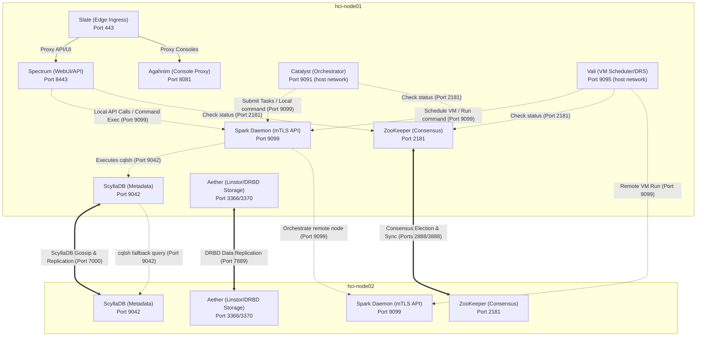

# Helios-HCI: Containerized Hyper-Converged Infrastructure Stack

Helios-HCI is a self-hosted, containerized Hyper-Converged Infrastructure (HCI) / private-cloud stack inspired by Nutanix's architecture (every component below is named after a Nutanix subsystem analog), built directly on Enterprise Linux (EL) 10.2 hypervisor hosts.

It eliminates resource-heavy Controller VMs (CVMs) by co-locating metadata, storage, configuration, and orchestration daemons inside lightweight Podman containers and native systemd daemons directly on host kernels, rather than running a separate management VM per node.

> [!WARNING]
> **Secure Boot Requirement:** 
> Because DRBD runs as an out-of-tree kernel module, **Secure Boot must be disabled** on all hypervisor hosts. Alternatively, the ELRepo secure boot public key (`/etc/pki/elrepo/SECURE-BOOT-KEY-elrepo.org.der`) must be imported into each host's MOK database (`mokutil --import`) and enrolled at boot. If Secure Boot is enabled without enrolling the key, loading the DRBD driver will fail with `Key was rejected by service`.

---

## 1. Tech Stack

* **Orchestration/control-plane code**: Python 3, deliberately stdlib-heavy. The only third-party dependencies are `paramiko` (`deploy_updates.py`, `provision.py`) and `cassandra-driver` (`daruk.py`), pinned in [requirements.txt](./requirements.txt); every daemon that runs on a hypervisor is stdlib-only.
* **Console proxy sidecar**: Rust (`agahnim/`, Tokio + `tokio-tungstenite` + `tokio-rustls`) — a native systemd service (not a container) that proxies VNC/SPICE WebSocket console traffic.
* **Frontend**: Vanilla HTML/CSS/JS under `static/` (no build step), with vendored noVNC (`static/novnc/`), SPICE-HTML5 (`static/spice-html5/`), and pako (`static/vendor/pako/`).
* **Deployment model**: a deliberate split (see [docs/deployment.md](./docs/deployment.md)). Third-party services with real dependency trees run as **Podman Quadlets** (`.container` files in `/etc/containers/systemd/`): ZooKeeper, ScyllaDB, Aether/Linstor, the Linstor controller, Spectrum, and Slate. The Helios daemons themselves are **native `systemd` units** (`/etc/systemd/system/*.service`) — they are stdlib-only Python whose job is to configure the host (network namespaces, VLAN bridges, IP addresses, DRBD), so a container boundary would isolate nothing while adding an image to build and version.
* **Data & consensus**: ScyllaDB ("Hydra", Cassandra-compatible, port `9042`) for cluster/VM metadata, and Apache ZooKeeper ("Odin"/"Zeus", port `2181`) for distributed consensus and leader election.
* **Storage**: Linstor + DRBD ("Aether") for replicated block storage (this replaced an earlier GlusterFS-based design — no GlusterFS code remains in the current tree).
* **Ingress**: Traefik ("Slate") terminating all client-facing WebUI/API/console traffic on port `443`.
* **CI**: [`.github/workflows/ci.yml`](./.github/workflows/ci.yml) byte-compiles every Python module, runs the unit and deployment-manifest tests, builds the Elixir app against the same toolchain the release image uses, checks the Rust console proxy, and builds the Spectrum container image.

---

## Licensing

Helios-HCI is licensed under the **Business Source License 1.1** (see [LICENSE](./LICENSE)).

In short: you may read, modify and self-host it freely, including commercially for your
own infrastructure. What is not permitted is offering Helios-HCI to third parties as a
hosted or managed commercial service. On the Change Date (2030-08-19) each released
version converts automatically to the **Mozilla Public License 2.0**.

BSL is source-available rather than OSI-approved open source. If that distinction matters
for your use, the Change License terms above are what you are waiting on.

Bundled third-party components (noVNC, pako, spice-html5) keep their own licenses and are
not covered by the BSL — see [THIRD_PARTY_LICENSES.md](./THIRD_PARTY_LICENSES.md).

---

## 2. Quick Start (Provisioning a New Cluster)

`provision.py` is the cluster bootstrapper. It SSHes into a set of nodes (currently reachable via temporary/DHCP IPs), assigns them static IPs, and pushes every Helios daemon/CLI plus the Podman Quadlet unit files needed to run the stack. It reads its inputs either interactively (it will prompt) or from environment variables, and supports one flag:

```bash
# Optional: force provisioning even if a node's hostname already matches
# the "Valkyrie-XXXXXX" pattern (i.e. re-provision an already-named host)
python3 provision.py --force
```

Non-interactive invocation (matches the environment variables `provision.py` actually reads):

```bash
export HELIOS_PASSWORD="<root password shared by all nodes>"
export HELIOS_DHCP_IPS="192.168.1.50,192.168.1.51,192.168.1.52"   # current/temporary node IPs
export HELIOS_STATIC_IPS="10.10.102.220,10.10.102.222,10.10.102.223"  # desired static IPs
export HELIOS_VIP="10.10.102.130"     # floating cluster VIP
export HELIOS_PREFIX="24"             # netmask prefix (auto-detected from the first DHCP node if omitted)
export HELIOS_GATEWAY="10.10.102.1"   # default gateway (auto-detected if omitted)

python3 provision.py
```

`provision.py` reassigns static IPs/hostnames, installs Podman/DRBD/Linstor packages, builds and installs `agahnim` (Rust) from source, base64-decodes and writes every daemon/CLI it embeds (see [docs/AGENTS.md](./docs/AGENTS.md) for the `*_B64` embedding mechanism), and writes the Quadlet unit files. On success it prints the exact follow-up command to run on the first node to actually bring the cluster online, e.g.:

```bash
ssh root@10.10.102.220
cluster -s 10.10.102.220,10.10.102.222,10.10.102.223 --redundancy_factor=1 --vip=10.10.102.130 create
```

From there, use the `cluster` CLI (section 5.E below) for day-2 lifecycle operations (`status`, `start`, `stop`, `destroy`). For the full bootstrap sequence and HA failover policy, see [docs/cluster.md](./docs/cluster.md) and [docs/deployment.md](./docs/deployment.md).

---

## 3. Directory Structure

```
Helios-HCI/
├── agahnim/              # Rust WebSocket console-proxy sidecar (Tokio), builds to /usr/local/bin/agahnim
│   ├── Cargo.toml
│   └── src/main.rs
├── docs/                 # Architecture guides, per-daemon narrative/technical docs, audit backlog
│   └── history/          # Superseded point-in-time changelogs (walkthrough.md, task.md, readme_old.md)
├── slate_config/         # Traefik ("Slate") static + dynamic config (traefik.yml, dynamic.yml)
├── spectrum_phx/          # Phoenix LiveView console (the Spectrum rewrite) -- see docs/spectrum_phx.md
│   └── quadlet/          # spectrum-phx.container, the Quadlet unit for the built image
├── static/                # WebUI frontend (vanilla HTML/CSS/JS), no build step
│   ├── novnc/            # Vendored noVNC client
│   ├── spice-html5/       # Vendored SPICE-HTML5 client
│   └── vendor/pako/       # Vendored pako (zlib) JS library
├── Dockerfile             # Builds the Spectrum WebUI container image (see docs/AGENTS.md for the
│                          #   server.py copy-rename indirection this depends on)
├── provision.py           # Cluster bootstrap/provisioner CLI (embeds base64 copies of ~19 daemons/CLIs)
├── sync_provision.py      # Re-encodes source files into provision.py's *_B64 constants (run after
│                          #   editing any embedded daemon/CLI — never hand-edit the *_B64 strings)
├── spectrum_server.py     # Main WebUI/REST API backend ("Spectrum")
├── cluster_new.py         # `cluster` CLI (create/status/start/stop/destroy)
├── valcli.py, catalyst.py, vali.py, dagur.py, mimir.py, spark.py,
│   spark_daemon_decoded.py, gatoway.py, urbosa.py, urbosa_bootstrap.py,
│   bifrost.py, mipha.py, hylia.py, logos.py, daruk.py, lanayru.py   # Daemons/CLIs, see component table below
├── catcli, mcli, mcli-runner, nodetool, allssh   # Companion CLIs/wrappers (non-.py)
├── check_updates.py, create_upgrade_zip.py,
│   deploy_updates.py      # Update pipeline (check → build zip → roll out over SSH/paramiko)
├── push_to_github.py       # Manual GitHub Contents-API uploader (reads GITHUB_TOKEN)
├── test_hylia.py           # unittest suite for Hylia (`python -m unittest test_hylia.py`)
├── LICENSE                 # Business Source License 1.1 (converts to MPL-2.0 on 2030-08-19)
├── THIRD_PARTY_LICENSES.md # Licenses of vendored noVNC / pako / spice-html5
├── TODO.md                 # Roadmap and technical-debt backlog
└── README.md
```

---

## 4. Component Mappings (Helios vs. Nutanix)

| Helios Service | Nutanix Equivalent | Technology Used | Description |
| :--- | :--- | :--- | :--- |
| [Valkyrie](./docs/valkyrie.md) | **AHV (Hypervisor)** | CentOS/RHEL KVM + libvirt | The physical host operating system. Runs VMs directly on host kernel. |
| [Spark](./docs/spark.md) | **Genesis** | Native Python mTLS daemon | Host-level bootstrap manager, systemd coordinator, and remote orchestrator. |
| [Odin](./docs/odin.md) / [ZooKeeper](./docs/zookeeper.md) | **Zeus (ZooKeeper)** | Podman + Apache ZooKeeper | Distributed consensus store for cluster metadata and active leader election. |
| [HydraDB](./docs/hydra.md) | **Medusa** | Podman + ScyllaDB (Cassandra) | Distributed metadata database for cluster configurations, VM state, and networks. |
| [Daruk](./docs/daruk.md) | **Medusa Proxy** | systemd + Python CQL Proxy | Persistent database query proxy shielding ScyllaDB from connection overhead. |
| [Aether](./docs/aether.md) | **Stargate** | Podman + Linstor + DRBD | Software-defined distributed replicated block storage engine (replaced an earlier GlusterFS-based design). |
| [Sidon](./docs/dfs/README.md) | **Stargate** (successor) | Native Rust systemd service — *designed, not built* | Per-node data-path daemon for the extent-based DFS. Serves VM disks to qemu over NBD, owns the replicated journal and the drain, and forwards to the vdisk's owner when it is not the owner itself. Intended to replace Aether's per-device DRBD replication. |
| [Purah](./docs/dfs/data-path.md) | **Curator** — *designed, not built* | Leader-elected role inside Sidon | Re-replication after node loss, mark-sweep garbage collection, background scrub against seal hashes, and locality rebuild after ownership moves. |
| [Ganon](./docs/dfs/ganon.md) | — *designed, not built* | Rust test harness | Fault-injection harness: kills, stalls, partitions and corrupts a storage substrate, then asserts every read returned a legal value. Built and calibrated against DRBD **before** any DFS code exists, and useful against the shipping product on its own. |
| [Spectrum](./docs/spectrum.md) | **Prism** | Podman + Python Web Server | Web UI console and REST API manager for monitoring, VM operations, and tasks. |
| [Spectrum (Phoenix)](./docs/spectrum_phx.md) | **Prism** | Podman + Elixir/Phoenix LiveView | The console rewrite, running beside the Python tier on port 8444 and taking over routes as they are ported. Renders server-side and never touches the data path. |
| [Catalyst](./docs/catalyst.md) | **Task Orchestrator** | Native Python service | Centralized task manager scheduling and tracking long-running asynchronous cluster operations. |
| [Slate](./docs/slate.md) | **Edge Ingress / Reverse Proxy** | Podman + Traefik | High-performance edge reverse proxy routing WebUI, API, VNC, and SPICE console traffic same-origin on port 443. |
| [Vali](./docs/vali.md) | **Acropolis VM Manager** | Native Python service | Dynamic VM placement scheduler, load balancer, and Distributed Resource Scheduler (DRS). |
| [Logos](./docs/logos.md) | **Arithmos** | Native Python collector | Distributed background telemetry agent collecting CPU, RAM, disk, and network stats. |
| [Dagur](./docs/dagur.md) | **Chronos** | Native Python service | Clustered cron task scheduler executing maintenance scripts and database tasks. |
| [Mimir](./docs/mimir.md) | **NCC (Health Checker)** | Native Python service | Background cluster diagnostics daemon executing periodic health checks. |
| [Mipha](./docs/mipha.md) | **Acropolis HA Manager** | Native Python service | High-Availability host liveness monitor and VM failover coordinator. |
| [Gatoway](./docs/gatoway.md) | **Flow** | Native Python service | Layer-2 VLAN network interface synchronization daemon. |
| [Urbosa](./docs/urbosa.md) | **Flow SDN** | Native Python service | Layer-3 software-defined overlay, distributed routing, and micro-segmentation daemon. |
| [Bifrost](./docs/bifrost.md) | **Vipmonitor** | Native Python service | Floating VIP manager daemon ensuring API access high availability. |
| [Hylia](./docs/hylia.md) | **Foundation (LCM)** | Native Python service | ZooKeeper-resumable rolling upgrade and Life Cycle Management (LCM) service. |
| [Lanayru](./docs/lanayru.md) | **Karbon / NKE** | Native Python service + Kine | Guest Kubernetes workload engine. Stores guest cluster state in ScyllaDB (Hydra) via Kine instead of dedicated `etcd` VMs. |
| [Agahnim](./docs/agahnim.md) | **Prism console proxy** | Native Rust systemd service (Tokio) | WebSocket console-proxy sidecar bridging browser clients to VM VNC/SPICE TCP sockets on port `8081`. |
| [Impa](./docs/mtls_lifecycle.md) | **Cluster certificate management** | Native Python CLI | mTLS certificate lifecycle for the cluster CA and every certificate it signed: `status` / `plan` / `renew` / `rollback` / `selftest`. Runs on the host holding `ca.key` and drives peers over SSH rather than mTLS, because renewal has to work after the certificates it repairs have already expired. |
| [Saga](./docs/backup_restore.md) | **Cerebro** (metadata half) | Native Python CLI | Backup and restore of what the cluster cannot rebuild by itself: the `hydra` keyspace via `nodetool snapshot`, the Linstor controller database, and `/etc/hci`, archived to an operator-supplied external target. Talks to `cqlsh`/`nodetool` directly, not through Daruk, because the restore path must work when the metadata layer is what is broken. **Does not back up guest data** — see the warning in its document. |

The three rows marked *designed, not built* are the extent-based DFS: a decision taken to replace per-device DRBD replication for VM disks with an extent store whose placement map lives in Hydra. Nothing is implemented — the design set is in [docs/dfs/](./docs/dfs/README.md) and the first milestone is the fault-injection harness, not the filesystem. Aether and Linstor remain the storage substrate until a migration completes, and indefinitely for anything that chooses them.

Each component above links to its narrative document. Most also have a `*_technical.md` companion covering internals (call flow, data structures, failure modes) — see [docs/README.md](./docs/README.md) for the complete index of both sets, plus the docs for the non-daemon tooling (`provision.py`, `sync_provision.py`, `deploy_updates.py`, `check_updates.py`, `create_upgrade_zip.py`, `valcli`, `test_hylia.py`) and the [scale-out add-on designs](./docs/add_ons_design.md).

---

## 5. Command-Line Interface (CLI) Reference

Helios-HCI exposes several CLI utilities on host consoles to manage, monitor, and query cluster components.

### A. Genesis/Bootstrap Utility (`spark`)
Run on any hypervisor host to check local systemd services and container statuses:
```bash
# Check running status, main PIDs, and health of all local services
spark status

# Output local service health in machine-readable JSON format
spark status --json

# Start ZooKeeper and Spark-Daemon bootstrap processes locally
spark start

# Stop ZooKeeper and Spark-Daemon locally
spark stop

# Gracefully stop ALL containerized and native cluster workloads on this host
spark stop all
```

### B. Acropolis VM & Infrastructure Management (`valcli`)
The primary CLI for administrator operations, virtual machine control, storage benchmarking, and database diagnostics:
```bash
# VM Operations
valcli vm.list                     # List all virtual machines in the cluster
valcli vm.on <vm_name>             # Power ON a virtual machine on a scheduled host
valcli vm.off <vm_name>            # Power OFF (force destroy) a virtual machine
valcli vm.migrate <vm> <target_ip>  # Live-migrate a VM to another node IP
valcli vm.balance                  # Manually trigger memory load rebalancing (DRS)
valcli drs.status                  # View cluster load deviation and migration history

# Host & Maintenance
valcli host.list                   # List all hypervisor nodes and maintenance states
valcli host.maintenance.enter <IP> # Enter maintenance mode (live-evacuates active VMs)
valcli host.maintenance.leave <IP> # Exit maintenance mode

# Storage & Cleanup
valcli storage.list                # List Aether storage containers and paths
valcli storage.benchmark <name>    # Run a raw write/read performance benchmark
valcli storage.cleanup_orphaned    # Prune orphaned VM disk raw files and NVRAM files

# Scheduling & Diagnostics
valcli scheduler.list              # List scheduled cron jobs (Dagur)
valcli scheduler.trigger <name>    # Manually trigger execution of a scheduled job
valcli health.check                # Execute all health diagnostics checks (Mimir)
valcli db.print <table_name>       # Print contents of ScyllaDB metadata table as ASCII
valcli db.query "<cql_query>"      # Run a raw CQL query against the ScyllaDB cluster
```

### C. Task Coordination CLI (`catcli`)
Interacts with the Catalyst orchestrator to queue, monitor, and clean up async cluster tasks:
```bash
# List all historical tasks, actions, progress, and statuses
catcli list

# View JSON status detail of a specific task
catcli status <task_uuid>

# Submit a custom task action to a target service queue
catcli submit --service vali --action start --payload '{"name": "my-linux-vm"}'

# Synchronize host DNS, NTP, and timezone configurations from database settings
catcli sync

# Prune completed and failed tasks from ScyllaDB history
catcli cleanup
```

### D. NCC Diagnostics CLI (`mcli`)
Manually run and query diagnostic health check schedules:
```bash
# List all registered NCC health checks
mcli health_checks list

# Manually trigger all diagnostic checks immediately
mcli health_checks run_all
```

### E. Cluster Management CLI (`cluster`)
Orchestrate cluster-wide lifecycle commands:
```bash
# Bootstrap a 3-node cluster with virtual IP 10.10.102.240
cluster create -s 10.10.102.220,10.10.102.222,10.10.102.223 -r 1 -v 10.10.102.240

# Query cluster-wide status (verbose includes Aether/Linstor peer and volume info)
cluster status --verbose

# Start all containerized and native services across the cluster
cluster start

# Stop all containerized and native services, wait for DRBD sync, and unmount Aether/Linstor volumes
cluster stop

# Wipe cluster configurations, databases, and formats claimed drives
cluster destroy
```
For detailed creation workflows and HA failover policies, see [cluster.md](./docs/cluster.md). For virtual networking, subnets, and VLAN management, see [network.md](./docs/network.md).

---

## 6. Directory Layout (Configuration & Certs)

All configuration parameters and certificates reside under standardized directories:
* `/etc/hci/` - Root configuration directory.
* `/etc/hci/cluster.json` - Global host and cluster definition file.
* `/etc/hci/spectrum/spectrum.env` - Node IP and API configuration.
* `/etc/hci/spark/certs/` - Mutual TLS node certificates (`node.crt`, `node.key`, `ca.crt`) used by `spark-daemon` on port `9099`.
* `/root/.certs/` - Client Mutual TLS certificates used by administrative utilities (`client.crt`, `client.key`).
* `/var/lib/hci/aether/volumes/` - Mount directory where local virtual machine disk raw files are stored.

---

## 7. Cluster Network Architecture

Helios-HCI uses a lightweight, secure network layout for inter-node orchestration, consensus, and storage replication:

* **Host-Network Service Ports**: Internal service APIs (Catalyst task queue on `9091`, Vali scheduler on `9095`) run in Quadlet containers with `Network=host` and bind to `0.0.0.0`, so they are reachable on the cluster network from any host that can route to them. Both now terminate mutual TLS against the cluster CA with `verify_mode = CERT_REQUIRED`, so an unauthenticated caller is refused during the TLS handshake rather than inside a handler — the credential, not the bind address, is what confines them.
* **Mutual TLS (mTLS) Mesh**: All cross-node administrative tasks and remote executions run securely over port `9099` via the **Spark Daemon**.
* **Consensus & Metadata Mesh**: Database gossip (ScyllaDB on `7000`) and consensus election (ZooKeeper on `2888`/`3888`) route over cluster-facing networks.
* **Floating Virtual IP (VIP)**: Managed dynamically by the **Bifrost** daemon, providing high-availability access to the Slate ingress on port `443`.

### Cluster Network Flow Chart



For a complete reference of network scopes, port allocations, and communication boundaries, see the [Network Architecture Documentation](./docs/network.md).

---

## 8. High-Availability & Robustness Enhancements

The stack has been enhanced with enterprise-grade resiliency and health-based routing:

* **Active WebUI VIP Failover**: The VIP manager (`bifrost`) evaluates active candidates on port `443` (Slate Ingress) and enforces a local health guard. A node will only bind the VIP if it is the leader AND **both** its local Slate ingress (`443`) and the Spectrum backend it proxies to (`8443`) are listening. Both are required because `slate_config/dynamic.yml` points Slate at exactly one backend — a node with `443` up but `8443` down returns `502` to every request, which is no better for clients than the blackhole the guard exists to prevent. If either layer is down or bootstrapping, the VIP floats to a healthy node, and the daemon logs which layer failed. Addresses are compared exactly rather than by substring, so a VIP of `10.10.102.13` is not confused with a host address of `10.10.102.130`.
* **Database Connection Resilience**: The WebUI (`spectrum`) establishes keyspace connection checks. If the local ScyllaDB instance is bootstrapping or down, Spectrum reads `/etc/hci/cluster.json` and falls back to other online database hosts.
* **Task API Queue Cache**: If ScyllaDB encounters brief connection latency or quorum shifts, Spectrum serves Catalyst tasks from an in-memory fallback cache to prevent UI progress bars from flickering or resetting to grey.
* **Streamlined Reboot Coordination**: Graceful VM evacuation and host transitions are fully isolated. The reboot sequence relies on the prior maintenance phase to gracefully migrate VMs, leaving the host-level `spark-daemon` active to process remote hardware reboot calls reliably.

---

## 9. Documentation

* [docs/README.md](./docs/README.md) - Index of every document in `docs/`, grouped by category.
* [docs/dfs/](./docs/dfs/README.md) - Design for the extent-based DFS (Sidon) that will replace per-device DRBD replication for VM disks. Designed, not yet building; the first milestone is a fault-injection harness.
* [docs/AGENTS.md](./docs/AGENTS.md) - Deep technical reference for AI coding agents working in this repo (daemon map, boot sequence, the `provision.py`/`sync_provision.py` embedding relationship, build/test commands).
* [docs/architecture.md](./docs/architecture.md) - Mid-length system design overview (request path, control-plane vs. data-plane split, network architecture).
* [docs/spark_api.md](./docs/spark_api.md) - The typed per-domain Spark API replacing raw root-shell execution.
* [docs/cluster_state.md](./docs/cluster_state.md) - ZooKeeper-backed cluster state: desired state, ephemeral per-node liveness, convergence, and the probe fallback.
* [docs/deployment.md](./docs/deployment.md) - The Podman Quadlet deployment model and the update-rollout pipeline.
* [docs/setup-guide.md](./docs/setup-guide.md) - Local dev prerequisites and workflow.
* [docs/hci_master_architecture_guide.md](./docs/hci_master_architecture_guide.md) - The deepest existing architecture reference (1500+ lines).
* [docs/audit_findings.md](./docs/audit_findings.md) - Actively-maintained backlog of known architectural gaps and edge cases.
* [Master Technical Mindmap](./docs/master_technical_mindmap.md) - High-level taxonomy map of all Helios-HCI components.
* [Master System Flowchart](./docs/master_flowchart.md) - System-wide flowchart illustrating database boundaries, mTLS API calls, and socket loops.
* [TODO.md](./TODO.md) - Roadmap and technical-debt backlog.
