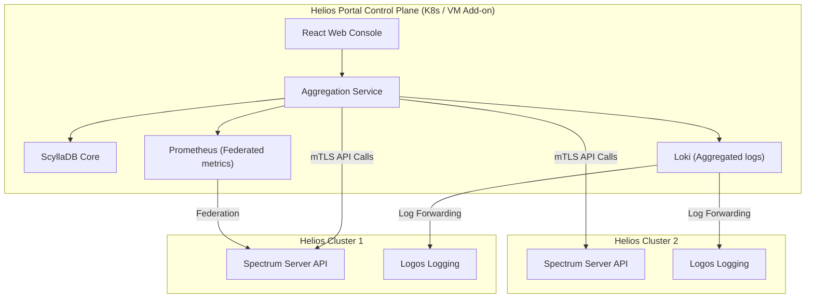
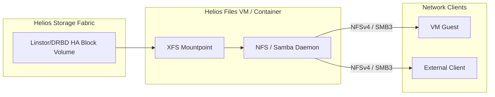
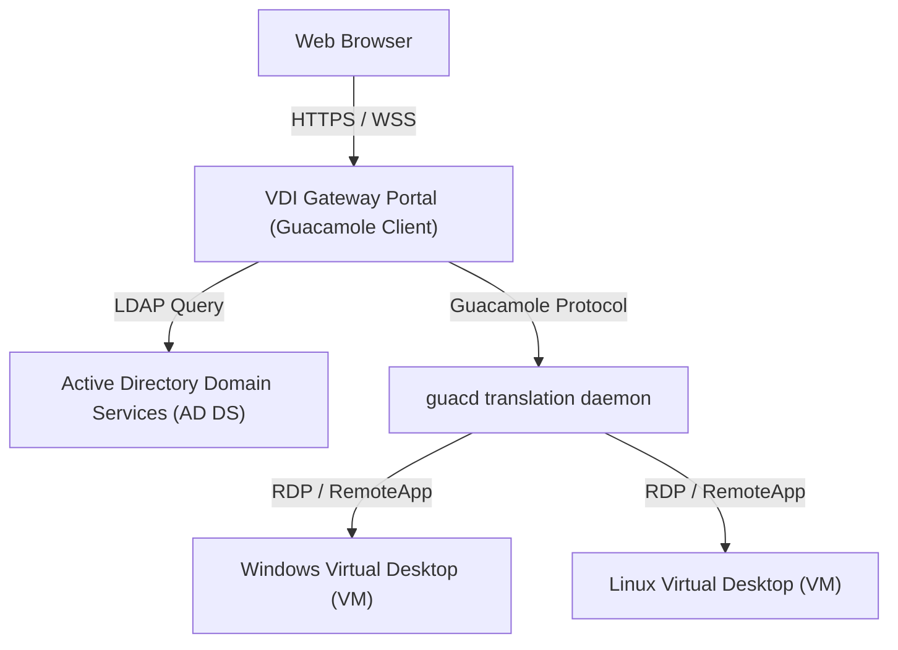
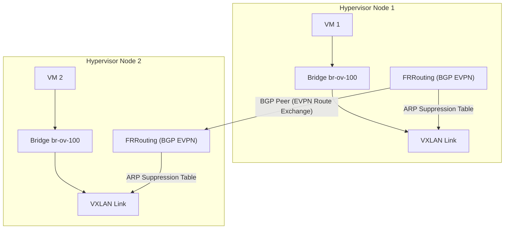

# Helios-HCI Scale-Out Add-ons Design Blueprint

This document outlines the architectural blueprints for the four scale-out add-on systems integrated with Helios-HCI. As specified, these services run as independent VM or containerized add-ons (K8s or Podman-based) to maintain core hypervisor stability.

---

## 1. Helios Portal (Prism Central Alternative)

A multi-cluster management panel designed to monitor, coordinate, and orchestrate virtual workloads across multiple independent Helios-HCI deployments.

### Architectural Layout:
*   **Deployment Model**: Deployed as a K8s Helm chart or a group of standalone Podman containers running on a dedicated management VM outside the production hypervisor hosts.
*   **Authentication & Security**: Communicates with each Helios cluster's `spectrum_server` using Mutual TLS (mTLS) client certificates.
*   **Key Features**:
    1.  **Unified Control Plane**: Aggregates multi-cluster inventory (hosts, VMs, virtual networks, storage pools).
    2.  **Federated Monitoring**: Uses a centralized Prometheus server to scrape metrics endpoints from individual cluster Spectrum servers, providing global dashboards.
    3.  **Global Log Collection**: Integrates with Grafana Loki to ingest syslog streams from individual cluster `logos` agents.
    4.  **Multi-Cluster Life Cycle Management (LCM)**: Triggers staged Hylia rolling upgrades across multiple clusters sequentially.

---

## 2. Helios Files (Scale-Out File Server)

A scale-out shared storage add-on exposing NFS and SMB exports, backed by highly available Linstor/DRBD block volumes.

### Architectural Layout:
*   **Deployment Model**: Deployed as a highly available Virtual Machine (or containerized exporter) orchestrated by Vali.
*   **Storage Integration**:
    1.  Catalyst provisions a Linstor block device volume configured with a replication factor of 3 (SimpleStrategy).
    2.  The block device is mounted inside the file server VM/container.
    3.  Standard sharing daemons (NFS Ganesha / Samba) export the mount point to the network.
*   **High Availability**: If the primary file server VM fails, Mipha detects the failure, demotes the DRBD resource, and restarts the file server instance on a surviving host, mounting the replicated storage.

---

## 3. Helios Horizon (VDI System)

An Active Directory-integrated virtual desktop and application streaming infrastructure, utilizing Guacamole translation protocols.

### Architectural Layout:
*   **Deployment Model**: Deployed on K8s (or a group of thin Linux VMs) as an add-on.
*   **Directory Services Integration**:
    - Integrates directly with Active Directory Domain Services (AD DS) via LDAP for user authentication, directory queries, and security group role assignment.
*   **Console Protocol (Guacamole-based RDP)**:
    - Employs **Apache Guacamole** (`guacd` daemon) to translate standard RDP/VNC streams from backend Windows/Linux VMs into HTML5/WebSockets frames rendered natively in the browser.
*   **Applications-Only Web Panel**:
    - Users can sign into a dedicated portal page and select individual applications (e.g. Photoshop, VS Code, Database Client) instead of full desktops.
    - Uses **Microsoft RemoteApp (via FreeRDP)** or **X11 Forwarding over RDP** to stream only the application's window boundary (seamless windows) using RDP compositing, displaying the app inline within a browser window wrapper.

---

## 4. Scale-Out Urbosa (SDN Overlay)

A scale-out overlay network manager resolving head-end replication limits via EVPN/BGP routing.

### Architectural Layout:
*   **Deployment Model**: Deployed as a distributed K8s-based network mesh control plane running on each hypervisor host.
*   **EVPN/BGP Integration**:
    - Replaces static FDB flooding entries (`bridge fdb append`) with a BGP EVPN routing mesh powered by **FRRouting (FRR)** daemon.
    - Nodes peer via internal BGP (iBGP) to exchange MAC and IP reachability routes dynamically.
*   **ARP Suppression**:
    - Learns guest MAC-to-IP mappings via EVPN.
    - Programmatically populates VXLAN ARP suppression tables locally, allowing hosts to answer guest ARP requests directly at the source bridge, eliminating Head-End Replication (HER) packet floods.
