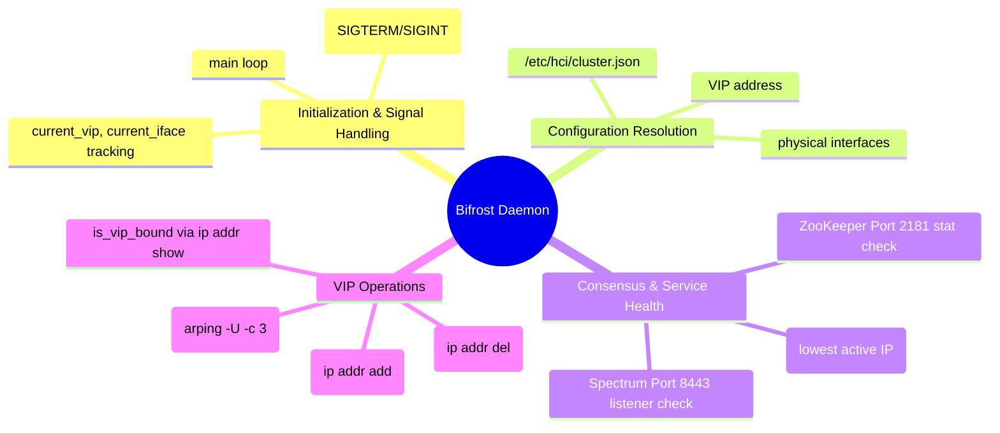

# Bifrost (Virtual IP Manager Daemon) - Technical Documentation

This document details the internal technical structure, functions, flowcharts, and mindmaps of the Bifrost daemon.

## Technical Mindmap

## Function & Logic Breakdown

### `get_local_net_info(hosts)`
- Runs `ip -json addr show` to obtain host network interfaces.
- Iterates over interfaces and returns the matching interface name and local IP.
- Default fallback: `ens192`, `None`.

### `get_zookeeper_leader_ip()`
- Reads `/etc/hci/cluster.json` to get a list of cluster node IPs.
- Queries ZooKeeper port `2181` using socket connections and sends the `stat` 4-letter word command.
- Parses response for `mode: leader` or `mode: standalone`.
- Verifies if the elected leader's Spectrum port `8443` is listening. If not, falls back to the candidate running Spectrum with the lowest IP address.

### `is_zookeeper_leader(local_ip=None)`
- Resolves the local hypervisor IP (reads `/etc/hci/spectrum/spectrum.env` or resolves via UDP socket to `8.8.8.8`).
- Compares it with the resolved ZooKeeper leader IP.

### `is_vip_bound(iface, vip)`
- Checks if the VIP is currently bound to the specified interface by parsing `ip addr show dev <iface>`.

### `main()` Loop
- Standard daemon loop running every 2 seconds.
- Performs ZooKeeper leadership and local Spectrum checks.
- Binds or releases the VIP and sends gratuitous ARP (GARP) updates using `/usr/sbin/arping`.
