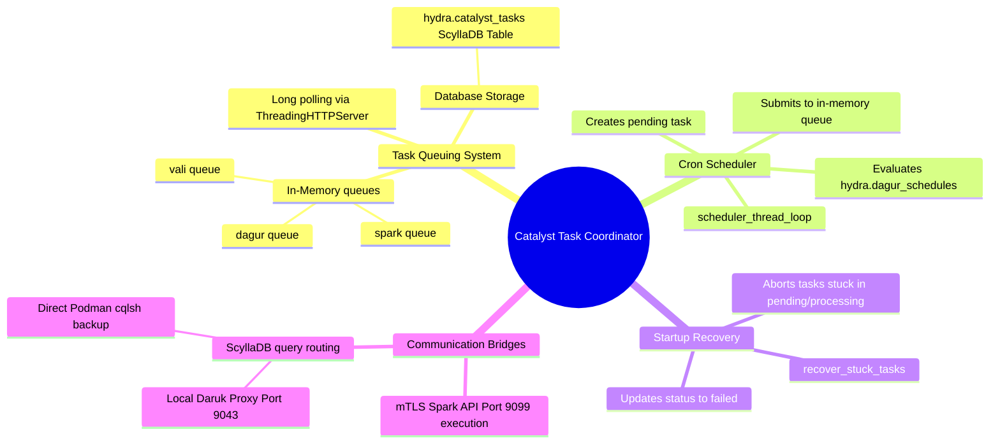

# Catalyst (Task Coordinator & Scheduler Daemon) - Technical Documentation

This document details the internal technical structure, functions, flowcharts, and mindmaps of the Catalyst task orchestration service.

## Technical Mindmap

## Function & Logic Breakdown

### `run_remote_spark(ip, command)`
- Establishes a TLS context (using `/root/.certs/ca.crt`, `client.crt`, and `client.key`) to execute shell commands securely on remote nodes via Spark's REST API port `9099`.

### `run_cql_query(cql_query, *args, **kwargs)`
- Submits CQL commands to the cluster metadata store.
- **Primary Route**: Performs a POST request to the local **Daruk** ScyllaDB proxy on `http://127.0.0.1:9043/query`.
- **Fallback Route**: If the proxy is unavailable, executes commands inside the `systemd-hydra-db` Podman container using standard command pipe inputs:
  `podman exec -i systemd-hydra-db cqlsh <local_ip>`

### `get_zookeeper_leader_ip()`
- Reads `/etc/hci/cluster.json` to fetch node IPs.
- Queries ZooKeeper port `2181` to locate the leader.
- Fallback designated candidate search on Catalyst port `9091` if the current leader is unavailable.

### `is_zookeeper_leader()`
- Compares the resolved ZooKeeper leader IP with the local hypervisor IP.

### `init_db_schema()`
- Seeds the `hydra.catalyst_tasks` table on service start:
  - `task_id` (uuid, primary key)
  - `service` (text)
  - `action` (text)
  - `status` (text)
  - `payload` (text)
  - `progress` (int)
  - `error_msg` (text)
  - `created_at` / `updated_at` (timestamp)

### `submit_task_to_memory(service, task_data)`
- Inserts a task dictionary into the corresponding in-memory `queue.Queue` (e.g. `vali`, `dagur`, `spark`).
- Creates a `threading.Event` to coordinate client long-polling.

### `scheduler_thread_loop()`
- Runs every 10 seconds on the ZooKeeper leader node.
- Queries `hydra.dagur_schedules` to find active cron jobs.
- Compares current time against interval checks. If due, creates a task in the database and dispatches it to the `dagur` queue.

### `recover_stuck_tasks()`
- Runs on daemon start. Queries the database for tasks in `pending` or `processing` state.
- Marks them as `failed` with error: `"Task aborted due to system daemon restart."`.

### `CatalystAPIHandler` (HTTP Server)
- **`GET /api/v1/queues/<service>`**: Fetches a pending task for the requested worker queue. Blocks up to 30s.
- **`GET /api/v1/tasks/status/<task_id>`**: Clients query task progression. If task is not completed, blocks up to 30s waiting for `task_events[task_id]` to be `.set()`.
- **`POST /api/v1/tasks/submit`**: Enqueues new jobs.
- **`POST /api/v1/tasks/update`**: Workers report progress or completion, triggering `task_events[task_id].set()`.
