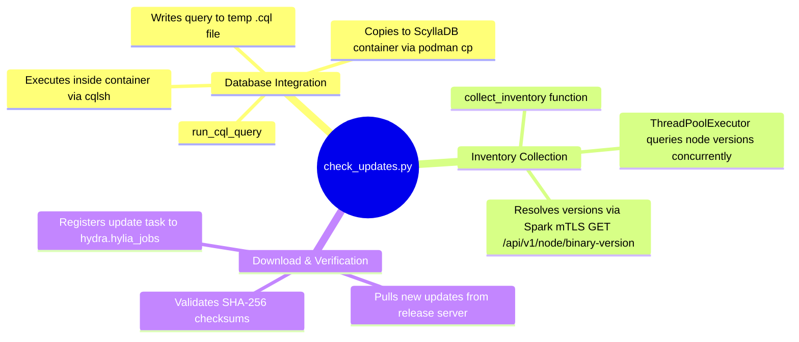

# Check Updates Utility - Technical Documentation

This document details the internal technical structure, functions, flowcharts, and mindmaps of the updates verification script (`check_updates.py`).

## Technical Mindmap

## Function & Logic Breakdown

### `run_cql_query(cql_query)`
- **Primary Path**: Submits CQL statement to the local Daruk query proxy (`http://127.0.0.1:9043/query`).
- **Fallback Path**:
  1. Writes the query statement to a temporary file (`.cql`) on the host.
  2. Copies this file into the `systemd-hydra-db` ScyllaDB Podman container using `podman cp`.
  3. Executes `cqlsh <local_ip> -f <temp_file>` inside the container.
  4. Deletes the temporary file inside the container and on the host.

### `collect_inventory()`
- Dynamically loads and imports the `hylia` module (located at `/usr/local/bin/hylia` or python system paths) to query active hosts list (`hylia.get_cluster_hosts()`).
- Launches a `ThreadPoolExecutor` to query nodes in parallel.
- For each node and system component, queries Spark's REST API `/api/v1/node/binary-version?path=<path>` to fetch local builds numbers.

### Update Registry Verification (`main()`)
- Connects to the central update registry URL (read from settings or defaults).
- Evaluates if new package builds exist.
- Downloads update zip archives.
- Computes SHA-256 checks to confirm contents integrity.
- Adds new rolling update jobs into the `hydra.hylia_jobs` queue.
