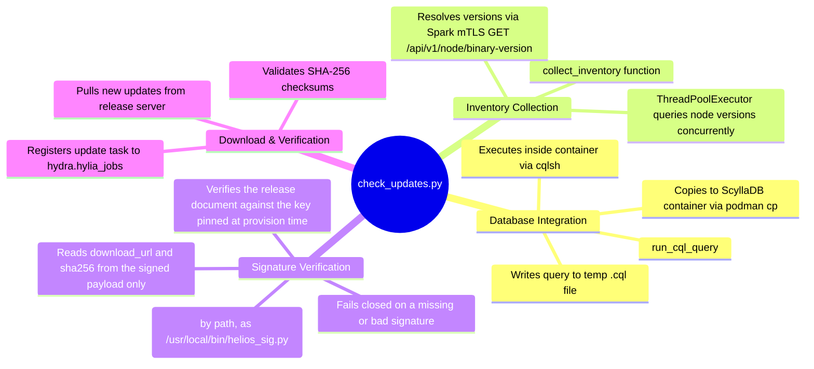

# Check Updates Utility - Technical Documentation

This document details the internal technical structure, functions, flowcharts, and mindmaps of the updates verification script (`check_updates.py`).

## Technical Mindmap

```mermaid
mindmap
  root((check_updates.py))
    Database Integration
      run_cql_query
      Writes query to temp .cql file
      Copies to ScyllaDB container via podman cp
      Executes inside container via cqlsh
    Inventory Collection
      collect_inventory function
      ThreadPoolExecutor queries node versions concurrently
      Resolves versions via Spark mTLS GET /api/v1/node/binary-version
    Signature Verification
      Loads helios_sig (by path, as /usr/local/bin/helios_sig.py)
      Verifies the release document against the key pinned at provision time
      Reads download_url and sha256 from the signed payload only
      Fails closed on a missing or bad signature
    Download & Verification
      Pulls new updates from release server
      Validates SHA-256 checksums
      Registers update task to hydra.hylia_jobs
```

## Function & Logic Breakdown

### `run_cql_query(cql_query)`
- **Primary Path**: Submits CQL statement to the local Daruk query proxy (`http://127.0.0.1:9043/query`).
- **Fallback Path**:
  1. Writes the query statement to a temporary file (`.cql`) on the host.
  2. Copies this file into the `systemd-hydra-db` ScyllaDB Podman container using `podman cp`.
  3. Executes `cqlsh <local_ip> -f <temp_file>` inside the container.
  4. Deletes the temporary file inside the container and on the host.

### `collect_inventory()`
- Dynamically loads and imports the `hylia` module (located at `/usr/local/bin/hylia` or python system paths) to query active hosts list (`hylia.get_cluster_hosts()`).
- Launches a `ThreadPoolExecutor` to query nodes in parallel.
- For each node and system component, queries Spark's REST API `/api/v1/node/binary-version?path=<path>` to fetch local builds numbers.

### `load_signing_module()`
- Imports `helios_sig`, falling back to a `SourceFileLoader` on `/usr/local/bin/helios_sig.py`
  (this script is installed as `check-updates`, a name Python cannot import, so it loads its
  neighbour by path the same way it loads `hylia`).
- There is no branch that continues without the module. A check that cannot verify a
  signature has nothing to say about whether an update is safe to offer.

### `resolve_release_document(document, public_key_path=None)`
- Verifies the release response against the public key pinned at
  `/etc/hci/keys/release_ed25519.pub` and returns **only** the fields the signature covers.
- The defect this fixes: `download_url` and its `sha256` used to be read out of the same
  JSON body a hostile update host would have written, so the digest only ever proved the
  download had not been corrupted in transit. Unsigned fields in the response are now
  ignored entirely — trusting one because a signature elsewhere in the body verified is
  the same bug wearing a signature.
- A **bad** signature is always fatal. A **missing** signature is fatal too, unless
  `HELIOS_ALLOW_UNSIGNED_UPDATES` is set to its exact documented value, in which case the
  release is accepted and the reason is written to `lcm_update_state.error_msg`, which
  Spectrum renders as the LCM page's error.
- See [update_signing.md](./update_signing.md) for the trust model and key handling.

### `validate_package_digest(digest)`
- Requires 64 hex characters. Spectrum rejects anything else at download time; refusing it
  here names the release that supplied it.

### `read_current_version(hylia_path=None)`
- Returns this node's installed build, or **`None`** when it could not be determined.
- Order: execute `hylia` from `HYLIA_PATH`, else `import hylia`, else read the file as
  text and take the `__build__` assignment out of it. Only when all three fail is the
  answer `None`.
- The defect this closes: `current_version` was initialised to `FALLBACK_BUILD` and every
  failure path left it there. A node where hylia could not be loaded *or* read — a broken
  interpreter, a half-finished upgrade, a permissions problem, the file simply missing —
  reported the build from before builds were tagged, which is not equal to any release
  the server will ever publish. Since the check is an inequality, that node announced
  "update available" on every run, forever, and no amount of updating could clear it:
  the next run could not read the version it had just installed either.
- A hylia that loads but carries no `__build__` attribute is a **different** case and does
  return `FALLBACK_BUILD`. The component is installed and genuinely predates build tags,
  which is what that constant means. "Installed, untagged" and "could not find out" are
  not the same answer and must not produce the same value.

### `decide_update_available(latest_version, current_version, latest_components, installed_inv)`
- Returns `(update_available, notes)`. `current_version=None` means unknown.
- The rule it exists to enforce: **unknown never counts as a mismatch.** Every comparison
  is an inequality against a release version, so any value substituted for "we could not
  find out" is unequal to the release permanently.
- An unknown current version yields `update_available = False` plus a note naming what
  could not be read. The notes are appended to `lcm_update_state.error_msg`, which
  Spectrum surfaces as the LCM page's error — an operator who is not being offered an
  update is entitled to know whether that is because there is none or because the question
  could not be answered, but not to be told there is one on the strength of a value nobody
  read.
- Per-component versions are treated the same way. `VERSION_UNREADABLE` (`"N/A"`) is what
  this script writes when the request to a node failed; it is not a version and is
  excluded from the comparison and listed in the notes. `"Not Installed"` and `"Unknown"`
  *are* answers about the component and are still compared — the former as a mismatch, the
  latter as `FALLBACK_BUILD`.
- `lcm_update_state.current_version` is written as `"unknown"` in this case, not as a
  plausible-looking build number, so the console shows something visibly wrong rather than
  something quietly false. `/api/lcm/upgrade/check` in `spectrum_server.py` renders it
  as-is instead of substituting a default.

### Update Registry Verification (`main()`)
- Connects to the central update registry URL (read from settings or defaults).
- Verifies the response signature and takes every field from the signed payload.
- Reads this node's build with `read_current_version()` and decides with
  `decide_update_available()`; it does not compare versions itself.
- Downloads update zip archives.
- Computes SHA-256 checks to confirm contents integrity.
- Adds new rolling update jobs into the `hydra.hylia_jobs` queue.
