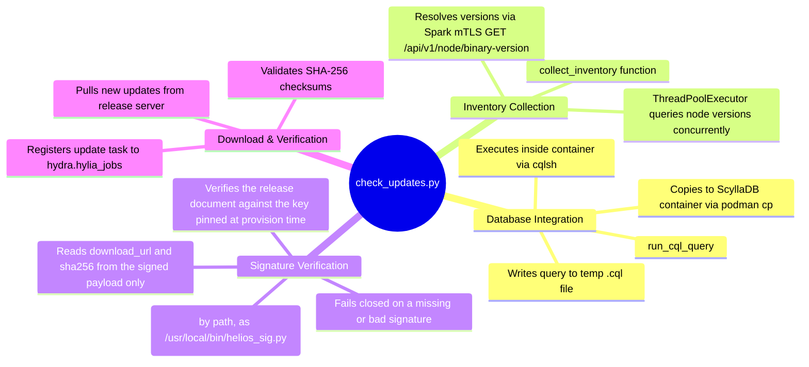

# Check Updates Utility - Technical Documentation

This document details the internal technical structure, functions, flowcharts, and mindmaps of the updates verification script (`check_updates.py`).

## Technical Mindmap

```mermaid
mindmap
  root((check_updates.py))
    Database Integration
      run_cql_query
      Writes query to temp .cql file
      Copies to ScyllaDB container via podman cp
      Executes inside container via cqlsh
    Inventory Collection
      collect_inventory function
      ThreadPoolExecutor queries node versions concurrently
      Resolves versions via Spark mTLS GET /api/v1/node/binary-version
    Signature Verification
      Loads helios_sig (by path, as /usr/local/bin/helios_sig.py)
      Verifies the release document against the key pinned at provision time
      Reads download_url and sha256 from the signed payload only
      Fails closed on a missing or bad signature
    Download & Verification
      Pulls new updates from release server
      Validates SHA-256 checksums
      Registers update task to hydra.hylia_jobs
```

## Function & Logic Breakdown

### `run_cql_query(cql_query)`
- **Primary Path**: Submits CQL statement to the local Daruk query proxy (`http://127.0.0.1:9043/query`).
- **Fallback Path**:
  1. Writes the query statement to a temporary file (`.cql`) on the host.
  2. Copies this file into the `systemd-hydra-db` ScyllaDB Podman container using `podman cp`.
  3. Executes `cqlsh <local_ip> -f <temp_file>` inside the container.
  4. Deletes the temporary file inside the container and on the host.

### `collect_inventory()`
- Dynamically loads and imports the `hylia` module (located at `/usr/local/bin/hylia` or python system paths) to query active hosts list (`hylia.get_cluster_hosts()`).
- Launches a `ThreadPoolExecutor` to query nodes in parallel.
- For each node and system component, queries Spark's REST API `/api/v1/node/binary-version?path=<path>` to fetch local builds numbers.

### `load_signing_module()`
- Imports `helios_sig`, falling back to a `SourceFileLoader` on `/usr/local/bin/helios_sig.py`
  (this script is installed as `check-updates`, a name Python cannot import, so it loads its
  neighbour by path the same way it loads `hylia`).
- There is no branch that continues without the module. A check that cannot verify a
  signature has nothing to say about whether an update is safe to offer.

### `resolve_release_document(document, public_key_path=None)`
- Verifies the release response against the public key pinned at
  `/etc/hci/keys/release_ed25519.pub` and returns **only** the fields the signature covers.
- The defect this fixes: `download_url` and its `sha256` used to be read out of the same
  JSON body a hostile update host would have written, so the digest only ever proved the
  download had not been corrupted in transit. Unsigned fields in the response are now
  ignored entirely — trusting one because a signature elsewhere in the body verified is
  the same bug wearing a signature.
- A **bad** signature is always fatal. A **missing** signature is fatal too, unless
  `HELIOS_ALLOW_UNSIGNED_UPDATES` is set to its exact documented value, in which case the
  release is accepted and the reason is written to `lcm_update_state.error_msg`, which
  Spectrum renders as the LCM page's error.
- See [update_signing.md](./update_signing.md) for the trust model and key handling.

### `validate_package_digest(digest)`
- Requires 64 hex characters. Spectrum rejects anything else at download time; refusing it
  here names the release that supplied it.

### Update Registry Verification (`main()`)
- Connects to the central update registry URL (read from settings or defaults).
- Verifies the response signature and takes every field from the signed payload.
- Evaluates if new package builds exist.
- Downloads update zip archives.
- Computes SHA-256 checks to confirm contents integrity.
- Adds new rolling update jobs into the `hydra.hylia_jobs` queue.
