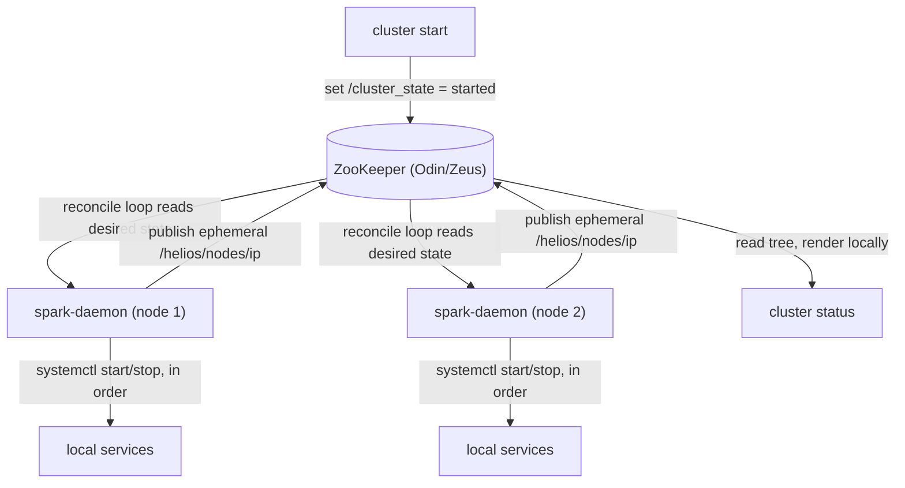

# Cluster State (ZooKeeper-backed)

How Helios records what the cluster *should* be doing, how each node reports what it is
*actually* doing, and how `cluster status` and `cluster start` read both.

This follows the Nutanix split: **Zeus** (ZooKeeper / Odin) holds cluster state,
**Genesis** (Spark) owns local services and publishes into it, and the CLI reads that
state and renders it. Helios already had both halves — this connects them.

---

## 1. Why

The previous model had `cluster status` fan mTLS calls out to every node on every
invocation. Each node ran ~17 `systemctl is-active` calls plus TCP probes, formatted
ANSI-coloured text, and returned it; the CLI printed the blob verbatim.

Four consequences:

* **Presentation lived in the daemon.** Adding a column or emitting JSON meant
  redeploying `spark-daemon` to every host.
* **Liveness was a sample.** A unit with `Restart=always` reports `active` during each
  restart window, so a crash-looping service reads as healthy roughly as often as not.
  This was not theoretical: `hylia` was observed having failed **31 consecutive times**
  (exit 127, a CRLF shebang) while `cluster status` reported it `UP` with an empty PID
  list rendered as a bare `[]`.
* **Nothing was authoritative.** No record of what the cluster was *meant* to be doing
  that survived the call.
* **The logic was duplicated.** `spark.py` and `spark_daemon_decoded.py` each derived
  service state independently and could disagree about the same host.

---

## 2. The znodes

| Path | Type | Written by | Meaning |
| :--- | :--- | :--- | :--- |
| `/cluster_state` | persistent | `cluster start` / `stop`, Spectrum | Desired state: `started` or `stopped` |
| `/helios/nodes/<ip>` | **ephemeral** | each node's `spark-daemon` | That node's actual state, refreshed every 5s |

`/helios/nodes/<ip>` carries the node's hostname, ZooKeeper leadership, maintenance
status, disk count, build, a timestamp, and per-service `{status, pids, restarts}`.

The node entries are **ephemeral**: their lifetime is bound to the publisher's ZooKeeper
session. A node that dies has its entry removed by the ensemble rather than inferred
from a failed probe. Verified behaviour: the entry disappears roughly one session
timeout after the process stops, and survives indefinitely while the publisher's
keepalive pings continue.

---

## 3. Flow



`cluster start` records intent once; each node converges toward it and republishes what
it actually achieved. The CLI then polls the published state and prints which services
are still pending until every node is up — rather than declaring success the moment the
start commands have been issued.

### A unit that is mid-transition is not drift

Between the state changes, the loop runs a periodic drift check: one batched
`systemctl is-active` over the managed units, acting only on the mismatches. It ignores
any unit reporting `activating` **or** `deactivating`, because both mean the unit is
already on its way somewhere and the next poll will see where it landed.

Ignoring `deactivating` is what keeps the reconciler from fighting whoever is doing the
stopping. A unit being stopped reports not-active for as long as the stop takes — ten
seconds for `spectrum`, which does not go down on SIGTERM and has to be killed — and
issuing a start inside that window makes systemd **cancel the pending stop job**. The
operator's `systemctl stop` then fails with `Job for spectrum.service canceled`.

That is not hypothetical: it is what made `deploy_updates.py`'s console restart a no-op
on two of three nodes. Its `systemctl stop && podman rm -f && systemctl start` chain
short-circuited on the cancelled stop, so the removal and the start never ran, and the
console came back up only because the reconciler had already started it. The rollout now
restarts the console with a single `systemctl restart`, which systemd will not interleave
another job into, and verifies the unit is active afterwards.

Nothing is lost by waiting a tick. If the stop was not wanted, the unit reads `inactive`
at the next poll and is started then — which is the whole point of the drift check.

---

## 4. ZooKeeper is infrastructure, not a workload

**ZooKeeper must never appear in a "stop the cluster" service list.** It is the store the
desired state lives in.

The old autostart path violated this and deadlocked:

```
ZooKeeper down  ->  /cluster_state unreadable  ->  assumed "stopped"
                ->  stop the cluster, including ZooKeeper  ->  ZooKeeper stays down
```

A latch that never reopens. `check_cluster_and_autostart` now starts ZooKeeper
unconditionally before any state is consulted, and ZooKeeper is absent from every stop
list. Relatedly, **"unreadable" is not "stopped"** — unknown intent means change nothing
and retry, never "tear everything down".

Note this differs from `spark stop all`, which does stop ZooKeeper: that is an explicit
operator instruction to quiesce one host, not an inference drawn from missing state.

---

## 5. Fallback

ZooKeeper is itself a service, so a ZooKeeper-backed `cluster status` cannot explain its
own absence. The direct mTLS probe is therefore retained as an explicit fallback rather
than deleted:

```
ZooKeeper unreachable; probing nodes directly over mTLS.
```

A configured node with no znode is reported `Down (no ZooKeeper registration)`, which
distinguishes "the node is gone" from "the whole ensemble is gone".

---

## 6. Flap detection

Each published service carries a `restarts` count from `systemctl show -p NRestarts`. A
unit that is `active` but has no main PID after repeated restarts is reported
**`FLAPPING`** rather than `UP`:

```
Hylia            FLAPPING restarting, 31 restarts
Vali             UP       [7] (4 restarts)
```

This is the case that motivated the work — see §1.

---

## 7. None of this is backed up, on purpose

`saga`, the metadata backup tool, deliberately captures nothing from ZooKeeper. See
[backup_restore.md](./backup_restore.md) §2.5.

`/helios/nodes/<ip>` is **ephemeral** — §2 — so there is nothing durable to capture; the
entry is republished within about five seconds of the node's `spark-daemon` starting.
`/cluster_state` holds one word that an operator retypes with `cluster start`.

Capturing them would be wrong twice: it would imply the tree is a system of record when
it is a live view, and restoring a stale `stopped` into a cluster somebody is trying to
bring up would hold it down — the same class of mistake as §4's latch.

---

## 8. The client

`helios_zk.py` is a minimal ZooKeeper 3.x wire-protocol client written against the
standard library, because the repo carries no third-party dependencies (see
[AGENTS.md](./AGENTS.md)) and the pre-existing code spoke only the read-only
four-letter-word commands (`stat` over a raw socket), which cannot create znodes.

It implements connect/session, ping keepalive, `create` (including ephemeral), `exists`,
`get`, `set`, `get_children`, and `delete`. Requests are serialized under a lock, so one
client is safe to share between the publisher loop and ad-hoc reads.

It is deployed to `/usr/local/bin/helios_zk.py` and imported by both `spark-daemon` and
the `cluster` CLI via `SourceFileLoader`, matching how `check_updates` loads `hylia`.

---

## 9. Related

* [cluster.md](./cluster.md) — the `cluster` CLI itself
* [spark.md](./spark.md) / [spark_technical.md](./spark_technical.md) — the daemon that publishes
* [zookeeper.md](./zookeeper.md), [odin.md](./odin.md) — the ensemble
* [backup_restore.md](./backup_restore.md) — what *is* backed up, and why this is not
* [TODO.md](../TODO.md) — remaining work, including the Daruk/Medusa metadata layer this
  composes with (one authoritative source rather than every caller re-deriving state)
