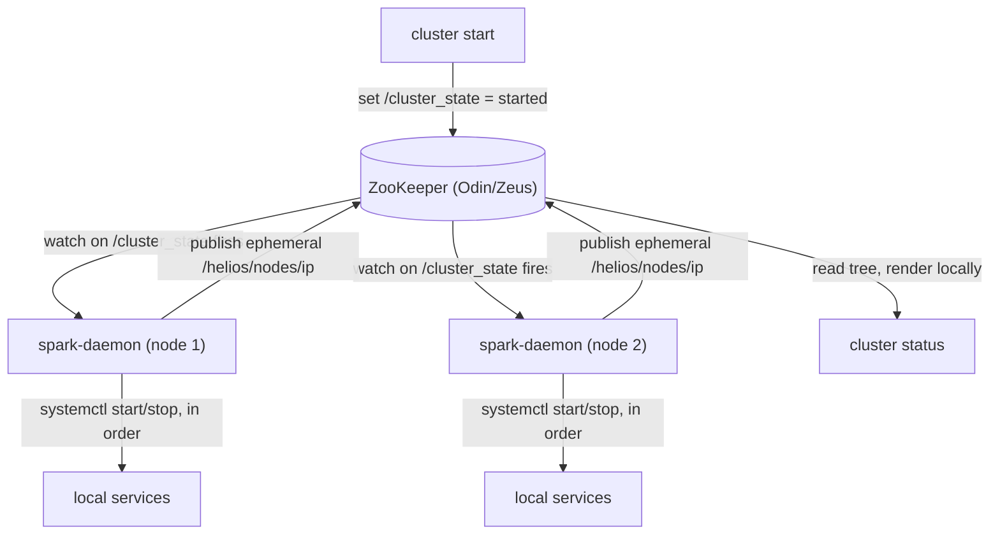

# Cluster State (ZooKeeper-backed)

How Helios records what the cluster *should* be doing, how each node reports what it is
*actually* doing, and how `cluster status` and `cluster start` read both.

This follows the Nutanix split: **Zeus** (ZooKeeper / Odin) holds cluster state,
**Genesis** (Spark) owns local services and publishes into it, and the CLI reads that
state and renders it. Helios already had both halves — this connects them.

---

## 1. Why

The previous model had `cluster status` fan mTLS calls out to every node on every
invocation. Each node ran ~17 `systemctl is-active` calls plus TCP probes, formatted
ANSI-coloured text, and returned it; the CLI printed the blob verbatim.

Four consequences:

* **Presentation lived in the daemon.** Adding a column or emitting JSON meant
  redeploying `spark-daemon` to every host.
* **Liveness was a sample.** A unit with `Restart=always` reports `active` during each
  restart window, so a crash-looping service reads as healthy roughly as often as not.
  This was not theoretical: `hylia` was observed having failed **31 consecutive times**
  (exit 127, a CRLF shebang) while `cluster status` reported it `UP` with an empty PID
  list rendered as a bare `[]`.
* **Nothing was authoritative.** No record of what the cluster was *meant* to be doing
  that survived the call.
* **The logic was duplicated.** `spark.py` and `spark_daemon_decoded.py` each derived
  service state independently and could disagree about the same host.

---

## 2. The znodes

| Path | Type | Written by | Meaning |
| :--- | :--- | :--- | :--- |
| `/cluster_state` | persistent | `cluster start` / `stop`, Spectrum | Desired state: `started` or `stopped` |
| `/helios/nodes/<ip>` | **ephemeral** | each node's `spark-daemon` | That node's actual state, refreshed every 5s |

`/helios/nodes/<ip>` carries the node's hostname, ZooKeeper leadership, maintenance
status, disk count, build, a timestamp, and per-service `{status, pids, restarts}`.

The node entries are **ephemeral**: their lifetime is bound to the publisher's ZooKeeper
session. A node that dies has its entry removed by the ensemble rather than inferred
from a failed probe. Verified behaviour: the entry disappears roughly one session
timeout after the process stops, and survives indefinitely while the publisher's
keepalive pings continue.

---

## 3. Flow


```mermaid
flowchart TB
    CLI["cluster start"] -->|"set /cluster_state = started"| ZK[("ZooKeeper (Odin/Zeus)")]
    ZK -->|"watch on /cluster_state fires"| SD1["spark-daemon (node 1)"]
    ZK -->|"watch on /cluster_state fires"| SD2["spark-daemon (node 2)"]
    SD1 -->|"systemctl start/stop, in order"| SVC1["local services"]
    SD2 -->|"systemctl start/stop, in order"| SVC2["local services"]
    SD1 -->|"publish ephemeral /helios/nodes/ip"| ZK
    SD2 -->|"publish ephemeral /helios/nodes/ip"| ZK
    ZK -->|"read tree, render locally"| STATUS["cluster status"]
```

`cluster start` records intent once; each node converges toward it and republishes what
it actually achieved. The CLI then polls the published state and prints which services
are still pending until every node is up — rather than declaring success the moment the
start commands have been issued.

### The trigger is a watch, not a timer

Each node's reconcile loop holds a **data watch** on `/cluster_state` and blocks until it
is woken. A `cluster start` is noticed in milliseconds.

It used to poll: re-read `/cluster_state` every 5s, re-assert every 30s. That is why
`cluster start` still drove services in numbered phases — a declaration that takes up to
half a minute to be noticed is not much of a declaration, so the CLI did the driving
itself. A real Nutanix Zeus shows what the alternative looks like: **90 connections
watching 319 paths, 568 watches total**, and nothing polling for state.

Two timers remain, and neither is the mechanism:

| Timer | Interval | What it is for |
| :--- | :--- | :--- |
| `ZK_DRIFT_CHECK_INTERVAL` | 30s | The local drift check. Nothing to do with ZooKeeper: a unit that dies while the desired state is unchanged produces no event to watch for. |
| `ZK_STATE_REREAD_INTERVAL` | 300s | A re-read of `/cluster_state`, so a **dropped** notification cannot wedge a node indefinitely. It also re-arms the watch, so it repairs as well as reads. |

The long one is deliberately long. Shorten it and it becomes the poll it replaced, with
the watch as decoration. Convergence depends on the notifications only for *promptness*;
correctness still comes from re-reading and from the lowest-sequence/drift rules, which
hold whenever they are evaluated.

The watch callback does not converge anything. It records the new value and sets an event;
the loop thread does the `systemctl` work. Shelling out from inside the callback would
block the client's watch dispatcher, and that dispatcher is what delivers every other
watch on that connection.

### A unit that is mid-transition is not drift

Between the state changes, the loop runs a periodic drift check: one batched
`systemctl is-active` over the managed units, acting only on the mismatches. It ignores
any unit reporting `activating` **or** `deactivating`, because both mean the unit is
already on its way somewhere and the next poll will see where it landed.

Ignoring `deactivating` is what keeps the reconciler from fighting whoever is doing the
stopping. A unit being stopped reports not-active for as long as the stop takes — ten
seconds for `spectrum`, which does not go down on SIGTERM and has to be killed — and
issuing a start inside that window makes systemd **cancel the pending stop job**. The
operator's `systemctl stop` then fails with `Job for spectrum.service canceled`.

That is not hypothetical: it is what made `deploy_updates.py`'s console restart a no-op
on two of three nodes. Its `systemctl stop && podman rm -f && systemctl start` chain
short-circuited on the cancelled stop, so the removal and the start never ran, and the
console came back up only because the reconciler had already started it. The rollout now
restarts the console with a single `systemctl restart`, which systemd will not interleave
another job into, and verifies the unit is active afterwards.

Nothing is lost by waiting a tick. If the stop was not wanted, the unit reads `inactive`
at the next poll and is started then — which is the whole point of the drift check.

---

## 4. ZooKeeper is infrastructure, not a workload

**ZooKeeper must never appear in a "stop the cluster" service list.** It is the store the
desired state lives in.

The old autostart path violated this and deadlocked:

```
ZooKeeper down  ->  /cluster_state unreadable  ->  assumed "stopped"
                ->  stop the cluster, including ZooKeeper  ->  ZooKeeper stays down
```

A latch that never reopens. `check_cluster_and_autostart` now starts ZooKeeper
unconditionally before any state is consulted, and ZooKeeper is absent from every stop
list. Relatedly, **"unreadable" is not "stopped"** — unknown intent means change nothing
and retry, never "tear everything down".

Note this differs from `spark stop all`, which does stop ZooKeeper: that is an explicit
operator instruction to quiesce one host, not an inference drawn from missing state.

---

## 5. Fallback

ZooKeeper is itself a service, so a ZooKeeper-backed `cluster status` cannot explain its
own absence. The direct mTLS probe is therefore retained as an explicit fallback rather
than deleted:

```
ZooKeeper unreachable; probing nodes directly over mTLS.
```

A configured node with no znode is reported `Down (no ZooKeeper registration)`, which
distinguishes "the node is gone" from "the whole ensemble is gone".

---

## 6. Flap detection

Each published service carries a `restarts` count from `systemctl show -p NRestarts`. A
unit that is `active` but has no main PID after repeated restarts is reported
**`FLAPPING`** rather than `UP`:

```
Hylia            FLAPPING restarting, 31 restarts
Vali             UP       [7] (4 restarts)
```

This is the case that motivated the work — see §1.

---

## 7. None of this is backed up, on purpose

`saga`, the metadata backup tool, deliberately captures nothing from ZooKeeper. See
[backup_restore.md](./backup_restore.md) §2.5.

`/helios/nodes/<ip>` is **ephemeral** — §2 — so there is nothing durable to capture; the
entry is republished within about five seconds of the node's `spark-daemon` starting.
`/cluster_state` holds one word that an operator retypes with `cluster start`.

Capturing them would be wrong twice: it would imply the tree is a system of record when
it is a live view, and restoring a stale `stopped` into a cluster somebody is trying to
bring up would hold it down — the same class of mistake as §4's latch.

---

## 8. The client

`helios_zk.py` is a minimal ZooKeeper 3.x wire-protocol client written against the
standard library, because the repo carries no third-party dependencies (see
[AGENTS.md](./AGENTS.md)) and the pre-existing code spoke only the read-only
four-letter-word commands (`stat` over a raw socket), which cannot create znodes.

It implements connect/session, ping keepalive, `create` (including ephemeral and
sequential), `exists`, `get`, `set`, `get_children`, `delete`, and **watches**.

It is deployed to `/usr/local/bin/helios_zk.py` and imported by both `spark-daemon` and
the `cluster` CLI via `SourceFileLoader`, matching how `check_updates` loads `hylia`. It is
also embedded in `provision.py` as base64, so a change to it needs `sync_provision.py`.

### The demultiplexer

One socket carries replies, server-pushed watch events and ping traffic. A dedicated
reader thread owns the receive side and routes each frame by its xid: `xid >= 0` to
whichever thread is waiting for that request, `xid == -1` to the watch dispatcher,
`XID_PING` to the floor. Senders hold a lock only for the length of a `sendall`, so any
number of threads can have requests outstanding at once.

That split is what makes watches possible at all. The previous shape held one lock across
send-*and*-receive, so the only thread allowed to read a frame was the one that had just
sent a request — and anything it did not recognise, **including every watch event**, had
to be discarded to find its own reply. The plumbing to receive notifications existed and
threw them away.

Callbacks run on a third thread, the dispatcher, rather than on the reader: re-arming a
watch means issuing a read, and a read waits for a reply only the reader can deliver.

### How re-arming works

ZooKeeper watches are one-shot — the server forgets a watch the moment it fires — so
anything long-lived has to re-arm, and a watch that silently stops firing is worse than a
poll because nothing looks wrong. The durable thing here is therefore the **registration**
(`Watch`), which outlives both the firing and the session. Arming is the act of performing
the read with the watch flag set, and three moments do it:

1. `watch_data` / `watch_children` / `watch_exists` arm once at registration and hand back
   what that read saw, so a caller about to act on the value does not need a second round
   trip.
2. When an event arrives, the dispatcher **re-arms first and then calls back**, passing the
   value the re-arming read returned. A callback is never told "something changed, go and
   look"; it is told what is there now.
3. `connect()` re-arms **every** registration still on the client, and reports
   `REASON_RECONNECTED`. The ensemble delivers nothing for the window a client was away, so
   a reconnect has to be treated as "the value may have changed" — this is the case a
   hand-rolled client gets wrong, and the symptom is a watch that works until the first
   blip and then never fires again.

Only `Watch.cancel()` ends a registration.

A data watch on a path that **does not exist yet** is the one asymmetry worth knowing: a
`getData` that fails leaves no watch behind, because ZooKeeper arms it only on the success
path. `exists` does register on a missing node. So the client falls back to an exists watch
when the arming `get` raises `ZKNoNode`, and reports the value as `None` — which matters
directly, because `/cluster_state` does not exist on a cluster that has never been started.

A session the ensemble refuses to resume is an expiry: the client drops the session, comes
back with a fresh one, and sets `session_expired` so the caller can see that the ephemeral
nodes it held — a published node entry, an election ballot — did not come back with it.

### Per-service leadership

`helios_zk.Election` is the standard recipe: a persistent parent per service, one ephemeral
sequential child per candidate, lowest counter wins. `Election.watch(callback)` is the
optional promptness layer on top — it watches the parent's children, so the survivor of a
lost session learns it leads at handover rather than at its next poll. `stand`,
`is_leader`, `leader_identity` and `resign` are correct without it.

`test_zk_watches.py` covers the ugly half of all this against a fake ensemble that speaks
the real wire protocol over loopback and answers each request on its own thread: two
requests in flight at once, a notification arriving in the middle of one, a reconnect
mid-watch, an expired session, and the server closing the socket.

---

## 9. Related

* [cluster.md](./cluster.md) — the `cluster` CLI itself
* [spark.md](./spark.md) / [spark_technical.md](./spark_technical.md) — the daemon that publishes
* [zookeeper.md](./zookeeper.md), [odin.md](./odin.md) — the ensemble
* [backup_restore.md](./backup_restore.md) — what *is* backed up, and why this is not
* [TODO.md](../TODO.md) — remaining work, including the Daruk/Medusa metadata layer this
  composes with (one authoritative source rather than every caller re-deriving state)
