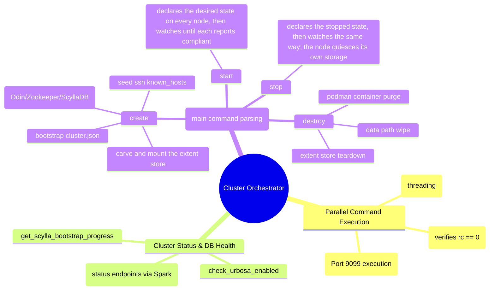

# Cluster Management & Lifecycle Utility - Technical Documentation

This document details the internal technical structure, functions, flows, and mindmaps of the cluster management utility (`cluster_new.py`).

## Technical Mindmap

## Function & Logic Breakdown

### `run_parallel(ips, cmd)`
- Spawns concurrent `threading.Thread` instances to execute commands on multiple IP targets in parallel using `run_remote_spark`.

### `run_remote_spark(ip, command)`
- Calls Spark's REST API execution endpoint on mTLS port `9099`.
- Locates mTLS credentials at local folders `/root/.certs/` or client directories.

### `run_checked_cmd(ip, command, allow_already_exists=False)`
- Runs `run_remote_spark` on a single node and checks return code.
- If command fails (return code != 0) and the error is not a harmless `"already exists"` warning, it prints the error and aborts execution with `sys.exit(1)`.

### `run_parallel_checked(ips, command, allow_already_exists=False)`
- Runs the specified command in parallel on list of target hosts.
- Aborts execution globally with `sys.exit(1)` if any node encounters a fatal error.

### `run_cql_query(cql_query, *args, **kwargs)`
- Submits CQL queries to the ScyllaDB cluster via the local Daruk proxy (`http://127.0.0.1:9043/query`) or direct `podman exec` to the container as fallback.

### `make_request(path, method="GET", payload=None)`
- Helper function that queries Spark REST endpoints over TLS. Tries the floating VIP first, falling back to localhost `127.0.0.1` on port `9099`.

### `main()` Command Processing

#### `cluster create`
- Writes `/etc/hci/cluster.json` on all nodes.
- Orchestrates formatting of storage drives to establish storage pools.
- Seeds TLS certs and SSH public keys to allow passwordless live migration.
- Fires up ZooKeeper (`Odin`), ScyllaDB (`HydraDB`), and launches application daemons.

#### `cluster status`
- Queries host systems, service container states, and keyspaces to report health metrics.
- `--verbose` prints detailed pool allocations, node roles, and disk layout.

#### `cluster start`
- Writes the desired state through `POST /api/v1/cluster/state` on each node and then watches
  the nodes' published status until every service is compliant or one reports an error. The CLI
  names no service: the declared service table, with its units and dependency order, lives in
  the reconcile loop in `spark_daemon_decoded.py`. See [cluster_state.md](./cluster_state.md).

#### `cluster stop`
- The same shape inverted: it declares the stopped state and watches. The node drains the
  storage journals and unmounts the extent store itself, immediately before the storage daemon
  stops, and in the reverse of the start order.

#### `cluster destroy`
- Confirms first: the operator types `destroy`, or passes `-y`/`--yes`. A non-interactive
  stdin without `--yes` is refused, and the prompt runs ahead of the cluster lock and every
  phase (`confirm_destroy` in `cluster_new.py`, pinned by `test_destroy_confirmation.py`).
- Purges systemd unit templates, deletes Podman containers, removes storage targets, and cleans `/var/lib/hci` configuration directories.
