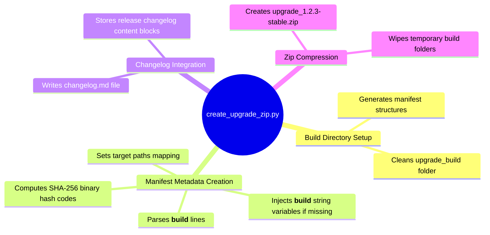

# Create Upgrade ZIP Utility - Technical Documentation

This document details the internal technical structure, functions, flowcharts, and mindmaps of the package compilation utility (`create_upgrade_zip.py`).

## Technical Mindmap

## Function & Logic Breakdown

### Component Mapping
- Tracks key system binaries and target installation directories:
  - `spark` -> `/usr/local/bin/spark`
  - `cluster` -> `/usr/local/bin/cluster`
  - `spark-daemon` -> `/usr/local/bin/spark-daemon`
  - [other 18 services/utilities mapping]

### Manifest & Hash Generation (`main()`)
- Copies each script into the temporary build folder `upgrade_build/`.
- Scans files for a `__build__` string parameter value.
- If missing, sets it to target version `"1.2.3-stable"` and injects it below shebangs.
- Computes a SHA-256 checksum of the compiled script.
- Records output properties in the `components` schema array inside `manifest.json`:
  - `file`: local filename in zip
  - `sha256`: file checksum hash digest
  - `target_path`: target installation endpoint path
  - `version`: build number version string

### Archive Packaging
- Compresses the contents of the `upgrade_build/` folder into `upgrade_1.2.3-stable.zip`.
- Deletes the temporary `upgrade_build/` folder to clean up.
