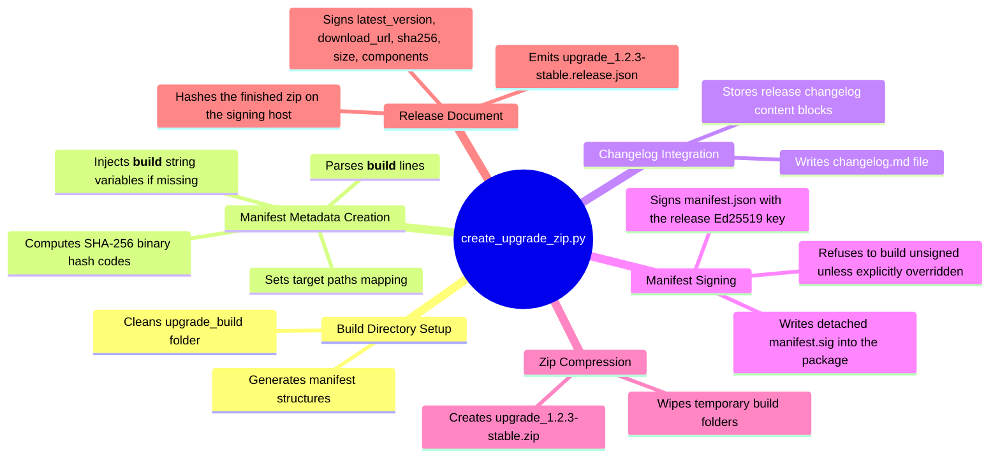

# Create Upgrade ZIP Utility - Technical Documentation

This document details the internal technical structure, functions, flowcharts, and mindmaps of the package compilation utility (`create_upgrade_zip.py`).

## Technical Mindmap

```mermaid
mindmap
  root((create_upgrade_zip.py))
    Build Directory Setup
      Cleans upgrade_build folder
      Generates manifest structures
    Manifest Metadata Creation
      Parses __build__ lines
      Injects __build__ string variables if missing
      Sets target paths mapping
      Computes SHA-256 binary hash codes
    Changelog Integration
      Writes changelog.md file
      Stores release changelog content blocks
    Manifest Signing
      Signs manifest.json with the release Ed25519 key
      Writes detached manifest.sig into the package
      Refuses to build unsigned unless explicitly overridden
    Zip Compression
      Creates upgrade_1.2.3-stable.zip
      Wipes temporary build folders
    Release Document
      Hashes the finished zip on the signing host
      Signs latest_version, download_url, sha256, size, components
      Emits upgrade_1.2.3-stable.release.json
```

## Function & Logic Breakdown

### Component Mapping
- Tracks key system binaries and target installation directories:
  - `spark` -> `/usr/local/bin/spark`
  - `cluster` -> `/usr/local/bin/cluster`
  - `spark-daemon` -> `/usr/local/bin/spark-daemon`
  - [other 18 services/utilities mapping]

### Manifest & Hash Generation (`main()`)
- Copies each script into the temporary build folder `upgrade_build/`.
- Scans files for a `__build__` string parameter value.
- If missing, sets it to target version `"1.2.3-stable"` and injects it below shebangs.
- Computes a SHA-256 checksum of the compiled script.
- Records output properties in the `components` schema array inside `manifest.json`:
  - `file`: local filename in zip
  - `sha256`: file checksum hash digest
  - `target_path`: target installation endpoint path
  - `version`: build number version string

### `resolve_signing_key()`
- Locates the release Ed25519 signing key (`HELIOS_RELEASE_SIGNING_KEY`, default
  `~/.helios/release_ed25519.key`) **before** any file is copied.
- Aborts with the `openssl genpkey` instructions if there is none: an unsigned package is
  refused by every node that has a key pinned, so discovering the missing key after the
  zip exists just produces an artefact nobody can install.
- Returns `None` only when `HELIOS_ALLOW_UNSIGNED_UPDATES` is set to its exact value,
  which prints a banner and produces a deliberately unsigned build.

### Manifest Signing
- `helios_sig.sign_manifest_file()` writes `manifest.sig` beside `manifest.json` inside the
  build directory, so it is packaged like any other file.
- The signature covers the exact bytes of `manifest.json`. Every component digest lives in
  that manifest, so one signature transitively covers every file in the package and the
  install path each one claims — which is what makes those digests worth checking, since
  on their own they only ever certified the package against itself.

### Archive Packaging
- Compresses the contents of the `upgrade_build/` folder into `upgrade_1.2.3-stable.zip`.
- Deletes the temporary `upgrade_build/` folder to clean up.

### `write_release_document(...)`
- Hashes the finished zip **here**, on the machine holding the signing key, and signs
  `latest_version`, `release_date`, `download_url`, `sha256`, `size`, `changelog`,
  `components` and `manifest_sha256` as one document.
- Emits `upgrade_1.2.3-stable.release.json`, which the update server publishes verbatim as
  the body of `/api/v1/releases/latest`. A digest the update host computes for a file the
  update host serves asserts nothing; this one is asserted by the signer.
- `HELIOS_RELEASE_DOWNLOAD_URL` overrides the download URL (default
  `https://updates-helios.zerotwo.cloud/downloads/<zip>`). A non-https URL aborts the
  build rather than being signed.
- With no signing key it emits the flat, unsigned legacy shape, which every node refuses
  unless the transition override is set. See [update_signing.md](./update_signing.md).
