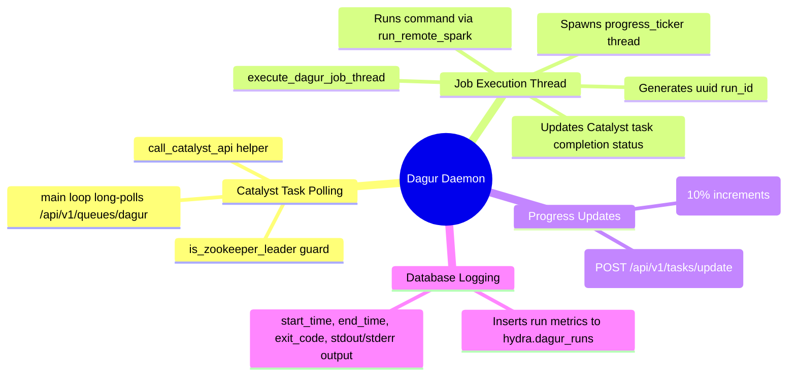

# Dagur (Task Scheduler Daemon) - Technical Documentation

This document details the internal technical structure, functions, flowcharts, and mindmaps of the Dagur background job execution worker.

## Technical Mindmap

## Function & Logic Breakdown

### `call_catalyst_api(path, payload=None, method="GET")`
- Performs HTTP API calls targeting Catalyst running locally on `http://127.0.0.1:9091`.
- Handles payload JSON encoding and parses responses. Returns HTTP status and decoded JSON object.

### `insert_dagur_run(job_name, start_time, run_id, end_time, status, exit_code, output)`
- Formats and inserts job run stats into ScyllaDB table `hydra.dagur_runs`. Escapes single quotes and backslashes in task outputs to prevent CQL execution syntax errors.

### `execute_dagur_job_thread(task_id, job_name, command)`
- Coordinates executing a scheduled task:
  1. Generates a unique execution `run_id`.
  2. Inserts a `RUNNING` status record into `hydra.dagur_runs`.
  3. Spawns `ticker_thread` to periodically increment task progress (5% -> 95%) in Catalyst.
  4. Runs the actual scheduled command via `run_remote_spark` targeting localhost `127.0.0.1`.
  5. Joins `ticker_thread` and sends the final `completed` (or `failed`) update to Catalyst with `100` progress.
  6. Updates the final execution record in `hydra.dagur_runs` with start/end time stamps and logs.

### `main()` Loop
- Main execution entry point.
- Every iteration:
  1. Checks `is_zookeeper_leader()`. If not the leader, sleeps for 2 seconds and retries (prevents duplicate cron runs on cluster followers).
  2. Requests a task from the Catalyst queue `/api/v1/queues/dagur`.
  3. If a task is returned (200 OK), extracts details and spins up a daemonized `execute_dagur_job_thread` to run the task asynchronously.
  4. If queue is empty (204 No Content) or errors occur, sleeps 2 seconds.
