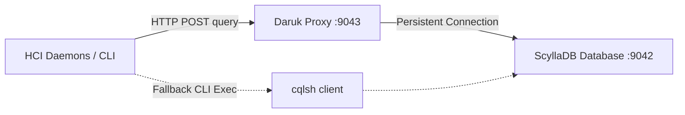

# Daruk (ScyllaDB Query Proxy)

Daruk is the persistent CQL HTTP Proxy that sits in front of the **Hydra (ScyllaDB)** metadata database.

> [!NOTE]
> **Name Origin:** In *The Legend of Zelda: Breath of the Wild*, **Daruk** is the Goron Champion who possesses the power of **Daruk's Protection**—a spherical red energy shield that deflects all external attacks. Similarly, **Daruk** acts as a protective query shield in front of ScyllaDB, shielding the database from the overhead of spawning containerized `cqlsh` Python sessions repeatedly and preventing database connection exhaustion.

## Purpose

Spawning a new containerized Python CQL shell (`cqlsh`) for every database read/write operation is extremely CPU-expensive, taking up to 1-2 seconds per request. 

To solve this:
1. **Daruk** runs inside the `systemd-hydra-db` container.
2. It maintains a single, persistent native python `cassandra-driver` connection to the local ScyllaDB instance.
3. It listens on `127.0.0.1:9043` and handles incoming CQL queries via lightweight HTTP POST requests, completing queries in under 2ms.
4. Clients fall back to raw `cqlsh` execution via host-level `podman exec` if **Daruk** is not active. Note that this fallback only works for host-level services; containerized services (like Spectrum) lack `podman` inside their environment and rely entirely on Daruk being online.

---

## Technical Architecture



---

## Integration and Cluster Management

To prevent systemd boot dependency loops (where systemd tries to start the proxy on reboot and subsequently forces `hydra-db` to boot up prematurely when the cluster is supposed to be in a stopped state):

1. **Disabled Auto-Start**: The `daruk.service` unit is *not* enabled on system boot (it has no `[Install]` section).
2. **Cluster Lifecycle Managed**:
   - `cluster start` starts the `daruk` service on all nodes after verifying ScyllaDB has successfully started and is listening on port `9042`.
   - `cluster stop` stops `daruk` before stopping `hydra-db` to ensure a clean sequential shutdown.

---

## REST API Specification

### Execute Query
* **Endpoint**: `POST /query`
* **Address**: `http://127.0.0.1:9043`
* **Headers**: `Content-Type: text/plain`
* **Body**: Raw CQL statement string.

#### Response Example (Success)
```json
{
  "status": "success",
  "rows": [
    {
      "key": "urbosa_enabled",
      "value": "true"
    }
  ]
}
```

#### Response Example (Error)
```json
{
  "status": "error",
  "error": "Error details from Cassandra driver..."
}
```
