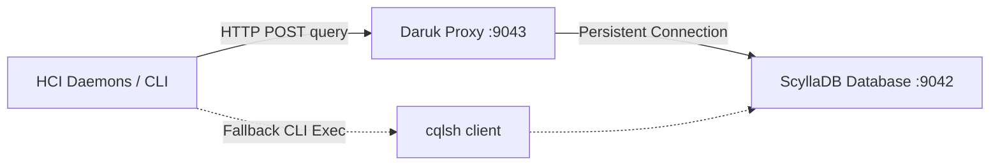

# Daruk (ScyllaDB Query Proxy)

Daruk is the persistent CQL HTTP Proxy that sits in front of the **Hydra (ScyllaDB)** metadata database.

> [!NOTE]
> **Name Origin:** In *The Legend of Zelda: Breath of the Wild*, **Daruk** is the Goron Champion who possesses the power of **Daruk's Protection**—a spherical red energy shield that deflects all external attacks. Similarly, **Daruk** acts as a protective query shield in front of ScyllaDB, shielding the database from the overhead of spawning containerized `cqlsh` Python sessions repeatedly and preventing database connection exhaustion.

## Purpose

Spawning a new containerized Python CQL shell (`cqlsh`) for every database read/write operation is extremely CPU-expensive, taking up to 1-2 seconds per request. 

To solve this:
1. **Daruk** runs inside the `systemd-hydra-db` container.
2. It maintains a single, persistent native python `cassandra-driver` connection to the local ScyllaDB instance.
3. It listens on `127.0.0.1:9043` and handles incoming CQL queries via lightweight HTTP POST requests, completing queries in under 2ms.
4. Clients fall back to raw `cqlsh` execution via host-level `podman exec` if **Daruk** is not active. Note that this fallback only works for host-level services; containerized services (like Spectrum) lack `podman` inside their environment and rely entirely on Daruk being online.

---

## Technical Architecture


```mermaid
graph LR
    Daemons["HCI Daemons / CLI"] -->|HTTP POST query| Daruk["Daruk Proxy :9043"]
    Daruk -->|Persistent Connection| ScyllaDB["ScyllaDB Database :9042"]
    
    Daemons -.->|Fallback CLI Exec| cqlsh["cqlsh client"]
    cqlsh -.-> ScyllaDB
```

---

## Integration and Cluster Management

To prevent systemd boot dependency loops (where systemd tries to start the proxy on reboot and subsequently forces `hydra-db` to boot up prematurely when the cluster is supposed to be in a stopped state):

1. **Disabled Auto-Start**: The `daruk.service` unit is *not* enabled on system boot (it has no `[Install]` section).
2. **Cluster Lifecycle Managed**:
   - `cluster start` starts the `daruk` service on all nodes after verifying ScyllaDB has successfully started and is listening on port `9042`.
   - `cluster stop` stops `daruk` before stopping `hydra-db` to ensure a clean sequential shutdown.

---

## REST API Specification

### Execute Query
* **Endpoint**: `POST /query`
* **Address**: `http://127.0.0.1:9043`
* **Headers**: `Content-Type: text/plain`
* **Body**: Raw CQL statement string.

#### Response Example (Success)
```json
{
  "status": "success",
  "rows": [
    {
      "key": "urbosa_enabled",
      "value": "true"
    }
  ]
}
```

#### Response Example (Error)
```json
{
  "status": "error",
  "error": "Error details from Cassandra driver..."
}
```

---

## Typed Compare-and-Swap Endpoints

`/query` runs whatever CQL it is handed and reports only whether the statement executed.
That is enough for a blind `UPDATE` and useless for a conditional one: a lightweight
transaction (LWT) that was *rejected* executed perfectly well, and every caller's
`run_cql_query()` flattens result rows into space-joined strings, so **"another host
already owns this VM" and "the claim succeeded" arrive as the same `rc=0`**. Ownership
writes were therefore unconditional in practice.

The `/v1/...` endpoints take **structured parameters instead of statement text**. The CQL
lives in Daruk's operation table and nowhere else, each statement is prepared once, and
values travel bound. A caller cannot supply CQL through them — there is no parameter that
accepts it.

### The applied / current contract

| Outcome | HTTP | Body |
| --- | --- | --- |
| The swap landed | `200` | `{"status": "success", "applied": true}` |
| The race was lost | `200` | `{"status": "success", "applied": false, "current": {...}}` |
| The request or the database failed | `400` | `{"status": "error", "error": "..."}` |

**A rejected compare-and-swap is a lost race, not a failure.** It is answered `200` on
purpose, so that a caller's generic error handling cannot turn a correctly refused claim
into a spurious outage. `applied` is the only field that says whether the write happened.

`current` holds the conditioned columns *as the database sees them now* — that is what lets
a caller say "the VM is already running on 10.10.102.42" rather than "the update failed".
It is returned only on rejection: on success the driver echoes the columns' *pre-image*,
which a caller could easily misread as the new state.

> [!NOTE]
> `current` values that are all null mean either a row that does not exist or a column that
> was never written; the two cannot be told apart from the result alone. Callers read the
> row before claiming it, which is where "no such VM" is decided.

### Operations

| Endpoint | Condition | Refused when |
| --- | --- | --- |
| `POST /v1/vm/claim` | `IF host_ip = ?` | another host holds the placement |
| `POST /v1/vm/release` | `IF host_ip = ?` | the caller is not the host of record |
| `POST /v1/vm/set-state` | `IF host_ip = ?` | the caller is not the host of record |
| `POST /v1/vm/migrate-lock` | `IF status != 'migrating'` | a migration is already in flight |
| `POST /v1/vm/migrate-unlock` | `IF status = 'migrating'` | this caller does not hold the lock |
| `POST /v1/vm/migrate-commit` | `IF host_ip = ? AND status = 'migrating'` | the source host or the lock changed |
| `POST /v1/vm/create` | `IF NOT EXISTS` | the name is already registered |
| `POST /v1/schedule/claim-job` | `IF last_run_epoch = ?` | another scheduler took this tick |
| `POST /v1/schedule/claim-check` | `IF last_run_epoch = ?` | another scheduler took this tick |
| `POST /v1/node/maintenance` | `IF status = ?` | the host is not in the expected state |
| `POST /v1/lock/acquire` | `IF NOT EXISTS` | another holder has the lock |
| `POST /v1/lock/renew` | `IF holder_token = ?` | the caller is not this acquisition |
| `POST /v1/lock/release` | `IF holder_token = ?` | the caller is not this acquisition |

`migrate-commit` moves the placement and drops the lock in one Paxos round. Two statements
would leave a window in which the VM is recorded on the target with the lock still held, or
unlocked while still recorded on the source — and a start arriving in that window picks the
wrong host.

### Claiming a scheduler tick

`last_run_epoch` is a schedule's clock and its lock at once. A scheduler reads it, decides
the job is due, and writes the current time back — a read-modify-write, and blind it submits
the job once per scheduler that reaches the row.

Two schedulers is not hypothetical. `is_zookeeper_leader()` probes ZooKeeper's four-letter
`stat` and, when the leader does not answer on port 9091, falls back to *"lowest node with
9091 open"*. A ZooKeeper that is slow, restarting or partitioned hands that answer to two
nodes at once, and both then believe they are the only scheduler. Both submit the same
backup, the same scrub, the same compaction, against the same volumes at the same moment.

`claim-job` covers `hydra.dagur_schedules` (keyed by `job_name`) and `claim-check` covers
`hydra.mimir_schedules` (keyed by `schedule_name`). They are two entries rather than one
with a table parameter: the table and its key column are part of the statement, and a
statement assembled from a request is what these endpoints exist to prevent.

```bash
# Two Catalysts that both read last_run_epoch = 1000 and both decided the job is due.
curl -s -X POST -H "Content-Type: application/json" \
  -d '{"job_name": "storage_scrub", "last_run_epoch": 5000, "expected_last_run_epoch": 1000}' \
  http://127.0.0.1:9043/v1/schedule/claim-job
# {"status": "success", "applied": true}
# {"status": "success", "applied": false, "current": {"last_run_epoch": 5000}}
```

`expected_last_run_epoch` is required, has no default, and is nullable. A default would
match every schedule whose clock has never been written and turn the claim back into the
blind write. Null is a real expected value: `last_run_epoch` is null, not `0`, for a
schedule inserted without one, and `IF last_run_epoch = 0` does not match a null.

The loser must skip the tick, not retry it — and so must a caller whose claim could not be
answered at all. A skipped tick runs on the next pass seconds later; a tick run twice
cannot be taken back.

### Cluster-wide locks

`hydra.cluster_locks` holds one row per named mutual exclusion. A lightweight transaction
cannot span partitions, so any exclusion that has to hold *across hosts* must condition on
a row every contender shares — which a scan of `hydra.nodes` is not, and never was. The
maintenance lock (`cluster-maintenance`) is the first user; see
[ring_lifecycle.md](./ring_lifecycle.md).

Three things make it a lock rather than a flag:

* **`IF NOT EXISTS`** — the check and the claim are one Paxos round. A refusal returns the
  whole existing row, so the caller's error can name the holder and its reason without a
  second read.
* **`holder_token`** — identifies one *acquisition*, not one node, and both `renew` and
  `release` condition on it. This is the holder token the migration lock lacks: matching
  on `holder` alone lets a stale release from a node's earlier, expired acquisition drop
  the lock that same node holds now.
* **`USING TTL`** — a node that dies holding the lock must not wedge the cluster until
  somebody deletes the row by hand. The TTL is short (300s for maintenance) and long
  operations renew it rather than asking for a longer one.

`renew` rewrites **every** non-key column, `holder_token` included. A column left out of
the `SET` keeps the original insert's TTL and expires first, after which the row is still
alive — other cells are live — but no longer renewable or releasable by its holder.

`acquired_at_ms` is a `bigint`, not a `timestamp`, because a refused `IF NOT EXISTS`
returns the whole row and `make_serializable` passes a driver `datetime` through
untouched — `json.dumps` would then raise on exactly the response that says who holds the
lock.

### Example

```bash
# Claim web-01 for this host, but only if nothing else holds it.
curl -s -X POST -H "Content-Type: application/json" \
  -d '{"name": "web-01", "host_ip": "10.10.102.41", "expected_host_ip": ""}' \
  http://127.0.0.1:9043/v1/vm/claim
# {"status": "success", "applied": true}

# The same claim from a second host, racing on the same read.
# {"status": "success", "applied": false, "current": {"host_ip": "10.10.102.41"}}
```

A misspelt parameter is a `400`, not a default. `{"expcted_host_ip": "..."}` would
otherwise fall back to `""` and turn the compare-and-swap into the unconditional claim the
endpoint exists to remove.

### `/query` refuses conditional statements

The daemons' `run_cql_query()` now **raises `ConditionalStatementError` when it is handed a
statement carrying an `IF` clause**, rather than running it. Its answer cannot express the
one thing that matters about a conditional write: Daruk renders a *rejected* lightweight
transaction as its row of values joined by spaces —

```
False 10.10.102.41
```

— and returns `rc=0`, which is indistinguishable from a successful write. Every caller that
used it for a compare-and-swap was reading lost races as wins.

The guard is in the daemons rather than in Daruk itself because `/query` has one legitimate
conditional caller: `helios_schema`, whose schema lock is an `IF NOT EXISTS` insert and a
conditional delete, and which parses the `[applied]` verdict positionally through
`lwt_applied()` — including the space-joined shape above. That lock cannot move to a typed
endpoint, because it runs *before* the schema exists and Daruk would need an operation-table
entry for a table nothing has created yet. Catalyst hands `ensure_schema()` an explicitly
named `run_conditional_cql_query()` for exactly that reason.

The keyword is looked for **outside quoted literals**. Dagur writes the stdout of arbitrary
jobs into `hydra.dagur_runs`, so a guard matching the raw text would refuse a run record
because a health check printed "check if the volume is mounted".

### Known limits

* The migration lock is a bare value with no holder identity and no expiry. A cleanup from
  a failed attempt that arrives after a *second* migration has taken the lock will match
  and release it. A holder token would fix that — `hydra.cluster_locks` demonstrates the
  shape, and the VM migration lock has not been moved onto it.
* An `UPDATE ... IF col = null` applies against a row that does not exist and creates a
  partial one. Endpoints whose callers pass a concrete expected value are unaffected.
  Verified again for `claim-job`: `{"expected_last_run_epoch": null}` against an unknown
  `job_name` returns `applied: true` and leaves a row holding only the key and the clock.
  Callers read the schedule before claiming it, which is where "no such job" is decided.
* A `/query` statement that selects a `timestamp` column fails inside Daruk —
  `make_serializable` passes the driver's `datetime` through and `json.dumps` raises — and
  the caller's `run_cql_query()` silently falls back to `podman exec cqlsh`. That fallback
  does not exist inside the Spectrum container. `hydra.schema_lock.acquired_at` is such a
  column, so a *refused* schema-lock acquisition takes the fallback on a host and fails
  outright in the container. `hydra.cluster_locks.acquired_at_ms` is a `bigint` for this
  reason; `schema_lock` has not been migrated.

---

## Command Examples & Verification

### A. Managing the Daruk Service
Because Daruk runs as a systemd service inside the container/host context, you can check its status:
```bash
# Check service status
systemctl status daruk

# View proxy request execution logs
journalctl -u daruk -n 20 --no-pager
```

### B. Verification via Curl Queries
To test Daruk's responsiveness directly from the host shell, execute an HTTP POST query request:
```bash
# Query nodes table through Daruk API
curl -X POST -H "Content-Type: text/plain" -d "SELECT hostname, ip, status FROM hydra.nodes;" http://127.0.0.1:9043/query

# Query specific settings key
curl -X POST -H "Content-Type: text/plain" -d "SELECT value FROM hydra.cluster_settings WHERE key = 'urbosa_enabled';" http://127.0.0.1:9043/query
```


---

## Technical Reference

For the internal code structure, class/function details, and execution flowcharts, see the [Technical Guide](./daruk_technical.md).
