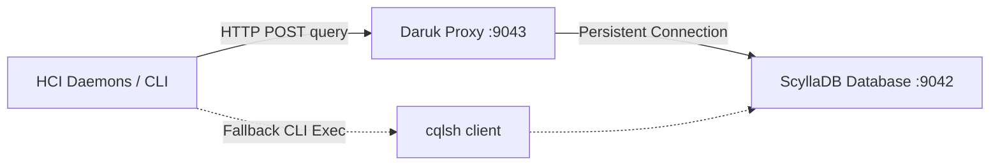

# Daruk (ScyllaDB Query Proxy)

Daruk is the persistent CQL HTTP Proxy that sits in front of the **Hydra (ScyllaDB)** metadata database.

> [!NOTE]
> **Name Origin:** In *The Legend of Zelda: Breath of the Wild*, **Daruk** is the Goron Champion who possesses the power of **Daruk's Protection**—a spherical red energy shield that deflects all external attacks. Similarly, **Daruk** acts as a protective query shield in front of ScyllaDB, shielding the database from the overhead of spawning containerized `cqlsh` Python sessions repeatedly and preventing database connection exhaustion.

## Purpose

Spawning a new containerized Python CQL shell (`cqlsh`) for every database read/write operation is extremely CPU-expensive, taking up to 1-2 seconds per request. 

To solve this:
1. **Daruk** runs inside the `systemd-hydra-db` container.
2. It maintains a single, persistent native python `cassandra-driver` connection to the local ScyllaDB instance.
3. It listens on `127.0.0.1:9043` and handles incoming CQL queries via lightweight HTTP POST requests, completing queries in under 2ms.
4. Clients fall back to raw `cqlsh` execution via host-level `podman exec` if **Daruk** is not active. Note that this fallback only works for host-level services; containerized services (like Spectrum) lack `podman` inside their environment and rely entirely on Daruk being online.

---

## Technical Architecture


```mermaid
graph LR
    Daemons["HCI Daemons / CLI"] -->|HTTP POST query| Daruk["Daruk Proxy :9043"]
    Daruk -->|Persistent Connection| ScyllaDB["ScyllaDB Database :9042"]
    
    Daemons -.->|Fallback CLI Exec| cqlsh["cqlsh client"]
    cqlsh -.-> ScyllaDB
```

---

## Integration and Cluster Management

To prevent systemd boot dependency loops (where systemd tries to start the proxy on reboot and subsequently forces `hydra-db` to boot up prematurely when the cluster is supposed to be in a stopped state):

1. **Disabled Auto-Start**: The `daruk.service` unit is *not* enabled on system boot (it has no `[Install]` section).
2. **Cluster Lifecycle Managed**:
   - `cluster start` starts the `daruk` service on all nodes after verifying ScyllaDB has successfully started and is listening on port `9042`.
   - `cluster stop` stops `daruk` before stopping `hydra-db` to ensure a clean sequential shutdown.

---

## REST API Specification

### Execute Query
* **Endpoint**: `POST /query`
* **Address**: `http://127.0.0.1:9043`
* **Headers**: `Content-Type: text/plain`
* **Body**: Raw CQL statement string.

#### Response Example (Success)
```json
{
  "status": "success",
  "rows": [
    {
      "key": "urbosa_enabled",
      "value": "true"
    }
  ]
}
```

#### Response Example (Error)
```json
{
  "status": "error",
  "error": "Error details from Cassandra driver..."
}
```

---

## Typed Compare-and-Swap Endpoints

`/query` runs whatever CQL it is handed and reports only whether the statement executed.
That is enough for a blind `UPDATE` and useless for a conditional one: a lightweight
transaction (LWT) that was *rejected* executed perfectly well, and every caller's
`run_cql_query()` flattens result rows into space-joined strings, so **"another host
already owns this VM" and "the claim succeeded" arrive as the same `rc=0`**. Ownership
writes were therefore unconditional in practice.

The `/v1/...` endpoints take **structured parameters instead of statement text**. The CQL
lives in Daruk's operation table and nowhere else, each statement is prepared once, and
values travel bound. A caller cannot supply CQL through them — there is no parameter that
accepts it.

### The applied / current contract

| Outcome | HTTP | Body |
| --- | --- | --- |
| The swap landed | `200` | `{"status": "success", "applied": true}` |
| The race was lost | `200` | `{"status": "success", "applied": false, "current": {...}}` |
| The request or the database failed | `400` | `{"status": "error", "error": "..."}` |

**A rejected compare-and-swap is a lost race, not a failure.** It is answered `200` on
purpose, so that a caller's generic error handling cannot turn a correctly refused claim
into a spurious outage. `applied` is the only field that says whether the write happened.

`current` holds the conditioned columns *as the database sees them now* — that is what lets
a caller say "the VM is already running on 10.10.102.42" rather than "the update failed".
It is returned only on rejection: on success the driver echoes the columns' *pre-image*,
which a caller could easily misread as the new state.

> [!NOTE]
> `current` values that are all null mean either a row that does not exist or a column that
> was never written; the two cannot be told apart from the result alone. Callers read the
> row before claiming it, which is where "no such VM" is decided.

### Operations

| Endpoint | Condition | Refused when |
| --- | --- | --- |
| `POST /v1/vm/claim` | `IF host_ip = ?` | another host holds the placement |
| `POST /v1/vm/release` | `IF host_ip = ?` | the caller is not the host of record |
| `POST /v1/vm/set-state` | `IF host_ip = ?` | the caller is not the host of record |
| `POST /v1/vm/migrate-lock` | `IF status != 'migrating'` | a migration is already in flight |
| `POST /v1/vm/migrate-unlock` | `IF status = 'migrating'` | this caller does not hold the lock |
| `POST /v1/vm/migrate-commit` | `IF host_ip = ? AND status = 'migrating'` | the source host or the lock changed |
| `POST /v1/vm/create` | `IF NOT EXISTS` | the name is already registered |
| `POST /v1/node/maintenance` | `IF status = ?` | the host is not in the expected state |

`migrate-commit` moves the placement and drops the lock in one Paxos round. Two statements
would leave a window in which the VM is recorded on the target with the lock still held, or
unlocked while still recorded on the source — and a start arriving in that window picks the
wrong host.

### Example

```bash
# Claim web-01 for this host, but only if nothing else holds it.
curl -s -X POST -H "Content-Type: application/json" \
  -d '{"name": "web-01", "host_ip": "10.10.102.41", "expected_host_ip": ""}' \
  http://127.0.0.1:9043/v1/vm/claim
# {"status": "success", "applied": true}

# The same claim from a second host, racing on the same read.
# {"status": "success", "applied": false, "current": {"host_ip": "10.10.102.41"}}
```

A misspelt parameter is a `400`, not a default. `{"expcted_host_ip": "..."}` would
otherwise fall back to `""` and turn the compare-and-swap into the unconditional claim the
endpoint exists to remove.

### Known limits

* The migration lock is a bare value with no holder identity and no expiry. A cleanup from
  a failed attempt that arrives after a *second* migration has taken the lock will match
  and release it. A holder token would fix that.
* An `UPDATE ... IF col = null` applies against a row that does not exist and creates a
  partial one. Endpoints whose callers pass a concrete expected value are unaffected.

---

## Command Examples & Verification

### A. Managing the Daruk Service
Because Daruk runs as a systemd service inside the container/host context, you can check its status:
```bash
# Check service status
systemctl status daruk

# View proxy request execution logs
journalctl -u daruk -n 20 --no-pager
```

### B. Verification via Curl Queries
To test Daruk's responsiveness directly from the host shell, execute an HTTP POST query request:
```bash
# Query nodes table through Daruk API
curl -X POST -H "Content-Type: text/plain" -d "SELECT hostname, ip, status FROM hydra.nodes;" http://127.0.0.1:9043/query

# Query specific settings key
curl -X POST -H "Content-Type: text/plain" -d "SELECT value FROM hydra.cluster_settings WHERE key = 'urbosa_enabled';" http://127.0.0.1:9043/query
```


---

## Technical Reference

For the internal code structure, class/function details, and execution flowcharts, see the [Technical Guide](./daruk_technical.md).
