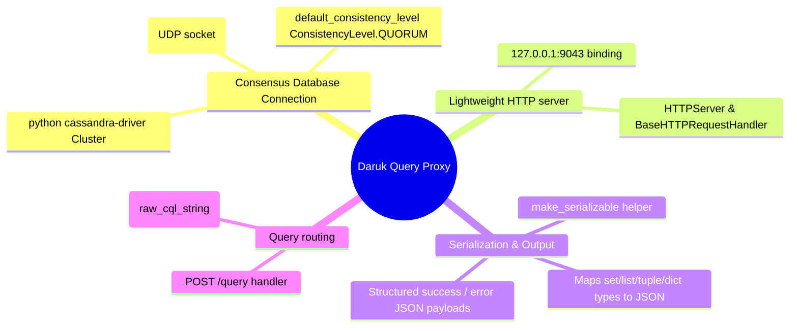

# Daruk (ScyllaDB Query Proxy) - Technical Documentation

This document details the internal technical structure, functions, flowcharts, and mindmaps of the Daruk CQL query proxy.

## Technical Mindmap

## Function & Logic Breakdown

### `get_local_ip()`
- Instantiates a UDP socket (`socket.AF_INET`, `socket.SOCK_DGRAM`) and attempts a connection to `10.255.255.255`.
- Returns the local bound interface IP address.
- Fallback: `127.0.0.1`.

### Database Driver Initialization
- `cluster = Cluster([LOCAL_IP])`
- `session = cluster.connect()`
- `session.default_consistency_level = ConsistencyLevel.QUORUM`: Enforces cluster-wide data write and read quorum consistency across nodes for all proxied queries.

### `make_serializable(obj)`
- Recursively traverses Cassandra driver query returns.
- Converts non-serializable datatypes (sets, row tuple subclasses, custom iterable models) into JSON-safe dictionaries and lists.

### `CQLProxyHandler` (HTTP Handler)
- **`POST /query`**:
  1. Decodes post payload as UTF-8 (contains the raw CQL statement string).
  2. Runs statement via the persistent Cassandra driver `session.execute(post_data)`.
  3. Iterates over rows, calling `_asdict()` or extracting `_fields` to serialize data.
  4. Encodes and returns success JSON payload containing data list: `{"status": "success", "rows": [...]}` on port 200.
  5. Catches exceptions and returns error payload: `{"status": "error", "error": "details"}` on port 400.
- All other endpoints or HTTP verbs return a `404 Not Found` response.

### `run()`
- Binds standard `HTTPServer` on `127.0.0.1:9043` to start serving query proxies.
