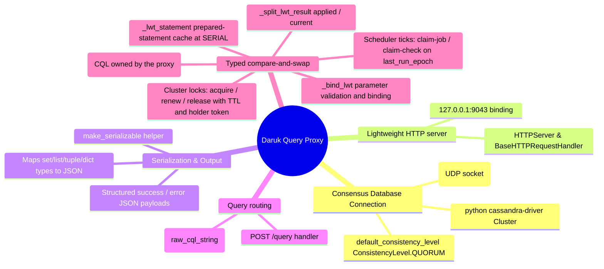

# Daruk (ScyllaDB Query Proxy) - Technical Documentation

This document details the internal technical structure, functions, flowcharts, and mindmaps of the Daruk CQL query proxy.

## Technical Mindmap


```mermaid
mindmap
  root((Daruk Query Proxy))
    Consensus Database Connection
      python cassandra-driver Cluster
      LOCAL_IP dynamic resolution (UDP socket)
      default_consistency_level ConsistencyLevel.QUORUM
    Lightweight HTTP server
      127.0.0.1:9043 binding
      HTTPServer & BaseHTTPRequestHandler
    Serialization & Output
      make_serializable helper
      Maps set/list/tuple/dict types to JSON
      Structured success / error JSON payloads
    Query routing
      POST /query handler
      session.execute(raw_cql_string)
    Typed compare-and-swap
      LWT_OPS operation table (CQL owned by the proxy)
      _bind_lwt parameter validation and binding
      _lwt_statement prepared-statement cache at SERIAL
      _split_lwt_result applied / current
      Cluster locks: acquire / renew / release with TTL and holder token
      Scheduler ticks: claim-job / claim-check on last_run_epoch
```

## Function & Logic Breakdown

### `get_local_ip()`
- Instantiates a UDP socket (`socket.AF_INET`, `socket.SOCK_DGRAM`) and attempts a connection to `10.255.255.255`.
- Returns the local bound interface IP address.
- Fallback: `127.0.0.1`.

### Database Driver Initialization
- `cluster = Cluster([LOCAL_IP])`
- `session = cluster.connect()`
- `session.default_consistency_level = ConsistencyLevel.QUORUM`: Enforces cluster-wide data write and read quorum consistency across nodes for all proxied queries.

### `make_serializable(obj)`
- Recursively traverses Cassandra driver query returns.
- Converts non-serializable datatypes (sets, row tuple subclasses, custom iterable models) into JSON-safe dictionaries and lists.

### `CQLProxyHandler` (HTTP Handler)
- **`POST /query`**:
  1. Decodes post payload as UTF-8 (contains the raw CQL statement string).
  2. Runs statement via the persistent Cassandra driver `session.execute(post_data)`.
  3. Iterates over rows, calling `_asdict()` or extracting `_fields` to serialize data.
  4. Encodes and returns success JSON payload containing data list: `{"status": "success", "rows": [...]}` on port 200.
  5. Catches exceptions and returns error payload: `{"status": "error", "error": "details"}` on port 400.
- All other endpoints or HTTP verbs return a `404 Not Found` response.

### `run()`
- Binds standard `HTTPServer` on `127.0.0.1:9043` to start serving query proxies.

---

## Compare-and-Swap Internals

### `LWT_OPS`
The whole surface of the typed endpoints: a dict keyed by URL path, each entry holding

| Key | Meaning |
| --- | --- |
| `cql` | the statement, owned by the proxy — never assembled from a request |
| `binds` | the ordered names whose values fill the statement's `?` placeholders |
| `params` | the caller-supplied parameters, each with a `type` and either `required` or a `default` |
| `fixed` | values the proxy supplies and a caller cannot name (the migration lock string) |

`binds` may repeat a name — `migrate-lock` binds the lock value twice, once as the value to
write and once as the value to compare against, and `/v1/lock/renew` binds `holder_token`
twice, once to rewrite it and once to condition on it.

A bind marker is not confined to the value list: `/v1/lock/acquire` ends
`IF NOT EXISTS USING TTL ?` and `/v1/lock/renew` begins `UPDATE ... USING TTL ?`, so the
TTL is bound like any other parameter rather than spliced into the statement text.
Verified against Scylla 5.4 through the prepared-statement path, along with binding an
`int` to a `bigint` millisecond column.

### `_bind_lwt(op_path, op, params)`
Validates the request body and returns the bound tuple, or raises `ValueError`.

- **Unknown keys are rejected, not ignored.** A misspelt `expected_host_ip` would otherwise
  fall back to its default and turn the compare-and-swap into an unconditional claim.
- Missing required parameters are rejected. `release` deliberately has no default expected
  owner: a release that matches any owner is the blind write these endpoints replace.
- `bool` is refused where an `int` is due. `isinstance(True, int)` is `True` in Python, so
  an unguarded check would register a VM with one vcpu because a caller sent `true`.
- `null` is accepted only for parameters marked `nullable`, because `IF col = null` is a
  real condition that matches a column which was never written.

### `_lwt_statement(cql)`
Prepares once and caches by statement text. Each prepared statement is pinned to
`ConsistencyLevel.QUORUM` and `serial_consistency_level = ConsistencyLevel.SERIAL`. Without
SERIAL the compare and the swap are not one Paxos round and the endpoint is back to being
the blind write it replaced. LWT results are never retried at a weaker consistency level,
degradable failure or not: a QUORUM failure on a conditional write means we do not know who
owns the row, and guessing is how both sides of a partition come to own the same VM.

### `_split_lwt_result(rows)`
Returns `(applied, current)`.

- Reads the verdict from **column 0 positionally**, guarded by `column_names[0] ==
  "[applied]"`. `ResultSet.was_applied` is deliberately not used: it is only readable
  *before* the result set is iterated and raises `RuntimeError` afterwards, so a handler
  that also wants the conflicting values has to get the order right or crash.
- Raises when there is no `[applied]` column at all, rather than assuming success — see the
  `INSERT ... JSON` note below.

---

## Observed Scylla Behaviour

Verified against the live cluster (Scylla 5.4, `release_version` 3.0.8, python
`cassandra-driver` 3.26.3). These are the behaviours the endpoints are built on.

| Case | Result |
| --- | --- |
| Rejected LWT | `[applied] = false` plus the conditioned columns **as they stand now** |
| Applied LWT | `[applied] = true` plus the same columns holding their **pre-image** |
| `IF status != 'migrating'` against a null `status` | **applies** — a null satisfies `!=` |
| `IF col = ''` against an absent row | does not apply (null is not `''`) |
| `IF col = null` against an absent row | **applies, and creates a partial row** |
| `IF col = null` against a row whose `col` is null | applies |
| `IF <bigint col> = <int>` | applies; a Python `int` binds to a `bigint` |
| `INSERT ... IF NOT EXISTS`, refused | returns the whole existing row |
| Statement with no `IF` | no rows and `column_names is None` |
| `IF NOT EXISTS USING TTL ?` | accepted; the TTL binds as the last parameter |
| A row renewed past its insert marker's TTL | still exists; a competing `IF NOT EXISTS` is still refused |
| `DELETE ... IF col = <concrete>` on an absent row | does not apply |
| `UPDATE ... IF <bigint col> = <concrete>` on an absent row | does not apply, and creates nothing |
| A `timestamp` column in an LWT result | comes back as a `datetime`, which `make_serializable` does not convert |
| A `timestamp` column in a `/query` result | Daruk answers `400` (`json.dumps` raises), and the caller falls back to `cqlsh` |
| `UPDATE hydra.nodes ... WHERE ip = ?` | rejected outright — `ip` is not the partition key |

The last one is why `hydra.cluster_locks.acquired_at_ms` is a `bigint`. A refused
`IF NOT EXISTS` returns the whole row, and `json.dumps` raises on a `datetime` — on
exactly the response that tells a caller who holds the lock. Any future conditional
endpoint over a table with a `timestamp` column hits the same edge.

The driver reports the column as `[applied]` in `ResultSet.column_names` but sanitises it to
`applied` in each row's `_fields`/`_asdict()`, because `[applied]` is not a valid Python
identifier. Code that matches on the literal `"[applied]"` inside a row dict finds nothing.

> [!WARNING]
> **`INSERT INTO <table> JSON ? IF NOT EXISTS` is accepted by Scylla and then executed
> unconditionally.** It returns no `[applied]` column, no rows, and it overwrites the
> existing row. Appending `IF NOT EXISTS` to a JSON insert therefore *looks* like a fix and
> does nothing. `/v1/vm/create` lists its columns explicitly for this reason, and
> `_split_lwt_result` raises rather than reporting a compare-and-swap that never happened.

---

## The conditional-statement guard in `run_cql_query`

Every daemon carries its own copy of `run_cql_query()`. Each copy now refuses a statement
that carries an `IF` clause, raising `ConditionalStatementError` before any I/O.

### Why the guard is in the callers and not in Daruk

`/query` has one legitimate conditional caller. `helios_schema` takes its schema lock with
`INSERT ... IF NOT EXISTS USING TTL` and releases it with `DELETE ... IF holder = ?`, and it
reads the verdict itself through `lwt_applied()`, which handles both the cqlsh table form
and Daruk's space-joined values. It cannot move to a typed endpoint: it runs *before* the
schema exists, so Daruk would need an operation-table entry for a table nothing has created
yet. Catalyst therefore hands `ensure_schema()` a function named
`run_conditional_cql_query()` — the same body without the guard, named so the exception is
visible at the call site rather than implied.

### Detection

```
statement with its single-quoted literals blanked out
  → matches ^\s*(insert|update|delete|begin)\b .* \bif\b   → refuse
```

Two things that look like details and are not:

* **Literals are blanked first.** Dagur writes the stdout of arbitrary jobs into
  `hydra.dagur_runs`, Catalyst and Mipha write task error messages. Any of them can contain
  the word "if", and a guard matching the raw statement would refuse the run record instead
  — losing the job history rather than protecting anything. A doubled quote (`''`) is an
  escaped quote inside a literal, not the end of one.
* **DDL is excluded.** `CREATE TABLE IF NOT EXISTS` is not a compare-and-swap and its result
  carries nothing a caller needs. Refusing it would stop every daemon from starting.

The guard is not the fix for any current bug — after this change no daemon builds a
conditional statement as text at all. It is there so the class cannot come back the next
time somebody appends `IF ...` to an existing call and the tests still pass.

> [!NOTE]
> `replace_run_cql.py` used to regenerate `run_cql_query()` across the tree from a
> hardcoded, guard-less template, so re-running it silently reverted the
> conditional-write guard everywhere. It has been deleted: its `static_dir` pointed
> at a path from a different machine, so it had not been runnable for some time, and
> a generator that can silently undo a safety check is not worth keeping. There are
> still several hand-maintained copies of `run_cql_query`; consolidating them into one
> module is tracked in TODO.md.