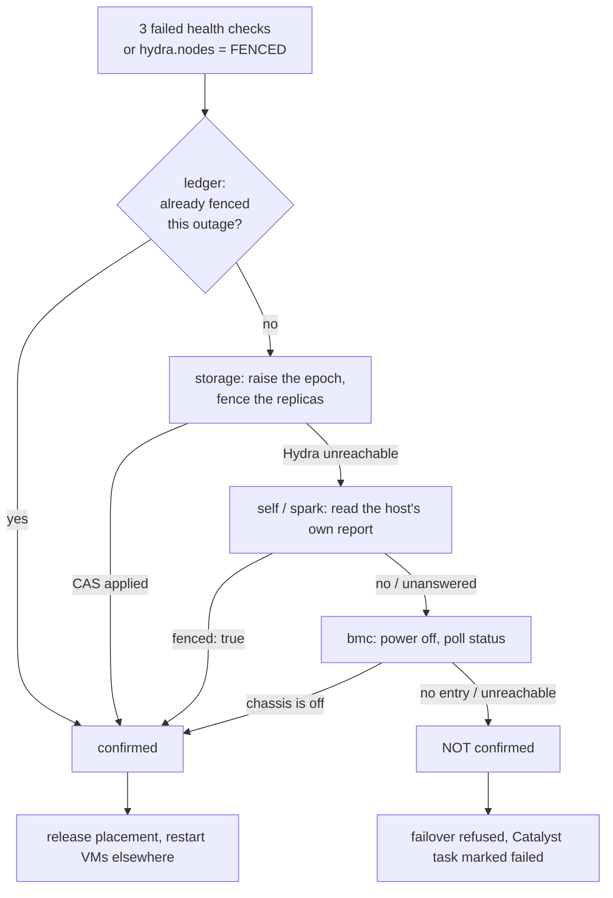

# Fencing

> [!NOTE]
> **The storage rung used to be an inference and is now an action, and that reordered the
> ladder.** With DRBD there was no way to reach into an unreachable host and stop it
> writing its own local copy, so this rung read quorum and *inferred* that a host which
> could not see a majority was already failing its own I/O — sound, but conditional on
> quorum being armed and on there being more than two nodes. Under [Sidon](./sidon.md) it
> raises the epoch on the dead host's vdisks and every replica then refuses its appends,
> so it runs **first**: it is the only unconditional rung, and spark and BMC drop to
> hygiene. §5 keeps the old reasoning, because the ways a storage fence can look like it
> works and not work are worth not rediscovering.

## 1. Why this is the whole problem

If Mipha starts a second copy of a VM on a healthy host while the first copy is still
running on the failed one, two qemu processes write the same disk with two independent
views of its filesystem. The result is not a merge conflict; it is a destroyed filesystem,
usually within seconds, and no later repair recovers it.

Under [Sidon](./sidon.md) the storage layer refuses the second writer by itself — that is
what §3 is — but the refusal has to be *made*, and making it is what fencing is. The
danger has not gone away; it has become something the cluster can act on rather than
something it has to reason about.

The guard has always been stated as "fence first, then fail over". Until this work the
fence was one request to `spark-daemon` **on the host being fenced**:

```python
fence_cmd = "systemctl stop libvirtd virtqemud || true; pkill -9 qemu || true"
rc, _, _ = run_remote_spark(ip, fence_cmd)
return rc == 0
```

Three defects, each of which alone is enough to lose a disk:

1. **It asks the wedged host to fence itself.** A host whose storage stack has hung, or
   whose kernel is livelocked, answers ICMP and can complete a TCP handshake while
   executing nothing.
2. **Every clause ends in `|| true`**, so the shell exits 0 whatever happened. `rc == 0`
   means "spark-daemon accepted the request". It has never meant "no qemu is running".
3. **The return value was discarded at the call site**, and the fence was only attempted
   when the host still answered ping — so a host that had gone *silent*, the one case the
   fence exists for, was assumed dead on no evidence at all.

Separately, the liveness check that triggers all of this is a ping plus a `spark-daemon`
reply. Both keep answering on a host whose storage or libvirt has died, so a partially
failed host is reported healthy, keeps its VMs, and is never evacuated.

---

## 2. The ladder

`fence_host()` in `mipha.py` tries four methods in order. Every rung must **read back**
the state it claims to have produced. "Could not tell" is recorded as a failure, never as
a success, and the first rung that confirms stops the ladder.

| Rung | What it does | What it proves |
| :--- | :--- | :--- |
| `storage` | Raises the epoch on every vdisk the host owns, and fences every reachable replica at the new epoch | The host's next write is refused, whether or not it knows or is reachable |
| `self` | Reads that the host already fenced itself (`hydra.nodes.status = FENCED`) | The host stopped its own guests and detached its vdisks, and verified it locally |
| `spark` | `POST /api/v1/host/fence` — kill guests, stop libvirt, detach vdisks — then reads back the post-state | No guest process and no vdisk still attached on that host |
| `bmc` | `ipmitool chassis power off`, then polls `chassis power status` until it reads `off` | The chassis has no power |

**Storage runs first, and that is a reversal.** It used to be last, because it could only
*infer* that a host had stopped writing; now it *makes* it stop, so it is the only
unconditional rung and anything tried before it would be something weaker tried first. The
rest are no longer safety mechanisms — a wedged host still holds a VIP and still burns
CPU, and stopping that is worth doing — but data safety no longer waits on any of them.



**A host already confirmed fenced during this outage is not fenced again.** The ledger
records confirmations only — a fence that *failed* is retried on the next pass, which is
what you want, while powering off a chassis that is already off costs a failover time it
does not have. A host that answers its health check again clears its own record, so the
next outage is decided on its own evidence.

---

## 3. Rung 1 — storage, the one that always works

The cluster owns the storage, and under Sidon that is enough on its own. Ownership of a
vdisk is an `(owner, epoch)` pair in Hydra; every journal append carries its writer's
epoch; and every replica persists the highest epoch it has been fenced at, fsynced before
the fence is acknowledged. Fencing is therefore two writes and no cooperation:

```
1. CAS in Hydra:      (dead_host, e) -> (nobody, e+1)
2. FENCE every reachable replica at e+1, in parallel
```

After step 2 the deposed host's next append meets a refusal. It does not have to agree, or
be reachable, or be running, or know that anything happened. It can be wedged, lying about
its own state, or convinced it is still the owner.

This rung needs Hydra and nothing else. It works on two nodes, with no BMC, with no quorum
arithmetic and no minimum node count. It is the only rung that has to succeed.

### Why the old design could not do this

Worth keeping, because the reasons were specific to DRBD and the obvious readings of "cut
the host off from its storage" still do not work in general:

* **Disconnecting the resource on the survivors did nothing to the failed host.** DRBD
  replication is peer-to-peer; the old Primary went on writing its own local copy exactly
  as before, and now without replicating.
* **`linstor resource delete <deadnode> <res>` was not a fence.** It needed the satellite
  on that node to carry it out. Against an unreachable node it recorded an intent. It was
  storage *cleanup*, and calling it fencing would have been a lie.
* **Promoting the resource on the survivor proved nothing either.** DRBD's refusal to
  allow two Primaries is enforced across a *connection*. Once the connection was gone the
  promotion check had no peer to consult, and `drbdadm primary` on the survivor and the
  old Primary on the failed host coexisted happily, each certain it was the only one.

What was left was to read DRBD quorum and *infer* that a host which could not see a
majority was already failing its own I/O. Sound, but conditional: it needed quorum armed
(and reading the flag was not enough — `drbdsetup status` reported `quorum: true` both
when a majority was held and when quorum was switched off entirely), it needed more than
two nodes for a majority to exist, and where those did not hold nothing could be
confirmed.

The difference is that Sidon's replicas enforce the fence themselves, at the point where
the write arrives, rather than the deposed host's own kernel being relied on to notice
something and stop.

---

## 4. Rung 3 — in-band, through Spark

`POST /api/v1/host/fence` with `{"confirm": true}` runs on the target host and returns
the state it can observe afterwards:

```json
{
  "fenced": false,
  "libvirt_active": false,
  "qemu_pids": [4211],
  "primary_resources": ["vm-web01"],
  "open_devices": ["vm-web01/0"],
  "actions": ["destroy web01: ok", "secondary vm-web01: State change failed: (-12) Device is held open by someone"],
  "detail": "the fence did not take -- guest processes still running: [4211]; still Primary on vm-web01"
}
```

It answers `200` when `fenced` is true and `409` when it is not, and the body is the same
either way, because the body *is* the evidence. Mipha reads the 409 body — a fence is the
one call where the failure detail is the point.

The sequence is: write the fence marker; `virsh destroy` each running domain; stop
`libvirtd`/`virtqemud` and their sockets; SIGKILL any surviving `qemu*` process found in
`/proc`; detach every attached vdisk — **checked, never forced**; then re-read everything.

The detach is not forced, and that is the same reasoning the demotion it replaced rested
on: a detach that is refused is exactly the information the caller needs. Forcing it past
a process that still holds the socket would not make that process stop writing; it would
only stop us finding out.

A `spark-daemon` too old to have the endpoint (a rolling upgrade) falls back to the
legacy command — and then runs `pgrep -a qemu`, because the legacy command's exit status
is worthless. If that verification cannot be read, the rung fails.

**What this rung does and does not prove.** A confirmed spark fence means the target
reported no guest process and no vdisk still attached. It does not defend against a host
that is lying: a compromised or badly malfunctioning `spark-daemon` can return whatever it
likes. That is inherent to in-band fencing, and it is why this rung is no longer the one
safety rests on — §3 runs first and never asks the host anything.

---

## 5. Rung 4 — out-of-band, through the BMC

### Where the credentials live

`/etc/hci/fencing.json`, mode `0600`, root-owned, **on every host**. Not in ScyllaDB, for
two reasons:

* The database is frequently part of what has failed when a fence is needed. Reading
  fencing credentials out of the thing you are trying to recover reproduces the
  chicken-and-egg the old fence already had.
* Anything in `hydra` is replicated to every node and readable by anything that can
  query it, including the web tier. Chassis power-off credentials for the whole cluster
  do not belong there.

Mipha only runs the failover loop on the ZooKeeper leader, and leadership moves, so the
file has to be present and identical on all hosts.

```json
{
  "unconfirmed_fence_policy": "block",
  "bmc": {
    "defaults": {
      "interface": "lanplus",
      "privilege_level": "OPERATOR",
      "power_off_timeout_seconds": 60
    },
    "hosts": {
      "helios-node-b": {
        "address": "10.9.0.2",
        "username": "helios-fence",
        "password_file": "/etc/hci/fencing.d/helios-node-b.pw"
      },
      "helios-node-c": {
        "address": "10.9.0.3",
        "username": "helios-fence",
        "password": "inline-is-allowed-but-worse"
      }
    }
  },
  "self_fence": {
    "enabled": true,
    "threshold": 3,
    "interval_seconds": 10,
    "grace_seconds": 180,
    "auto_recover_after_clean_seconds": 0,
    "release_zookeeper_leadership": true
  }
}
```

Hosts are keyed by hostname, with the IP accepted as an alias. `defaults` is merged under
each entry, so a per-host value overrides it rather than replacing the block.

### When credentials are absent, unusable, or badly protected

* **Absent** — the rung reports `no BMC entry for <host>; out-of-band fencing is not
  configured for this host` and the ladder falls through to storage. Absent never means
  "assume the fence worked".
* **`ipmitool` not installed** — reported as such, and the rung fails. It is not in the
  Helios base image today; installing it is a prerequisite for this rung, and
  `mipha --fence-status` says so on the host it is missing from.
* **File readable by anyone but root** — the whole `bmc` section is discarded with a
  loud warning, and every fence attempt logs it. A `password_file` with the same problem
  is refused individually. Power-off credentials for the cluster silently taken from a
  world-readable file would be a worse outcome than a fence that does not run.

### The password never reaches the command line

`/proc/<pid>/cmdline` is world-readable, so `ipmitool -P <password>` publishes the secret
to every account on the host for the duration of the fence. Helios passes `-E` and puts
the value in `IPMI_PASSWORD` in the child's environment, restoring the process
environment afterwards. A test asserts the password never appears in argv.

### Nothing here treats exit status 0 as a power-off

`ipmitool` returns 0 for a chassis command the BMC accepted and then failed to carry out,
and for a session opened against the wrong host entirely. The only evidence that counts is
polling `chassis power status` until it reads `Chassis Power is off`. If it never does
within `power_off_timeout_seconds`, the rung fails and says what the BMC last answered.

---

## 6. The gate

`failover_permitted(fence, config)` is the decision, kept as one function rather than a
condition buried in the control loop:

* **fence confirmed** → the failover proceeds, exactly as before.
* **not confirmed, `unconfirmed_fence_policy: "block"` (the default)** → the host is still
  marked `DOWN`, so Vali stops placing new work there, but **nothing is released and
  nothing is restarted**. The Catalyst parent task is marked `failed` with the reason, so
  the refusal is visible in the UI rather than only in a journal nobody is reading. The
  loop retries on the next pass, so the failover starts by itself the moment Hydra is
  reachable again or the operator powers the host off.
* **not confirmed, `unconfirmed_fence_policy: "failover"`** → it proceeds anyway, with a
  warning on every occurrence. This is available on purpose and is not the default: a
  cluster may rather risk it than lose HA, but it has to say so.

The parent Catalyst task is created *before* the fence, not after it, so a refused
failover is as visible as one that ran.

---

## 7. Self-fencing

The watchdog runs on **every** host, not only the leader, because the failure it detects
is local and the host is the only party that can see it.

### What it monitors

Every 10 seconds, three probes, each returning `ok`, `failed` or **`unknown`**:

| Probe | Method | `failed` means |
| :--- | :--- | :--- |
| `libvirt` | `virsh -c qemu:///system list --name` | libvirt is not answering |
| `drbd_control` | `drbdsetup status --json` parses, and this host has `.res` files | the storage control plane is dead |
| storage serviceability | per Primary resource, from the status document | see below |

`unknown` is load-bearing. A probe that could not reach a verdict — `virsh` not installed,
Sidon momentarily not answering — never escalates to the tier that destroys running
guests. That distinction is what stops a slow probe from evacuating a healthy host.

A vdisk is **unserviceable** when Sidon reports it **degraded**: its drain has failed. The
guest's writes are still safe in the journal, but the journal is no longer emptying, so
the disk will backpressure and stop. That is the local-origin equivalent of the old
"Primary without quorum" — the guest is not broken yet and will be.

There are fewer causes than there were, and the missing ones are worth naming. DRBD had
three: `quorum-lost`, `io-failures`, and `no-data` (a failed local disk with no `UpToDate`
peer — a failed local disk *with* one was deliberately not listed, because DRBD 9 turned
the node into a diskless client and kept serving over the network). Sidon has no quorum to
lose, and a read whose local copy is damaged is repaired from a replica transparently, so
what is left is the case where this node can no longer make progress.

### Two tiers

**Quarantine** — publish `hydra.nodes.status = DEGRADED`. Vali already refuses to place on
any host whose status is not exactly `NORMAL`, so this needs no scheduler change. The host
keeps running what it has and stops receiving more. Reversible: the host leaves quarantine
by itself when the probes are clean again.

This is the answer for **libvirt being dead**, and the reasoning matters. When `libvirtd`
dies, qemu keeps running and the guests keep working; only management is lost. Destroying
them would be a self-inflicted outage, and failing them over while they are still writing
would be the corruption this whole document is about. Losing management of a working VM is
not a reason to destroy it.

**Fence** — stop the guests, detach every vdisk, publish `FENCED`. Reserved for
conditions where the guests are *already* broken, so stopping is strictly better than
continuing.

Concretely, "take itself out" is: write the marker; call the local
`POST /api/v1/host/fence`, or a short built-in fallback if `spark-daemon` is itself dead;
verify; release ZooKeeper leadership; publish the status.

### Guarding against a self-fence that should not have happened

A self-fence that fires on a blip evacuates a healthy host. So:

* **Three consecutive passes** (30 s) of the same condition. One good pass resets the
  counter to zero — a failure, a recovery and another failure do not add up to a fence.
* **A startup grace period** of 180 s. Sidon replays journals and re-establishes peers
  during startup; without this, every probe fires at once on boot.
* **`unknown` never escalates** to the hard tier.
* **A host in maintenance is exempt.** A host being drained on purpose looks a great deal
  like a host whose storage is failing.
* **A single-node cluster never self-fences.** There is nowhere for the guests to be
  restarted, so it would be a pure outage with no safety benefit whatsoever.
* **Every storage trigger requires a peer that answers.** If nothing else is up, killing
  the guests here does not get them started anywhere else, so the host quarantines
  instead.
* **`"enabled": false`** switches the whole thing off.

The peer check is the one behaviour that got *stricter* rather than looser, and it is a
real regression worth stating. DRBD's `quorum-lost` was exempt from it: losing quorum
**is** a majority test, so if we had lost it a majority existed elsewhere by definition,
whether or not it was answering us right now. A failed drain proves nothing of the kind —
the extent store may simply be full, on a cluster where nothing else is wrong — so with no
peer answering, the outcome here is quarantine rather than fence.

### Leadership

A self-fenced host that holds ZooKeeper leadership is a problem: the Mipha leader does not
monitor itself, so nothing would evacuate it, and Purah would keep running on a host whose
storage has just been declared unserviceable. The fence therefore stops the local
`zookeeper` so a healthy node takes over — but **only at three nodes or more**, because
below that the remaining ensemble could not form a quorum either. On a two-node cluster
the fence still stops the guests and detaches the vdisks, and then logs that coordination
stays put until an operator intervenes.

One thing this used to be worse. Under LINSTOR the controller itself lived on a replicated
volume the leader had to hold Primary and mounted, so a self-fenced leader took the
cluster's whole control plane with it unless leadership moved. Sidon's block map is in
Hydra, which every node can write, so leadership decides who *acts* and not who holds the
only copy of anything.

### Coming back

Deliberately manual: `mipha --clear-self-fence` on the fenced host. It re-runs the probe
and prints it, refuses if the fault is still present (`--force` overrides), removes the
marker, returns `hydra.nodes` to `NORMAL`, and restarts ZooKeeper if the fence stopped it.

A host that destroyed its own guests had a real fault, and a host that returns to service
by itself is a host that can take VMs and drop them again on a loop. Automatic recovery
exists behind `auto_recover_after_clean_seconds`, and defaults to 0 — off.

---

## 8. What remains unsafe

Stated precisely, because an over-claimed fence is worse than a missing one.

### 8.1 Hydra unreachable

The one way left to reach an unconfirmed fence. If `hydra.dfs_vdisks` cannot be read or
the compare-and-swap cannot be made, nothing can be fenced — and the default is to
**refuse the failover**: the VMs stay placed on the failed host and stay down until an
operator acts.

Unlike its predecessor this is obviously right rather than regrettable. Promoting a VM
whose disk ownership cannot be moved is precisely the split-brain the ladder exists to
prevent, and a cluster whose metadata layer is unreachable has a larger problem than one
host being down.

It becomes a *safety* failure only if the operator sets
`unconfirmed_fence_policy: "failover"`. Then Helios will restart the guests on a host it
cannot prove has stopped, and if that host is still running them, their disks are
destroyed. The setting exists because some clusters would rather take that risk than lose
HA; nothing in this design makes it safe.

### 8.2 ~~Two-node clusters have no storage fence~~ — resolved

Kept because it shaped the design. DRBD quorum needed a majority, a two-replica resource
on a two-node cluster had no third vote, and LINSTOR's diskless tiebreaker needed a third
node to place it on — so on a two-node cluster the storage rung could never confirm and
**a BMC was not optional**. Three nodes was the first configuration where it stood on its
own.

Epoch fencing is not a vote. Two nodes is fine, and so is one.

### 8.3 The in-band rung trusts the host it is fencing

A confirmed spark fence rests on the target's own report: a compromised or badly
malfunctioning `spark-daemon` can return `fenced: true` regardless. In-band fencing cannot
close this; that is what the BMC rung is for. It matters much less than it did, because
the storage rung runs first and does not consult the host at all.

### 8.4 ~~Quorum loses the last unreplicated writes~~ — resolved

Kept because it is the failure the journal's write-all rule was chosen to avoid. Between a
partition starting and DRBD noticing it, the isolated Primary could complete writes its
peers never received; when it rejoined, the split-brain policy discarded the divergent
copy in favour of the survivor's. Correct — the survivor is the one that has been serving
the guest — and still lost data for that window.

Sidon does not acknowledge a write that has not reached every replica. A guest whose peer
is unreachable gets EIO and knows the write did not happen, rather than being told it did
and having it discarded later. That is the trade: availability during single-replica loss,
in exchange for never losing an acknowledged write.

### 8.5 A self-fenced host that cannot reach the database

The fence itself is local and works regardless. Publishing `FENCED` needs Daruk and
ScyllaDB. If that write cannot be made, the leader keeps seeing a host that answers its
health check and never evacuates it. The guests are stopped, so this is an outage rather
than corruption, and the watchdog retries the write on every pass.

### 8.6 A self-fence that did not fully take

If a guest could not be killed or a vdisk refused to detach, the host publishes
`DEGRADED`, **not** `FENCED`. `FENCED` is a claim the leader acts on by skipping its own
ladder entirely, so it may only be published by a fence that verified. The leader then has
to prove the fence itself, and will refuse the failover if it cannot.

### 8.7 Nothing here fences the network

There is no fabric control in Helios, so a host cannot be cut off at the switch. The
storage rung is the substitute, and it is now a complete one for the purpose that matters:
a partitioned host cannot write. It can still hold a VIP and still answer clients, which
network fencing would stop and this does not.

### 8.8 A local storage fault with no peer to ask

The one behaviour that genuinely regressed. DRBD's quorum loss *was* a majority test, so a
node could self-fence on it without checking that any peer was reachable. A failed drain
proves nothing of the kind — the extent store may simply be full — so the peer check now
applies to every local storage fault, and with no peer answering the outcome is quarantine
rather than fence.

---

## 9. Operating it

```bash
# What fencing this host could actually perform, and what it could not.
mipha --fence-status

# Return a host that fenced itself to service (run it on that host).
mipha --clear-self-fence
mipha --clear-self-fence --force     # the fault is still present and you know it

# Watch a fence happen.
journalctl -u mipha -f --no-pager | grep -E 'Fence|Self-Fence'
```

`--fence-status` on the live single-node cluster:

```
Fencing configuration : /etc/hci/fencing.json (absent -- defaults in use)
Unconfirmed fence     : block

Out-of-band (BMC) coverage, 1 host(s) in the cluster:
  ipmitool is NOT installed on this host: no BMC fence can run from here.
  Valkyrie-997A49          no BMC entry -- power fencing unavailable

Storage fencing:
  ARMED -- 15 vdisk(s) in the map, 11 owned by this host.
  Fencing a host raises the epoch on the vdisks it owns; every replica then rejects its writes.
  This works on two nodes, with no BMC, and against a host that is wedged or unreachable. There is nothing to arm.

Self-fencing          : enabled (threshold 3 x 10s)
```

---

## 10. The Spark endpoint this added

It follows `spark_api.md`'s rules: no caller-supplied command fragments, argv lists with
`shell=False`, structured responses, validated at the boundary.

| Method | Path | Body / Query | Returns |
| :-- | :-- | :-- | :-- |
| POST | `/api/v1/host/fence` | `{"confirm":true}` | `200`/`409` with the verification report |

`/host/fence` exists because the fence has to be verified on the host that ran it, and
because one implementation shared by the remote fence and the self-fence is better than
two that drift.

There were two. `GET /api/v1/storage/drbd/options` returned a resource's *configured*
options, and existed for one reason: `drbdsetup status` reported `quorum: true` both when
a majority was genuinely held and when quorum was switched off entirely, so the rung had
to read the configuration rather than the status to know whether its own evidence meant
anything. Nothing needs it now — the storage rung neither reads a flag nor infers from
one.

---

## 11. Related

* [mipha.md](./mipha.md) — the HA coordinator this is part of
* [mipha_technical.md](./mipha_technical.md) — function-level reference
* [sidon.md](./sidon.md) — the storage layer this rests on: ownership, epochs, the
  write-all journal
* [aether.md](./aether.md) — its predecessor, kept as history
* [spark_api.md](./spark_api.md) — the typed API contract these two endpoints follow
* [ring_lifecycle.md](./ring_lifecycle.md) — the other half of "a host went away": the
  ScyllaDB ring, which fencing deliberately does not touch
