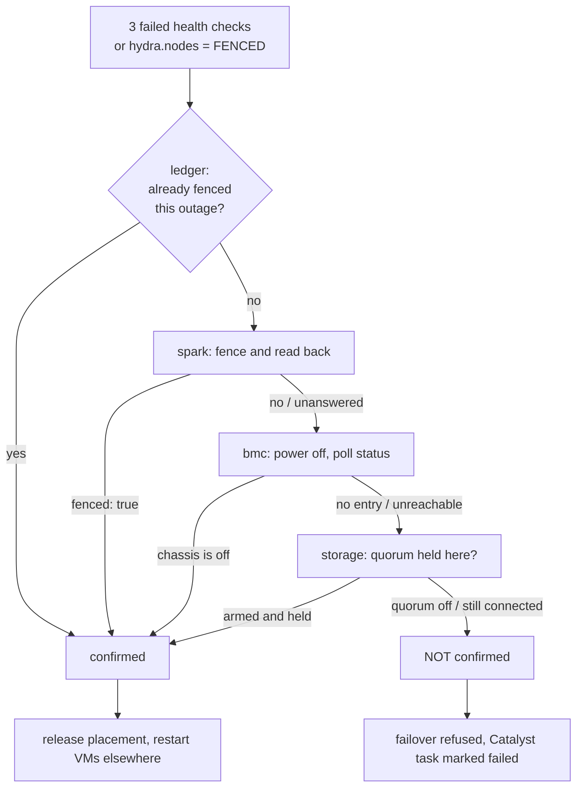

# Fencing

How Helios establishes that a failed host has stopped writing, before it restarts that
host's VMs somewhere else — and, precisely, when it cannot.

This is the Nutanix "Acropolis HA needs a fence" problem. Mipha is the HA manager; this
document is the part of Mipha that decides whether a failover is allowed to happen at
all.

---

## 1. Why this is the whole problem

A VM's disk is a raw DRBD device, opened directly by qemu. If Mipha starts a second copy
of a VM on a healthy host while the first copy is still running on the failed one, two
qemu processes write the same block device with two independent views of its filesystem.
The result is not a merge conflict; it is a destroyed filesystem, usually within seconds,
and no later repair recovers it.

The guard has always been stated as "fence first, then fail over". Until this work the
fence was one request to `spark-daemon` **on the host being fenced**:

```python
fence_cmd = "systemctl stop libvirtd virtqemud || true; pkill -9 qemu || true"
rc, _, _ = run_remote_spark(ip, fence_cmd)
return rc == 0
```

Three defects, each of which alone is enough to lose a disk:

1. **It asks the wedged host to fence itself.** A host whose storage stack has hung, or
   whose kernel is livelocked, answers ICMP and can complete a TCP handshake while
   executing nothing.
2. **Every clause ends in `|| true`**, so the shell exits 0 whatever happened. `rc == 0`
   means "spark-daemon accepted the request". It has never meant "no qemu is running".
3. **The return value was discarded at the call site**, and the fence was only attempted
   when the host still answered ping — so a host that had gone *silent*, the one case the
   fence exists for, was assumed dead on no evidence at all.

Separately, the liveness check that triggers all of this is a ping plus a `spark-daemon`
reply. Both keep answering on a host whose storage or libvirt has died, so a partially
failed host is reported healthy, keeps its VMs, and is never evacuated.

---

## 2. The ladder

`fence_host()` in `mipha.py` tries four methods in order. Every rung must **read back**
the state it claims to have produced. "Could not tell" is recorded as a failure, never as
a success, and the first rung that confirms stops the ladder.

| Rung | What it does | What it proves |
| :--- | :--- | :--- |
| `self` | Reads that the host already fenced itself (`hydra.nodes.status = FENCED`) | The host stopped its own guests and gave up Primary, and verified it locally |
| `spark` | `POST /api/v1/host/fence` — kill guests, stop libvirt, demote DRBD — then reads back the post-state | No guest process, no open DRBD device, no Primary resource on that host |
| `bmc` | `ipmitool chassis power off`, then polls `chassis power status` until it reads `off` | The chassis has no power |
| `storage` | Reads DRBD quorum from the surviving replicas | The failed host's own kernel is already failing its writes |



**A host already confirmed fenced during this outage is not fenced again.** The ledger
records confirmations only — a fence that *failed* is retried on the next pass, which is
what you want, while powering off a chassis that is already off costs a failover time it
does not have. A host that answers its health check again clears its own record, so the
next outage is decided on its own evidence.

---

## 3. Rung 2 — in-band, through Spark

`POST /api/v1/host/fence` with `{"confirm": true}` runs on the target host and returns
the state it can observe afterwards:

```json
{
  "fenced": false,
  "libvirt_active": false,
  "qemu_pids": [4211],
  "primary_resources": ["vm-web01"],
  "open_devices": ["vm-web01/0"],
  "actions": ["destroy web01: ok", "secondary vm-web01: State change failed: (-12) Device is held open by someone"],
  "detail": "the fence did not take -- guest processes still running: [4211]; still Primary on vm-web01"
}
```

It answers `200` when `fenced` is true and `409` when it is not, and the body is the same
either way, because the body *is* the evidence. Mipha reads the 409 body — a fence is the
one call where the failure detail is the point.

The sequence is: write the fence marker; `virsh destroy` each running domain; stop
`libvirtd`/`virtqemud` and their sockets; SIGKILL any surviving `qemu*` process found in
`/proc`; drop the mounts Mipha's own storage loop put on DRBD devices; `drbdadm secondary`
every Primary resource — **checked, never `--force`**; then re-read everything.

Two details that matter:

* **The marker is written first.** `linstor_ha_loop()` re-promotes `linstor-db` and the
  container resources within two seconds on whichever node holds ZooKeeper leadership, so
  a fence that demoted before the loop knew to stand down would be undone before it
  finished. `self_fence_is_active()` forces that loop into its follower branch.
* **`drbdadm secondary` is not forced.** A demotion that is refused is exactly the
  information the caller needs. Forcing it past a process that still holds the device
  would not make that process stop writing; it would only stop us finding out.

A `spark-daemon` too old to have the endpoint (a rolling upgrade) falls back to the
legacy command — and then runs `pgrep -a qemu` and reads `/api/v1/storage/drbd/status`,
because the legacy command's exit status is worthless. If that verification cannot be
read, the rung fails.

**What this rung does and does not prove.** A confirmed spark fence means the target's
kernel reported no process holding the DRBD device and *accepted a demotion to Secondary*
— DRBD refuses to demote a device that is open, so the demotion succeeding is real
evidence that the writer is gone. It does not defend against a host that is lying: a
compromised or badly malfunctioning `spark-daemon` can return whatever it likes. That is
inherent to in-band fencing and is the reason the BMC rung exists.

---

## 4. Rung 3 — out-of-band, through the BMC

### Where the credentials live

`/etc/hci/fencing.json`, mode `0600`, root-owned, **on every host**. Not in ScyllaDB, for
two reasons:

* The database is frequently part of what has failed when a fence is needed. Reading
  fencing credentials out of the thing you are trying to recover reproduces the
  chicken-and-egg the old fence already had.
* Anything in `hydra` is replicated to every node and readable by anything that can
  query it, including the web tier. Chassis power-off credentials for the whole cluster
  do not belong there.

Mipha only runs the failover loop on the ZooKeeper leader, and leadership moves, so the
file has to be present and identical on all hosts.

```json
{
  "unconfirmed_fence_policy": "block",
  "bmc": {
    "defaults": {
      "interface": "lanplus",
      "privilege_level": "OPERATOR",
      "power_off_timeout_seconds": 60
    },
    "hosts": {
      "helios-node-b": {
        "address": "10.9.0.2",
        "username": "helios-fence",
        "password_file": "/etc/hci/fencing.d/helios-node-b.pw"
      },
      "helios-node-c": {
        "address": "10.9.0.3",
        "username": "helios-fence",
        "password": "inline-is-allowed-but-worse"
      }
    }
  },
  "self_fence": {
    "enabled": true,
    "threshold": 3,
    "interval_seconds": 10,
    "grace_seconds": 180,
    "auto_recover_after_clean_seconds": 0,
    "release_zookeeper_leadership": true
  }
}
```

Hosts are keyed by hostname, with the IP accepted as an alias. `defaults` is merged under
each entry, so a per-host value overrides it rather than replacing the block.

### When credentials are absent, unusable, or badly protected

* **Absent** — the rung reports `no BMC entry for <host>; out-of-band fencing is not
  configured for this host` and the ladder falls through to storage. Absent never means
  "assume the fence worked".
* **`ipmitool` not installed** — reported as such, and the rung fails. It is not in the
  Helios base image today; installing it is a prerequisite for this rung, and
  `mipha --fence-status` says so on the host it is missing from.
* **File readable by anyone but root** — the whole `bmc` section is discarded with a
  loud warning, and every fence attempt logs it. A `password_file` with the same problem
  is refused individually. Power-off credentials for the cluster silently taken from a
  world-readable file would be a worse outcome than a fence that does not run.

### The password never reaches the command line

`/proc/<pid>/cmdline` is world-readable, so `ipmitool -P <password>` publishes the secret
to every account on the host for the duration of the fence. Helios passes `-E` and puts
the value in `IPMI_PASSWORD` in the child's environment, restoring the process
environment afterwards. A test asserts the password never appears in argv.

### Nothing here treats exit status 0 as a power-off

`ipmitool` returns 0 for a chassis command the BMC accepted and then failed to carry out,
and for a session opened against the wrong host entirely. The only evidence that counts is
polling `chassis power status` until it reads `Chassis Power is off`. If it never does
within `power_off_timeout_seconds`, the rung fails and says what the BMC last answered.

---

## 5. Rung 4 — storage, the one that always exists

Even with no BMC, the cluster owns the storage. It is worth being exact about what that
buys, because the obvious readings of "cut the host off from its DRBD resources" do not
work:

* **Disconnecting the resource on the survivors does nothing to the failed host.** DRBD
  replication is peer-to-peer; the old Primary goes on writing its own local copy exactly
  as before, and now without replicating.
* **`linstor resource delete <deadnode> <res>` is not a fence.** It needs the satellite on
  that node to carry it out. Against an unreachable node it records an intent. It is
  storage *cleanup*, and calling it fencing would be a lie.
* **Promoting the resource here proves nothing either.** DRBD's refusal to allow two
  Primaries is enforced across a *connection*. Once the connection is gone, the promotion
  check has no peer to consult; `drbdadm primary` on the survivor and the old Primary on
  the failed host coexist happily, each certain it is the only one.

What does work is a property the failed host's own kernel enforces without any
cooperation from its userspace: **DRBD quorum**.

With `quorum majority` and `on-no-quorum io-error`, a node that cannot see a majority of
a resource's nodes fails every I/O on that resource. Two disjoint sets cannot both be a
majority. So if a surviving replica holds quorum, the failed host by definition does not,
and its writes are **already erroring** — before Mipha does anything at all.

`storage_fence_assert()` confirms only when, for **every** resource the failed host backs,
all of the following read true from a surviving replica:

1. the configured `quorum` is `majority`, `all`, or a number greater than half the
   resource's node count — `quorum 1` is satisfied by every node alone, so both sides of
   a partition would hold it;
2. the configured `on-no-quorum` is `io-error` or `suspend-io` — a suspended writer is
   not writing, which is the same safety property with a different user experience;
3. this survivor's devices all report `quorum: true`;
4. the connection to the failed host is not `Connected`.

Partial coverage is not coverage: one unarmed resource out of two blocks the whole
assertion, because the VM on the unarmed one is the one that gets two writers.

### Reading the flag is not enough — this is the trap

`drbdsetup status --json` reports `"quorum": true` on a device **both** when a majority is
held **and** when quorum is switched off entirely. A storage fence built on that flag
alone would confirm on every cluster that has no quorum at all. That is why
`GET /api/v1/storage/drbd/options` was added: it returns the *configured* options from
`drbdsetup show --json`, which is the only place the distinction exists.

Verified on the live single-node cluster: every resource reports `"quorum": true` in the
status document while `drbdsetup show` reports `"quorum": "off"`, and the assertion
correctly refuses.

### Arming it

LINSTOR arms quorum by itself on clusters that can hold one. The live cluster carries
LINSTOR's defaults:

```
DrbdOptions/Resource/on-no-quorum        io-error
DrbdOptions/auto-add-quorum-tiebreaker   True
```

and sets `DrbdOptions/Resource/quorum` per resource-definition to `majority` once the
resource has enough nodes, or `off` when it does not. On the single-node test cluster it
is `off` on every resource, which is correct — there is no majority of one to hold.

To arm it explicitly:

```bash
# one resource
linstor resource-definition drbd-options --quorum majority --on-no-quorum io-error <resource>
# everything created from now on
linstor controller set-property DrbdOptions/auto-quorum io-error
```

`mipha --fence-status` prints these when it finds an unarmed resource.

Worth knowing but not required: `on-suspended-primary-outdated force-secondary` (DRBD
9.1+) makes a suspended, outdated Primary demote itself rather than merely disconnect.
Helios leaves it at LINSTOR's `disconnect` default; `io-error` already stops the writes.

---

## 6. The gate

`failover_permitted(fence, config)` is the decision, kept as one function rather than a
condition buried in the control loop:

* **fence confirmed** → the failover proceeds, exactly as before.
* **not confirmed, `unconfirmed_fence_policy: "block"` (the default)** → the host is still
  marked `DOWN`, so Vali stops placing new work there, but **nothing is released and
  nothing is restarted**. The Catalyst parent task is marked `failed` with the reason, so
  the refusal is visible in the UI rather than only in a journal nobody is reading. The
  loop retries on the next pass, so the failover starts by itself the moment the operator
  powers the host off or arms quorum.
* **not confirmed, `unconfirmed_fence_policy: "failover"`** → it proceeds anyway, with a
  warning on every occurrence. This is available on purpose and is not the default: a
  cluster may rather risk it than lose HA, but it has to say so.

The parent Catalyst task is created *before* the fence, not after it, so a refused
failover is as visible as one that ran.

---

## 7. Self-fencing

The watchdog runs on **every** host, not only the leader, because the failure it detects
is local and the host is the only party that can see it.

### What it monitors

Every 10 seconds, three probes, each returning `ok`, `failed` or **`unknown`**:

| Probe | Method | `failed` means |
| :--- | :--- | :--- |
| `libvirt` | `virsh -c qemu:///system list --name` | libvirt is not answering |
| `drbd_control` | `drbdsetup status --json` parses, and this host has `.res` files | the storage control plane is dead |
| storage serviceability | per Primary resource, from the status document | see below |

`unknown` is load-bearing. A probe that could not reach a verdict — `virsh` not installed,
`drbdsetup` failing on a node that backs no resources — never escalates to the tier that
destroys running guests. That distinction is what stops a slow probe from evacuating a
healthy host.

A Primary resource is **unserviceable** for one of three causes:

* `quorum-lost` — a device reports `quorum: false`. With `on-no-quorum io-error` the
  guest's writes are already failing, and a majority exists elsewhere.
* `io-failures` — `force-io-failures` or `suspended-quorum` on the resource. Same effect
  on the guest, local origin.
* `no-data` — the local disk is `Failed`/`Detaching` **and** no connected peer is
  `UpToDate`. A failed local disk *with* a healthy peer is deliberately not listed: DRBD 9
  turns the node into a diskless client and keeps serving over the network, the guest
  never notices, and fencing it would be an outage we caused.

### Two tiers

**Quarantine** — publish `hydra.nodes.status = DEGRADED`. Vali already refuses to place on
any host whose status is not exactly `NORMAL`, so this needs no scheduler change. The host
keeps running what it has and stops receiving more. Reversible: the host leaves quarantine
by itself when the probes are clean again.

This is the answer for **libvirt being dead**, and the reasoning matters. When `libvirtd`
dies, qemu keeps running and the guests keep working; only management is lost. Destroying
them would be a self-inflicted outage, and failing them over while they are still writing
would be the corruption this whole document is about. Losing management of a working VM is
not a reason to destroy it.

**Fence** — stop the guests, give up Primary on every DRBD resource, publish `FENCED`.
Reserved for conditions where the guests are *already* broken, so stopping is strictly
better than continuing — and, the point, it makes the host provably safe to fail over with
no BMC anywhere in the cluster.

Concretely, "take itself out" is: write the marker (so `linstor_ha_loop` stands down);
call the local `POST /api/v1/host/fence`, or a short built-in fallback if `spark-daemon`
is itself dead; verify; release ZooKeeper leadership; publish the status.

### Guarding against a self-fence that should not have happened

A self-fence that fires on a blip evacuates a healthy host. So:

* **Three consecutive passes** (30 s) of the same condition. One good pass resets the
  counter to zero — a failure, a recovery and another failure do not add up to a fence.
* **A startup grace period** of 180 s. Resources come up Secondary and without quorum
  during `drbdadm up`; without this, every probe fires at once on boot.
* **`unknown` never escalates** to the hard tier.
* **A host in maintenance is exempt.** A host being drained on purpose looks a great deal
  like a host whose storage is failing.
* **A single-node cluster never self-fences.** There is nowhere for the guests to be
  restarted, so it would be a pure outage with no safety benefit whatsoever.
* **The `no-data` and `io-failures` triggers additionally require a peer that answers.**
  If nothing else is up, killing the guests here does not get them started anywhere else,
  so the host quarantines instead. `quorum-lost` is exempt from this check: losing quorum
  *is* a majority test, so if we lost it a majority exists elsewhere by definition,
  whether or not it is answering us right now.
* **`"enabled": false`** switches the whole thing off.

Note the consequence of the last exemption: on a cluster where DRBD quorum is not armed,
the `quorum-lost` trigger can never fire, so the hard tier only reacts to local device
faults. That is safe — it never fires spuriously — and it is also the honest limit: with
no quorum, self-fencing does not protect against a network partition.

### Leadership

A self-fenced host that holds ZooKeeper leadership is a problem: the Mipha leader does not
monitor itself, so nothing would evacuate it, and the LINSTOR controller would stay on
storage that has just been declared unserviceable. The fence therefore stops the local
`zookeeper` so a healthy node takes over — but **only at three nodes or more**, because
below that the remaining ensemble could not form a quorum either. On a two-node cluster
the fence still stops the guests and demotes the storage, and then logs that coordination
stays put until an operator intervenes.

### Coming back

Deliberately manual: `mipha --clear-self-fence` on the fenced host. It re-runs the probe
and prints it, refuses if the fault is still present (`--force` overrides), removes the
marker, returns `hydra.nodes` to `NORMAL`, and restarts ZooKeeper if the fence stopped it.

A host that destroyed its own guests had a real fault, and a host that returns to service
by itself is a host that can take VMs and drop them again on a loop. Automatic recovery
exists behind `auto_recover_after_clean_seconds`, and defaults to 0 — off.

---

## 8. What remains unsafe

Stated precisely, because an over-claimed fence is worse than a missing one.

### 8.1 No BMC, quorum not armed, host unreachable

No rung can confirm. The default is to **refuse the failover**: the VMs stay placed on the
failed host and stay down until an operator acts. That is an availability failure, not a
safety failure — and it is the honest outcome.

It becomes a *safety* failure only if the operator sets
`unconfirmed_fence_policy: "failover"`. Then Helios will restart the guests on a host it
cannot prove has stopped, and if that host is still running them, their disks are
destroyed. The setting exists because some clusters would rather take that risk than lose
HA; nothing in this design makes it safe.

### 8.2 Two-node clusters have no storage fence

DRBD quorum needs a majority. A two-replica resource on a two-node cluster has no third
vote, and LINSTOR's diskless tiebreaker needs a third node to place it on. So on a
two-node Helios cluster the storage rung can never confirm, and **a BMC is not optional
if you want HA to work there**. Three nodes is the first configuration where the storage
rung stands on its own.

*Not verified here:* the single-node test cluster can only demonstrate the `quorum: off`
case. That LINSTOR sets `quorum majority` and adds a tiebreaker at three nodes is its
documented behaviour and matches the controller properties observed on the live cluster
(`auto-add-quorum-tiebreaker True`, `on-no-quorum io-error`), but it has not been observed
end to end here.

### 8.3 The in-band rung trusts the host it is fencing

A confirmed spark fence rests on the target's own report. The demotion succeeding is real
evidence — DRBD will not demote an open device — but a compromised or badly malfunctioning
`spark-daemon` can return `fenced: true` regardless. In-band fencing cannot close this;
that is what the BMC rung is for.

### 8.4 Quorum loses the last unreplicated writes

Between a partition starting and DRBD noticing it, the isolated Primary can complete
writes its peers never receive. When it rejoins, the split-brain policy
(`after-sb-1pri discard-secondary`, and the per-resource resolution in
`resolve_drbd_standalone()`) discards the divergent copy in favour of the survivor's.
That is correct — the survivor is the one that has been serving the guest — and it is
still lost data for that window. Quorum prevents *concurrent writers*; it does not make a
partition free.

### 8.5 A self-fenced host that cannot reach the database

The fence itself is local and works regardless. Publishing `FENCED` needs Daruk and
ScyllaDB. If that write cannot be made, the leader keeps seeing a host that answers its
health check and never evacuates it. The guests are stopped, so this is an outage rather
than corruption, and the watchdog retries the write on every pass.

### 8.6 A self-fence that did not fully take

If a guest could not be killed or a resource refused to demote, the host publishes
`DEGRADED`, **not** `FENCED`. `FENCED` is a claim the leader acts on by skipping its own
ladder entirely, so it may only be published by a fence that verified. The leader then has
to prove the fence itself, and will refuse the failover if it cannot.

### 8.7 Nothing here fences the network

There is no fabric control in Helios, so a host cannot be cut off at the switch. The
storage rung is the substitute, and it only works where quorum is armed.

---

## 9. Operating it

```bash
# What fencing this host could actually perform, and what it could not.
mipha --fence-status

# Return a host that fenced itself to service (run it on that host).
mipha --clear-self-fence
mipha --clear-self-fence --force     # the fault is still present and you know it

# Watch a fence happen.
journalctl -u mipha -f --no-pager | grep -E 'Fence|Self-Fence'
```

`--fence-status` on the live single-node cluster:

```
Fencing configuration : /etc/hci/fencing.json (absent -- defaults in use)
Unconfirmed fence     : block

Out-of-band (BMC) coverage, 1 host(s) in the cluster:
  ipmitool is NOT installed on this host: no BMC fence can run from here.
  Valkyrie-997A49          no BMC entry -- power fencing unavailable

Storage fencing (DRBD quorum) for the resources on this host:
  img-test                     NOT ARMED -- quorum is off, so DRBD does not stop a partitioned node from writing
  linstor-db                   NOT ARMED -- quorum is off, so DRBD does not stop a partitioned node from writing
  test-disk0                   NOT ARMED -- quorum is off, so DRBD does not stop a partitioned node from writing

Self-fencing          : enabled (threshold 3 x 10s)
```

---

## 10. The two Spark endpoints this added

Both follow `spark_api.md`'s rules: no caller-supplied command fragments, argv lists with
`shell=False`, structured responses, validated at the boundary.

| Method | Path | Body / Query | Returns |
| :-- | :-- | :-- | :-- |
| GET | `/api/v1/storage/drbd/options` | `?resource=` | `{"resource":str,"options":{...}}` |
| POST | `/api/v1/host/fence` | `{"confirm":true}` | `200`/`409` with the verification report |

`/storage/drbd/options` exists because `drbdsetup status` cannot distinguish "quorum held"
from "quorum disabled" (§5). `/host/fence` exists because the fence has to be verified on
the host that ran it, and because one implementation shared by the remote fence and the
self-fence is better than two that drift.

---

## 11. Related

* [mipha.md](./mipha.md) — the HA coordinator this is part of
* [mipha_technical.md](./mipha_technical.md) — function-level reference
* [aether.md](./aether.md) — LINSTOR/DRBD, replication factors, the write path
* [spark_api.md](./spark_api.md) — the typed API contract these two endpoints follow
* [ring_lifecycle.md](./ring_lifecycle.md) — the other half of "a host went away": the
  ScyllaDB ring, which fencing deliberately does not touch
