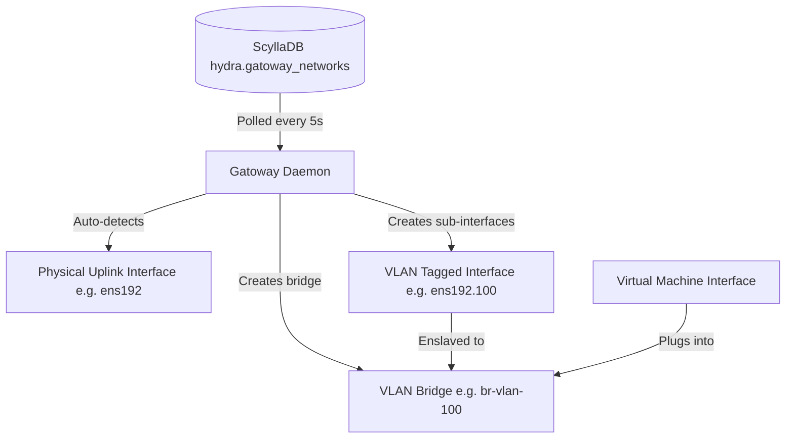

# Gatoway (Layer-2 VLAN Network Sync Daemon)

**Gatoway** is the host-level L2 networking coordinator and bridge synchronization daemon for the hypervisor hosts. It is the direct equivalent of Nutanix **Flow** (which manages Open vSwitch (OVS) bridges and VLAN interfaces for virtual machines).

> [!NOTE]
> **Name Origin:** Named after **Gato**, the singing training robot from the game *Chrono Trigger* ("My name is Gato, I have metal joints..."). It is also a play on "Gateway" and the Spanish/Portuguese word for cat, serving as the physical Layer-2 VLAN bridge coordinator.

---

## 1. System Architecture

Gatoway runs as a native Python daemon (`gatoway.service`) on every hypervisor host in the cluster. It synchronizes the host's physical and virtual bridge states with the logical network configurations declared in ScyllaDB.



---

## 2. Component Interactions & Database Schema

### A. Database Schema
Gatoway network configurations are stored in the `hydra` keyspace:
```sql
CREATE TABLE IF NOT EXISTS hydra.gatoway_networks (
    net_id uuid PRIMARY KEY,
    name text,
    type text,         -- 'direct' (untagged) or 'vlan' (tagged)
    vlan_id int        -- VLAN ID (e.g. 100, 200, Null for direct)
);
```

### B. Synchronization Loop
Every 5 seconds, the `gatoway` daemon on each host performs the following steps:
1. **Fetch Networks**: Queries `SELECT * FROM hydra.gatoway_networks;` via the local `systemd-hydra-db` container.
2. **Reconcile Tagged VLANs**:
   - For each network of type `vlan` with a valid `vlan_id` (e.g., `100`):
     * Checks if the Linux bridge `br-vlan-100` exists. If not, it creates it: `ip link add br-vlan-100 type bridge`.
     * Checks if the sub-interface `ens192.100` exists on the physical uplink. If not, it creates it: `ip link add link ens192 name ens192.100 type vlan id 100`.
     * Enslaves `ens192.100` to `br-vlan-100`: `ip link set ens192.100 master br-vlan-100`.
     * Sets both the sub-interface and the bridge states to `UP`.
3. **Prune Deleted Networks**:
   - Compares active VLAN bridges on the host (`br-vlan-*`) with those in ScyllaDB.
   - If a bridge exists on the host but its network has been deleted from ScyllaDB, it tears down the bridge and the physical sub-interface automatically to release kernel resources.

---

## 3. Command Examples & Syntax

### A. Managing the Gatoway Service
You can manage and monitor the sync daemon using standard systemctl calls:
```bash
# Check if the Gatoway daemon is active and running
systemctl status gatoway

# View bridge synchronization events and query logs
journalctl -u gatoway -n 30 --no-pager

# Restart the daemon
systemctl restart gatoway
```

### B. Validating Host Bridges & Interfaces
To verify that Gatoway has configured the host networking stack correctly:
```bash
# List all active bridges on the host
ip link show type bridge

# Show detailed interfaces enslaved to bridges (e.g. br-vlan-100)
ip link show master br-vlan-100

# View VLAN sub-interfaces on physical interfaces
ip -d link show type vlan
```

### C. Adding a VLAN Network to the Cluster Registry
Administrators can register new VLANs using the database query tools:
```bash
# Query currently registered networks
valcli db.query "SELECT * FROM hydra.gatoway_networks;"

# Insert a new VLAN 150 network named 'Marketing-VLAN'
valcli db.query "INSERT INTO hydra.gatoway_networks (net_id, name, type, vlan_id) VALUES (uuid(), 'Marketing-VLAN', 'vlan', 150);"
```
Gatoway will detect the new database entry within 5 seconds and automatically bootstrap the required bridge (`br-vlan-150`) and sub-interface (`ens192.150`) on all cluster nodes.
