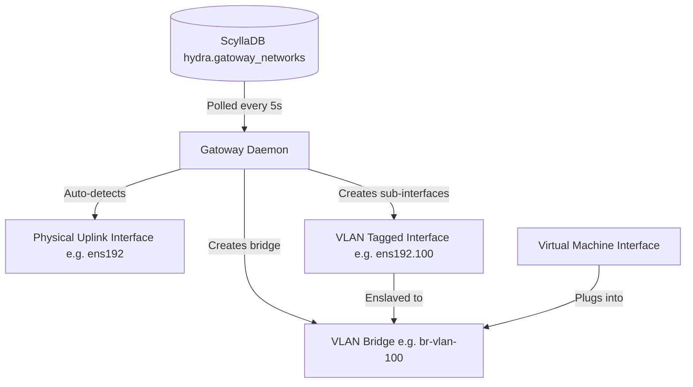

# Gatoway (Layer-2 VLAN Network Sync Daemon)

**Gatoway** is the host-level L2 networking coordinator and bridge synchronization daemon for the hypervisor hosts. It is the direct equivalent of Nutanix **Flow** (which manages Open vSwitch (OVS) bridges and VLAN interfaces for virtual machines).

> [!NOTE]
> **Name Origin:** Named after **Gato**, the singing training robot from the game *Chrono Trigger* ("My name is Gato, I have metal joints..."). It is also a play on "Gateway" and the Spanish/Portuguese word for cat, serving as the physical Layer-2 VLAN bridge coordinator.

---

## 1. System Architecture

Gatoway runs as a native Python daemon (`gatoway.service`) on every hypervisor host in the cluster. It synchronizes the host's physical and virtual bridge states with the logical network configurations declared in ScyllaDB.



---

## 2. Component Interactions & Database Schema

### A. Database Schema
Gatoway network configurations are stored in the `hydra` keyspace:
```sql
CREATE TABLE IF NOT EXISTS hydra.gatoway_networks (
    net_id uuid PRIMARY KEY,
    name text,
    type text,         -- 'direct' (untagged) or 'vlan' (tagged)
    vlan_id int        -- VLAN ID (e.g. 100, 200, Null for direct)
);
```

A second table holds the constraint the first one cannot express — see
[VLAN uniqueness](#c-vlan-uniqueness) below:
```sql
CREATE TABLE IF NOT EXISTS hydra.gatoway_vlan_claims (
    vlan_id int PRIMARY KEY,  -- the VLAN, and therefore the thing two creates contend for
    net_id text,              -- the network holding it; a release is conditional on this
    name text,                -- a copy, so a refusal can name the holder without a read
    claimed_at_ms bigint      -- how a claim left behind by a dead create is recognised
);
```

Both tables belong to the ordered cluster schema in `helios_schema.py`; neither is created
by a daemon's own `init_db`. See [Hydra](./hydra.md).

### B. Synchronization Loop
Every 5 seconds, the `gatoway` daemon on each host performs the following steps:
1. **Fetch Networks**: Queries `SELECT * FROM hydra.gatoway_networks;` via the local `systemd-hydra-db` container.
2. **Reconcile Tagged VLANs**:
   - For each network of type `vlan` with a valid `vlan_id` (e.g., `100`):
     * Checks if the Linux bridge `br-vlan-100` exists. If not, it creates it: `ip link add br-vlan-100 type bridge`.
     * Checks if the sub-interface `ens192.100` exists on the physical uplink. If not, it creates it: `ip link add link ens192 name ens192.100 type vlan id 100`.
     * Enslaves `ens192.100` to `br-vlan-100`: `ip link set ens192.100 master br-vlan-100`.
     * Sets both the sub-interface and the bridge states to `UP`.
3. **Prune Deleted Networks**:
   - Compares active VLAN bridges on the host (`br-vlan-*`) with those in ScyllaDB.
   - If a bridge exists on the host but its network has been deleted from ScyllaDB, it tears down the bridge and the physical sub-interface automatically to release kernel resources.
   - **A bridge that still has anything enslaved beyond its own VLAN uplink is refused, not deleted.** Those extra interfaces are guest taps, and removing the bridge would pull the NIC out from under a running VM. The refusal is logged once, naming the interfaces to detach.
   - **A failed or unparseable read of `hydra.gatoway_networks` skips both reconciliation and pruning.** Treating "the query failed" as "no networks configured" would delete every `br-vlan-*` bridge on the host at once. Urbosa's overlay reclaimer follows the same two rules for the same reasons — see [Resource Reclamation](./urbosa.md#e-resource-reclamation).

### C. VLAN uniqueness

`hydra.gatoway_networks` is keyed by `net_id`, so a VLAN id is an ordinary column and two
networks on VLAN 100 are legal as far as that table is concerned. They are not legal as
far as the host is concerned: Gatoway builds one `br-vlan-100`, so both networks' guests
end up in the same broadcast domain and neither operator is told.

Both consoles read the table and refuse a clash before writing. That check stays — it
names the offending network, and it catches the mistake an operator actually makes — but
it is advisory. A read followed by a write is two operations, and two creates a
millisecond apart both read "VLAN 100 is free" and both write it.

`hydra.gatoway_vlan_claims` is the constraint. It is keyed by the VLAN id, which is the
only thing two racing creates share and therefore the only thing a lightweight transaction
can serialise them on — an `IF NOT EXISTS` is confined to a single partition. The loser is
refused deterministically rather than by timing.

**Every path that assigns a VLAN takes the claim, and every path that gives one up
releases it.** Creating a network, deleting one, and re-tagging one onto a different VLAN
all go through it, in both consoles. The order is fixed and is the part worth remembering:

* **Create** claims first, then writes the network row. The claim is what decides the race,
  so anything written before it is written on the strength of a read that may already be
  stale — and Gatoway polls every five seconds, so a row that exists for a moment is a
  network that may be configured on every host. A create that then fails to write its row
  gives the claim back.
* **Delete** removes the row first, then releases the claim. Releasing first would leave a
  window in which the network still exists and its VLAN is free.
* **Re-tag** claims the new VLAN, writes, then releases the old one. Without this an edit
  is the way round the constraint: create on a free VLAN, then edit onto a taken one.

A claim that is left behind makes its VLAN unusable, which is worse than the duplicate the
claim prevents, so a create that loses to a claim whose network does not exist takes the
claim over — conditionally, so two creates finding the same stranded claim still produce
one winner, and only once the claim is more than five minutes old, so a create that is
merely still running is not robbed of the VLAN it just claimed. That is what
`claimed_at_ms` is for.

**Adopting a cluster that already has duplicates.** The migration that adds the table
claims every VLAN already in use. Where two networks carry the same VLAN, the lowest
`net_id` gets the claim and the rest are reported at daemon start, by name:

```
VLAN 100 is carried by 2 networks. The claim is held by production (…); staging (…) hold
no claim and will keep working exactly as they do now, but nothing can be created on VLAN
100 until they are gone. Re-tag or delete the extras — whichever is safe for the guests
attached to them — and the claim then matches reality.
```

Nothing is deleted and nothing is re-tagged automatically. Both take a guest's network
away, and a migration running at daemon start is the worst possible place to do that.

---

## 3. Command Examples & Syntax

### A. Managing the Gatoway Service
You can manage and monitor the sync daemon using standard systemctl calls:
```bash
# Check if the Gatoway daemon is active and running
systemctl status gatoway

# View bridge synchronization events and query logs
journalctl -u gatoway -n 30 --no-pager

# Restart the daemon
systemctl restart gatoway
```

### B. Validating Host Bridges & Interfaces
To verify that Gatoway has configured the host networking stack correctly:
```bash
# List all active bridges on the host
ip link show type bridge

# Show detailed interfaces enslaved to bridges (e.g. br-vlan-100)
ip link show master br-vlan-100

# View VLAN sub-interfaces on physical interfaces
ip -d link show type vlan
```

### C. Adding a VLAN Network to the Cluster Registry
The supported way to add one is the console, or `POST /api/networks/create` on the Python
tier — both take the VLAN claim described in [VLAN uniqueness](#c-vlan-uniqueness) before
they write the row, and both give it back if the write fails. There is no `valcli`
subcommand for this.

`valcli db.query` remains the escape hatch it has always been, and it is worth being
explicit about what it does not do: **a raw `INSERT` writes a network with no claim on its
VLAN.** Nothing stops it, nothing notices, and the next create of that VLAN through a
console will win a claim on a VLAN that is already in use. If you have to do it by hand,
take the claim in the same sitting:

```bash
# Query currently registered networks, and what holds each VLAN
valcli db.query "SELECT * FROM hydra.gatoway_networks;"
valcli db.query "SELECT * FROM hydra.gatoway_vlan_claims;"

# Claim VLAN 150 first. If this answers [applied] False, somebody already has it -- the
# row it returns says who -- and the INSERT below must not be run.
valcli db.query "INSERT INTO hydra.gatoway_vlan_claims (vlan_id, net_id, name, claimed_at_ms) VALUES (150, '0a1b2c3d-0000-4000-8000-000000000001', 'Marketing-VLAN', 0) IF NOT EXISTS;"

# Then the network itself, with the same net_id -- the claim's holder token is that id,
# and a delete releases the claim by presenting it.
valcli db.query "INSERT INTO hydra.gatoway_networks (net_id, name, type, vlan_id) VALUES (0a1b2c3d-0000-4000-8000-000000000001, 'Marketing-VLAN', 'vlan', 150);"
```
Gatoway will detect the new database entry within 5 seconds and automatically bootstrap the required bridge (`br-vlan-150`) and sub-interface (`ens192.150`) on all cluster nodes.

Deleting one by hand is the same two statements in the other order — the row, then
`DELETE FROM hydra.gatoway_vlan_claims WHERE vlan_id = 150 IF net_id = '…';`. A claim left
behind is recoverable: it names a network that does not exist, so a create through a
console takes it over once it is five minutes old.


---

## Technical Reference

For the internal code structure, class/function details, and execution flowcharts, see the [Technical Guide](./gatoway_technical.md).
