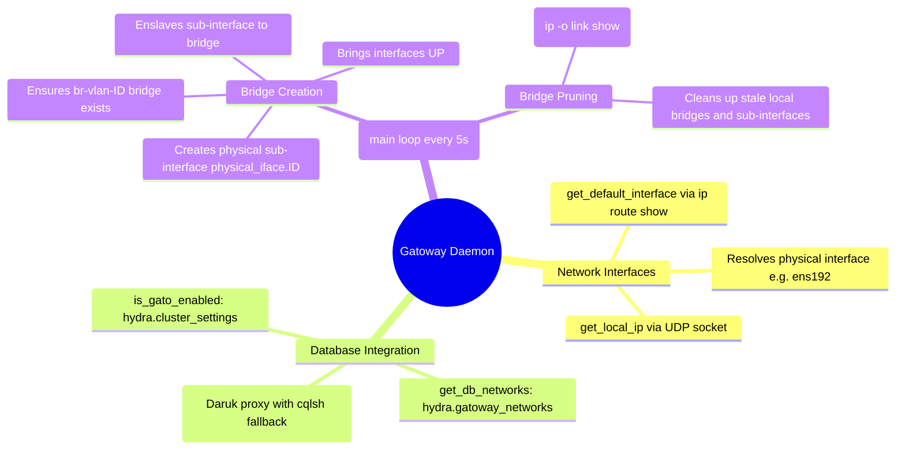

# Gatoway (Layer-2 VLAN Network Sync Daemon) - Technical Documentation

This document details the internal technical structure, functions, flowcharts, and mindmaps of the Gatoway Layer-2 VLAN synchronization daemon.

## Technical Mindmap

## Function & Logic Breakdown

### `run_cmd(cmd)`
- Spawns a shell command using `subprocess.Popen` with piped stdout/stderr.
- Returns the return code, stdout, and stderr.

### `get_local_ip()`
- Instantiates a UDP socket and queries `10.255.255.255`. Returns the bound interface IP.

### `run_cql_query(cql_query)`
- Routes CQL commands through the local Daruk proxy (`http://127.0.0.1:9043/query`) or fallback container execution.

### `get_default_interface()`
- Analyzes `ip route show | grep default` to extract the host's primary gateway network card device name.
- Fallback default: `ens192`.

### `get_db_networks()`
- Queries the `hydra.gatoway_networks` table returning registered network JSON records:
  - `net_id` (uuid)
  - `name` (text)
  - `type` (text) - e.g. `direct` or `vlan`
  - `vlan_id` (int)

### `get_active_vlan_bridges()`
- Scans host network interfaces using `ip -o link show` and filters for bridge interfaces matching `br-vlan-[0-9]*`.
- Returns list of active VLAN bridge names.

### `is_gato_enabled()`
- Checks settings table `hydra.cluster_settings` for `'gato_enabled'` key status.

### `main()` Control Loop
- Loop executes every 5 seconds:
  1. Verifies `is_gato_enabled()`.
  2. Resolves current networks from the database. Filter records by `type == "vlan"` and extract VLAN IDs.
  3. **Reconciliation phase**: For each VLAN ID from DB:
     - Verifies bridge `br-vlan-ID` exists (if not, creates it).
     - Verifies sub-interface `phys_iface.ID` exists (if not, creates it via `ip link add link <phys> name <phys.id> type vlan id <id>`).
     - Enslaves sub-interface to the VLAN bridge if not already bound.
     - Brings both interfaces UP.
  4. **Pruning phase**: For each local bridge of form `br-vlan-ID` not present in the DB network definitions:
     - Sets bridge and sub-interface states to `down`.
     - Deletes the bridge (`ip link delete br-vlan-ID`).
     - Deletes the physical sub-interface (`ip link delete phys_iface.ID`).
