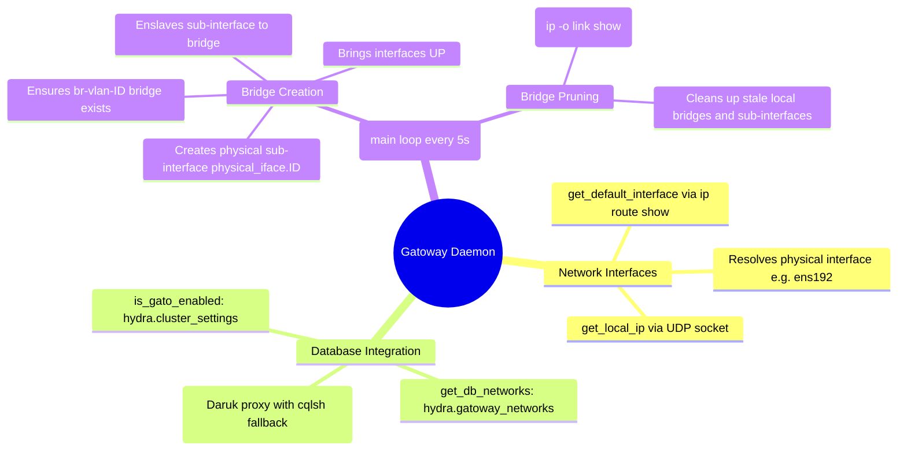

# Gatoway (Layer-2 VLAN Network Sync Daemon) - Technical Documentation

This document details the internal technical structure, functions, flowcharts, and mindmaps of the Gatoway Layer-2 VLAN synchronization daemon.

## Technical Mindmap

```mermaid
mindmap
  root((Gatoway Daemon))
    Network Interfaces
      get_default_interface via ip route show
      Resolves physical interface e.g. ens192
      get_local_ip via UDP socket
    Database Integration
      run_cql_query helper (Daruk proxy with cqlsh fallback)
      get_db_networks: hydra.gatoway_networks
      is_gato_enabled: hydra.cluster_settings
    State Reconciliation (main loop every 5s)
      Bridge Creation
        Ensures br-vlan-ID bridge exists
        Creates physical sub-interface physical_iface.ID
        Enslaves sub-interface to bridge
        Brings interfaces UP
      Bridge Pruning
        get_active_vlan_bridges (ip -o link show)
        Cleans up stale local bridges and sub-interfaces
```

## Function & Logic Breakdown

### `run_cmd(cmd)`
- Spawns a shell command using `subprocess.Popen` with piped stdout/stderr.
- Returns the return code, stdout, and stderr.

### `get_local_ip()`
- Instantiates a UDP socket and queries `10.255.255.255`. Returns the bound interface IP.

### `run_cql_query(cql_query)`
- Routes CQL commands through the local Daruk proxy (`http://127.0.0.1:9043/query`) or fallback container execution.

### `get_default_interface()`
- Analyzes `ip route show | grep default` to extract the host's primary gateway network card device name.
- Fallback default: `ens192`.

### `get_db_networks()`
- Queries the `hydra.gatoway_networks` table returning registered network JSON records:
  - `net_id` (uuid)
  - `name` (text)
  - `type` (text) - e.g. `direct` or `vlan`
  - `vlan_id` (int) — **null for every `direct` network**, which is what the seeded
    `Physical-Direct` row carries on a live cluster. A reader that treats the column as
    always present will build a bridge named after nothing.

### The VLAN claim (`hydra.gatoway_vlan_claims`)

Nothing in this daemon reads or writes it: Gatoway reconciles from `hydra.gatoway_networks`
and the claim exists to stop two rows appearing there on one VLAN in the first place. It
is documented here because the failure it prevents is Gatoway's — one `br-vlan-100` per
VLAN means two networks sharing a tag share a broadcast domain.

The writers are the two consoles, and the operations are Daruk's, not this daemon's:

| Operation | Statement | Taken by |
| --- | --- | --- |
| claim | `INSERT INTO hydra.gatoway_vlan_claims (…) VALUES (…) IF NOT EXISTS` | create, and re-tag onto a new VLAN |
| release | `DELETE FROM hydra.gatoway_vlan_claims WHERE vlan_id = ? IF net_id = ?` | delete, re-tag off an old VLAN, and a create that could not write its row |
| take over | `UPDATE … SET net_id = ?, name = ?, claimed_at_ms = ? WHERE vlan_id = ? IF net_id = ?` | a create losing to a claim whose network no longer exists |

The Python tier reaches them through `/v1/network/claim-vlan`, `release-vlan` and
`reclaim-vlan`; the Phoenix tier issues the same statements through
`SpectrumPhx.Hydra.apply_lwt_row/3`, which returns the refused row so the loser can be
told who beat it. See [gatoway.md](./gatoway.md#c-vlan-uniqueness) for the ordering rules
and [daruk.md](./daruk.md#claiming-a-vlan) for why a refused release is not always a lost
race.

### `get_active_vlan_bridges()`
- Scans host network interfaces using `ip -o link show` and filters for bridge interfaces matching `br-vlan-[0-9]*`.
- Returns list of active VLAN bridge names.

### `is_gato_enabled()`
- Checks settings table `hydra.cluster_settings` for `'gato_enabled'` key status.

### `main()` Control Loop
- Loop executes every 5 seconds:
  1. Verifies `is_gato_enabled()`.
  2. Resolves current networks from the database. Filter records by `type == "vlan"` and extract VLAN IDs.
  3. **Reconciliation phase**: For each VLAN ID from DB:
     - Verifies bridge `br-vlan-ID` exists (if not, creates it).
     - Verifies sub-interface `phys_iface.ID` exists (if not, creates it via `ip link add link <phys> name <phys.id> type vlan id <id>`).
     - Enslaves sub-interface to the VLAN bridge if not already bound.
     - Brings both interfaces UP.
  4. **Pruning phase**: For each local bridge of form `br-vlan-ID` not present in the DB network definitions:
     - Sets bridge and sub-interface states to `down`.
     - Deletes the bridge (`ip link delete br-vlan-ID`).
     - Deletes the physical sub-interface (`ip link delete phys_iface.ID`).
