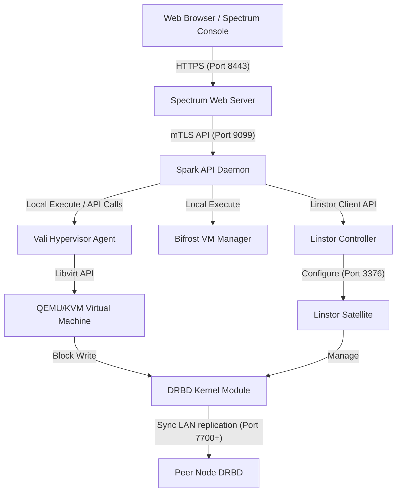
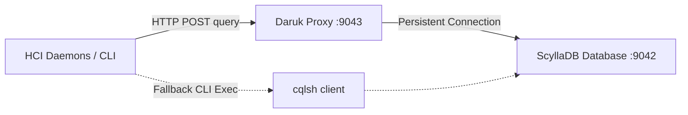
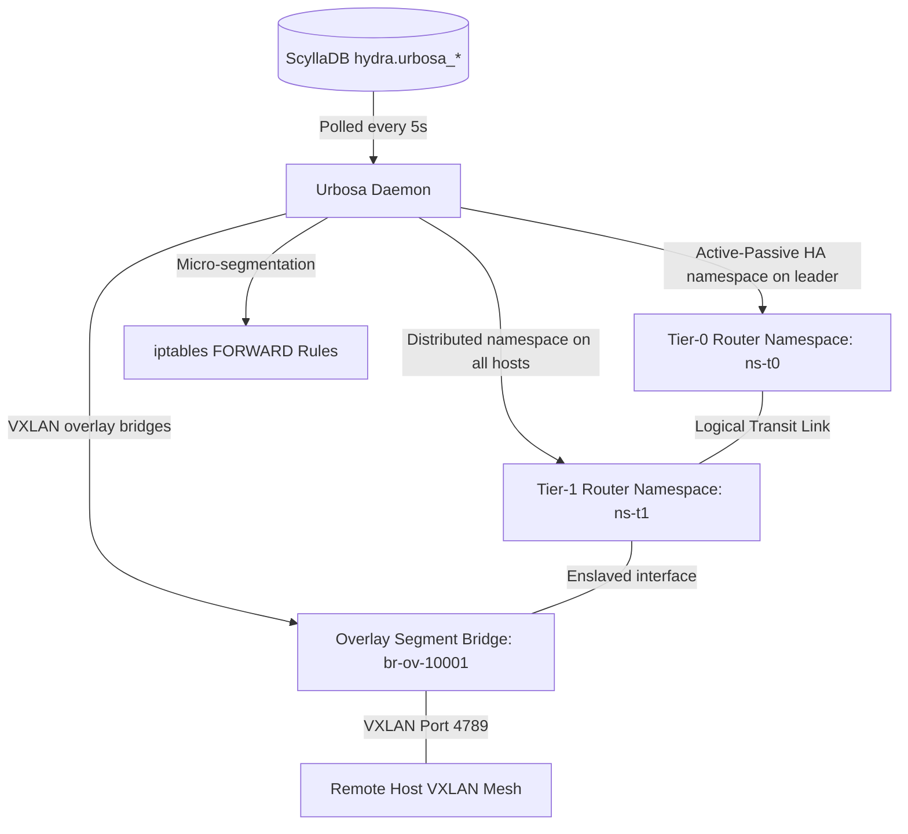
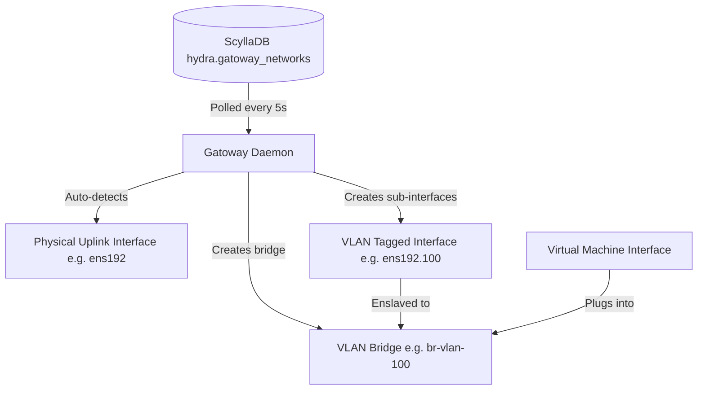
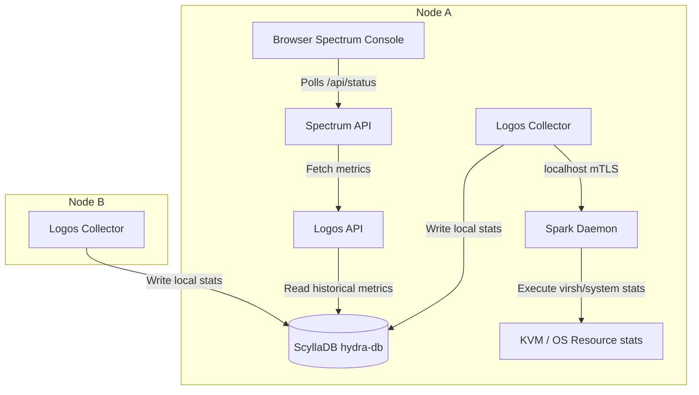
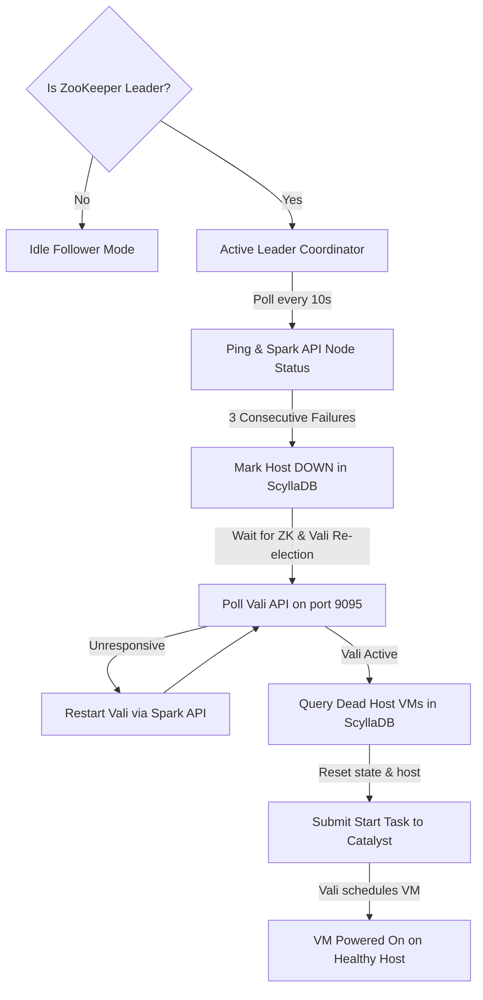

# Helios Hyperconverged Infrastructure (HCI) - Master Architecture Guide

This document serves as the master reference architecture guide for the Helios-HCI system. It details the system topology, component mappings, database schemas, storage fabrics, networks, and service lifecycles of the cluster.

---

## 1. Executive Architectural Overview & Nutanix Mapping

Helios-HCI is a software-defined, hyperconverged infrastructure platform designed to cluster physical commodity servers into a single pools of compute, memory, and storage. It is built as a direct open-source alternative to the **Nutanix Enterprise Cloud Platform**.

Below is the mapping between Nutanix proprietary services and their Helios-HCI counterparts:

| Nutanix Service | Helios-HCI Component | Description |
| :--- | :--- | :--- |
| **AHV / Acropolis** | **Bifrost & Vali** | VM lifecycle manager, scheduling agent, and QEMU/KVM hypervisor wrapper. |
| **Stargate** | **Aether** | Distributed block storage data-path engine (Linstor + DRBD block replication). |
| **Zeus Configuration** | **ZooKeeper** | Consensus configuration store and cluster metadata repository. |
| **Zeus Datastore** | **HydraDB (ScyllaDB)** | High-throughput distributed storage for cluster stats, VM states, and logs. |
| **Prism Central / Element**| **Spectrum** | Unified web console and administration interface (React/Python). |
| **Acropolis Image Service**| **Dagur** | Management, distribution, and local caching of VM installation ISOs/images. |
| **Acropolis Dynamic Scheduler**| **Mimir** | Dynamic placement engine for virtual workloads based on node resource usage. |
| **Host Microseg / SDN** | **Urbosa & Gatoway** | Distributed virtual routing, VXLAN overlay networks, and L2 port sync. |

---

## 2. High-Level System Topology & Network Flows

A Helios-HCI cluster consists of 1 to $N$ physical hypervisor hosts running Rocky Linux (Valkyrie). Each node runs a local instance of the Spark REST API daemon, which coordinates local system services, hypervisors, and storage containers.



### Cluster Ports Matrix
*   **9099 (mTLS)**: Spark REST API Daemon. Inter-node coordination and administrative calls.
*   **8443 (HTTPS)**: Spectrum Web UI Console.
*   **2181 (TCP)**: ZooKeeper client port. Cluster state consensus.
*   **2888/3888 (TCP)**: ZooKeeper quorum peer/leader election ports.
*   **9042 (TCP)**: ScyllaDB database native transport port.
*   **9043 (TCP)**: Daruk query proxy port (redirects to ScyllaDB).
*   **3370 (TCP)**: Linstor controller API port.
*   **3366 (TCP)**: Linstor satellite API port.
*   **7700-7890 (TCP)**: DRBD block replication port range (assigned dynamically).

---

## 3. Storage Layer: Linstor + DRBD Block Replication

Aether bypasses standard network filesystems (e.g., NFS, GlusterFS) by implementing direct block-level replication using Linstor and DRBD:

*   **LVM-Thin Pools**: Non-boot storage drives on each node are unified under an LVM volume group `vg_aether` and thin-provisioned pool `thin_pool_aether`.
*   **DRBD Resources**: Virtual disks are allocated as DRBD resources. If a VM is configured with $FTT=1$, Linstor creates a replicated DRBD volume mirrored across the local node and a peer node.
*   **Direct I/O Path**: The QEMU virtual machine interacts directly with the local DRBD block device (`/dev/drbd/by-res/<vm>/0`). Read operations are processed locally at host hardware speeds. Write operations are processed locally and replicated synchronously over the network via DRBD to the peer node before the write is acknowledged.

---

## 4. Hyperconverged Database Schemas (HydraDB / ScyllaDB)

ScyllaDB (`hydra-db`) stores all runtime stats, metric histories, task queues, and persistent metadata.

### Key Keyspaces and Tables

#### Keyspace: `hydra`

```sql
CREATE KEYSPACE hydra WITH replication = {'class': 'SimpleStrategy', 'replication_factor': 3};
```

1.  **`storage_containers`**: Maps storage targets.
    *   `name` (text, primary key)
    *   `tier` (text) - e.g. SSD/HDD
    *   `quota_bytes` (bigint)
    *   `path` (text)
    *   `ftt` (int)
2.  **`vms`**: Stores VM status and configurations.
    *   `name` (text, primary key)
    *   `cpu` (int)
    *   `memory_mb` (int)
    *   `state` (text) - e.g. RUNNING, STOPPED
    *   `host_ip` (text)
    *   `vnc_port` (int)
    *   `disks` (list<text>)
3.  **`cluster_settings`**: Global settings key-value store.
    *   `key` (text, primary key)
    *   `value` (text)
4.  **`metrics_history`**: Cluster-wide telemetry.
    *   `host_ip` (text)
    *   `metric_name` (text)
    *   `timestamp` (timestamp)
    *   `value` (double)
    *   PRIMARY KEY ((host_ip, metric_name), timestamp)

---

## 5. Component Deep Dives


### Valkyrie (Node Host OS)
Valkyrie is the foundation of our HCI cluster, serving as the hypervisor host operating system. It is the direct equivalent of Nutanix **AHV** (Acropolis Hypervisor).

> [!NOTE]
> **Name Origin:** In Norse mythology, the **Valkyries** ("choosers of the slain") are noble female figures who select who survives or perishes in battle, guiding them to Valhalla. In Helios-HCI, **Valkyrie** is the underlying host operating system that supports, hosts, and decides the placement/evacuation of the virtual machine workloads.

### Nutanix Role (AHV)
In Nutanix, AHV is a customized hypervisor based on CentOS/RHEL KVM. It runs virtual machines, hosts the Controller VM (CVM) which is granted direct control of local storage controllers via PCI passthrough, and accesses storage via a local NFS mount routed to the CVM.

### Containerized HCI Approach
In our architecture, the physical host OS (EL 10.2) is **Valkyrie**. 
Instead of running a separate, resource-heavy CVM virtual machine:
1. **Direct KVM/libvirt on Host**: The EL 10.2 host runs the KVM kernel module and `libvirtd` / `virtqemud` directly.
2. **Co-located Container Services**: Services like storage (`Aether`), cluster state (`Odin`/`Zookeeper`), and metadata (`Hydra`) run as lightweight Podman containers directly on the host's kernel space.
3. **Internal Storage Mounting**:
   - `Aether` (Stargate) runs in a Podman container and exports storage via NFS (using NFS-Ganesha or standard NFS).
   - Valkyrie's host `libvirtd` mounts this NFS export locally over the loopback interface (`127.0.0.1` or a dedicated internal bridge IP).
   - QEMU VMs run on Valkyrie and use virtual disks stored in this NFS storage pool.

---

### Host Configuration

#### Required Host Services
- `libvirtd` (or modular daemons: `virtqemud`, `virtstoraged`, `virtnetworkd`, `virtnodedevd`)
- `podman` (container engine)
- `rpcbind` / `nfs-utils` (to mount loopback NFS storage)

#### Network Architecture
- **Management & Cluster Interface (`eth0` / `bond0`)**: Connects the hosts together. Standard host IPs (e.g., `10.10.102.220`, `222`, `223`).
- **Internal Storage Bridge (`virbr1` or Loopback)**: Dedicated path for the host hypervisor to talk to the local `Aether` storage daemon.

---

### Service Configuration File (`/etc/hci/cluster.json`)
The host references a global cluster configuration file to resolve peers:

```json
{
  "cluster_name": "aura-hci-01",
  "redundancy_factor": 2,
  "hosts": [
    {
      "node_id": 1,
      "ip": "10.10.102.220",
      "hostname": "hci-node01"
    },
    {
      "node_id": 2,
      "ip": "10.10.102.222",
      "hostname": "hci-node02"
    },
    {
      "node_id": 3,
      "ip": "10.10.102.223",
      "hostname": "hci-node03"
    }
  ]
}
```

---

### ZooKeeper (Configuration Consensus Registry)
Zookeeper provides highly reliable distributed coordination and consensus. It is used directly as **Zookeeper** in the Nutanix architecture.

> [!NOTE]
> **Name Origin:** In our stack, Zookeeper serves as the consensus engine for the **Odin** service wrapper. Just as Odin oversees the Norse gods from Asgard and maintains active consensus, Zookeeper coordinates active cluster leader elections and central state configuration records.

### Nutanix Role (Zookeeper)
In Nutanix, Zookeeper stores critical configuration state for the cluster, including node mappings, IP addresses, configured storage containers, and cluster topology. It runs on a subset of nodes (usually 3 or 5) to ensure high availability and uses Paxos-like consensus to resolve cluster state changes.

### Containerized HCI Approach
In our 3-node cluster, we run a **3-node ZooKeeper ensemble** using official ZooKeeper images in Podman containers across the hosts (`10.10.102.220`, `222`, `223`).
1. **Host Networking Mode**: To avoid overlay network overhead and complex container DNS resolution, Zookeeper containers run in `network=host` mode.
2. **Persistent Storage**: Zookeeper transactions and snapshots are written to host directories mounted into the container.
3. **Cluster Config**: Configured using standard environment variables or files mapped to the Zookeeper directory.

---

### Deployment & Configuration

#### Ports Used (Host Network)
* `2181`: Client connections (used by Odin).
* `2888`: Follower connections to the Leader.
* `3888`: Leader election port.

#### Directory Configuration on Host
* **Data Path**: `/var/lib/hci/zookeeper/data/`
* **Log Path**: `/var/lib/hci/zookeeper/log/`
* **Node ID File**: `/etc/hci/zookeeper/myid` (Contains a single integer: `1`, `2`, or `3`)

#### Sample Podman Command (Run by Spark/Systemd)
```bash
podman run -d \
  --name zookeeper \
  --net=host \
  --restart=always \
  -v /var/lib/hci/zookeeper/data:/data:Z \
  -v /var/lib/hci/zookeeper/log:/datalog:Z \
  -e ZOO_MY_ID=1 \
  -e ZOO_SERVERS="server.1=10.10.102.220:2888:3888;2181 server.2=10.10.102.222:2888:3888;2181 server.3=10.10.102.223:2888:3888;2181" \
  zookeeper:3.9.2
```

*(Note: The `:Z` flag on volume mounts ensures correct SELinux context labeling on EL 10.2).*

---

### HydraDB (Distributed ScyllaDB Cluster)
Hydra is the distributed metadata database and abstraction layer. It is the direct equivalent of Nutanix **Medusa**.

> [!NOTE]
> **Name Origin:** In Greek mythology, the **Hydra** is a multi-headed serpent that grows back heads when they are cut off, representing extreme resilience. **HydraDB** uses a multi-node ScyllaDB replication ring so that database access remains online and available even if individual nodes go offline.

### Nutanix Role (Medusa)
In Nutanix, Medusa acts as the database proxy and abstraction layer sitting in front of **Cassandra** (a highly customized Apache Cassandra database running on the CVMs). Medusa manages metadata such as virtual disk locations, block maps, snapshots, and cluster configuration. It handles Paxos operations to ensure strict consistency.

### Containerized HCI Approach
In our architecture, **Hydra** runs in a container on every host, leveraging a distributed **ScyllaDB** (a C++ rewritten, high-performance Cassandra-compatible database) or standard **Cassandra** container cluster.
1. **Consensus & Clustering**: The ScyllaDB/Cassandra instances on all three hosts auto-discover each other using Zookeeper/Odin and form a ring topology.
2. **Replication & Consensus**: Data keyspaces use a replication factor of 3 (RF=3) with local quorum write/read consistency. This ensures metadata is consistent and partition-tolerant.
3. **CQL HTTP Proxy (Daruk)**: To avoid the massive host CPU overhead of spawning containerized `cqlsh` python sessions repeatedly, a persistent **CQL HTTP Proxy (Daruk)** (`daruk.service`) runs inside the `systemd-hydra-db` container.
    * **Port**: `9043` on `localhost` (bridged via `Network=host`).
    * **Connection**: Maintains a single, persistent native python `cassandra-driver` connection to ScyllaDB.
    * **Uptime Fallback**: Clients issue HTTP POST requests containing CQL queries, which execute in under 2ms. If the proxy is unavailable, host-level processes automatically fall back to executing `cqlsh` directly via `podman exec`. Note that containerized services (like Spectrum) lack host `podman` command access and require Daruk to be online.

---

### CQL HTTP Proxy API Specification

The CQL HTTP Proxy exposes a single lightweight endpoint on localhost for executing raw database queries without startup latency.

#### Execute Query Endpoint
* **URL**: `http://127.0.0.1:9043/query`
* **Method**: `POST`
* **Headers**: `Content-Type: text/plain`
* **Request Body**: Raw CQL statement string.

##### Success Response (HTTP 200 OK)
Returns a list of rows represented as dictionary objects mapping columns to values:
```json
{
  "status": "success",
  "rows": [
    {
      "key": "urbosa_enabled",
      "value": "true"
    },
    {
      "key": "dns_mtu",
      "value": "1500"
    }
  ]
}
```

##### Error Response (HTTP 400 Bad Request / 500 Internal Error)
Returns error status with the ScyllaDB driver execution exception:
```json
{
  "status": "error",
  "error": "Error Message details (e.g., SyntaxException, KeyspaceNotDefined)"
}
```

#### Python Client Integration (`run_cql_query`)
All internal python daemons call `run_cql_query(cql_query)` which encapsulates this HTTP REST API. It handles returned data formatting dynamically:
1. **JSON Select Queries** (e.g., `SELECT JSON *`): Unpacks the raw `"json"` column value directly.
2. **Standard Select Queries**: Joins row values with space separators (e.g., `key value`). If clients query settings (`SELECT key, value`), it falls back to space-separated lines (`urbosa_enabled true`).
3. **Execution Fallback**: If the HTTP query fails, it encodes the CQL query in base64 and spawns `podman exec -i systemd-hydra-db cqlsh` as a secondary channel.

---

### Technical Details

#### Backend Configuration (ScyllaDB / Cassandra)
- **Container Name**: `hydra-db`
- **Port Mapping**:
  - `9042`: CQL Native client port (used by Hydra api layer).
  - `7000`: Cassandra inter-node communication port.
  - `7001`: Cassandra SSL inter-node port.
  - `9160`: Thrift client API (disabled by default).
- **Persistent Data Volume on Host**: `/var/lib/hci/hydra/data`

#### Schema and Key Entities
Hydra stores:
1. **VM Metadata**: VM configurations, power state, host assignment.
2. **Virtual Disk Map**: Logical disk IDs mapped to Aether storage blocks.
3. **Snapshot History**: References to point-in-time storage states.
4. **Task Progress**: Global operations status (e.g., migration progress, backup progress).

---

### Sample Podman Quadlet / Run Definition
When deploying, the database container is configured with cluster seed node IPs:

```bash
podman run -d \
  --name hydra-db \
  --net=host \
  --restart=always \
  -v /var/lib/hci/hydra/data:/var/lib/cassandra:Z \
  -e CASSANDRA_CLUSTER_NAME=aura-hci-metadata \
  -e CASSANDRA_SEEDS=10.10.102.220,10.10.102.222 \
  -e CASSANDRA_NUM_TOKENS=256 \
  scylladb/scylla:5.4.0
```

*(Note: In Quadlet deployment, these options are written dynamically by Spark during bootstrap).*

---

### Daruk (ScyllaDB Local Query Proxy)
Daruk is the persistent CQL HTTP Proxy that sits in front of the **Hydra (ScyllaDB)** metadata database.

> [!NOTE]
> **Name Origin:** In *The Legend of Zelda: Breath of the Wild*, **Daruk** is the Goron Champion who possesses the power of **Daruk's Protection**—a spherical red energy shield that deflects all external attacks. Similarly, **Daruk** acts as a protective query shield in front of ScyllaDB, shielding the database from the overhead of spawning containerized `cqlsh` Python sessions repeatedly and preventing database connection exhaustion.

### Purpose

Spawning a new containerized Python CQL shell (`cqlsh`) for every database read/write operation is extremely CPU-expensive, taking up to 1-2 seconds per request. 

To solve this:
1. **Daruk** runs inside the `systemd-hydra-db` container.
2. It maintains a single, persistent native python `cassandra-driver` connection to the local ScyllaDB instance.
3. It listens on `127.0.0.1:9043` and handles incoming CQL queries via lightweight HTTP POST requests, completing queries in under 2ms.
4. Clients fall back to raw `cqlsh` execution via host-level `podman exec` if **Daruk** is not active. Note that this fallback only works for host-level services; containerized services (like Spectrum) lack `podman` inside their environment and rely entirely on Daruk being online.

---

### Technical Architecture



---

### Integration and Cluster Management

To prevent systemd boot dependency loops (where systemd tries to start the proxy on reboot and subsequently forces `hydra-db` to boot up prematurely when the cluster is supposed to be in a stopped state):

1. **Disabled Auto-Start**: The `daruk.service` unit is *not* enabled on system boot (it has no `[Install]` section).
2. **Cluster Lifecycle Managed**:
   - `cluster start` starts the `daruk` service on all nodes after verifying ScyllaDB has successfully started and is listening on port `9042`.
   - `cluster stop` stops `daruk` before stopping `hydra-db` to ensure a clean sequential shutdown.

---

### REST API Specification

#### Execute Query
* **Endpoint**: `POST /query`
* **Address**: `http://127.0.0.1:9043`
* **Headers**: `Content-Type: text/plain`
* **Body**: Raw CQL statement string.

##### Response Example (Success)
```json
{
  "status": "success",
  "rows": [
    {
      "key": "urbosa_enabled",
      "value": "true"
    }
  ]
}
```

##### Response Example (Error)
```json
{
  "status": "error",
  "error": "Error details from Cassandra driver..."
}
```

---

### Aether (Linstor/DRBD Storage Fabric)
Aether is the cluster storage controller and block path manager. It is the direct equivalent of Nutanix **Stargate**.

> [!WARNING]
> **Secure Boot Requirement:** 
> Because DRBD runs as an out-of-tree kernel module, **Secure Boot must be disabled** on all hypervisor hosts. Alternatively, the ELRepo secure boot public key (`/etc/pki/elrepo/SECURE-BOOT-KEY-elrepo.org.der`) must be imported into each host's MOK database (`mokutil --import`) and enrolled at boot. If Secure Boot is enabled without enrolling the key, loading the DRBD driver will fail with `Key was rejected by service`.

> [!NOTE]
> **Name Origin:** In Greek mythology, **Aether** is the personification of the bright upper sky and the air breathed by gods. Historically in physics, the *aether* was a hypothetical space-filling medium postulated to support the propagation of electromagnetic waves. In Helios-HCI, **Aether** refers to the distributed storage fabric (Linstor + DRBD) that spans all physical nodes to form a single, unified virtual storage medium.

---

### Nutanix Role (Stargate)
In Nutanix, Stargate is the core data-path service. All read and write operations from VMs are sent directly to Stargate. In our updated architecture, Aether bypasses FUSE filesystems completely, exposing virtual disks directly to QEMU as replicated DRBD block devices.

---

### Failures To Tolerate (FTT) & Replication

FTT defines the redundancy level of the cluster, mapping directly to Nutanix Redundancy Factors (RF). Under Linstor/DRBD, FTT dictates the auto-placement replication count of the DRBD resources:

*   **FTT = 0 (Redundancy Factor 1 / RF1)**:
    - **Replication count**: 1.
    - **Minimum hosts**: 1.
    - **Behavior**: Allocated only on the host running the VM. No network replication.
*   **FTT = 1 (Redundancy Factor 2 / RF2)**:
    - **Replication count**: 2.
    - **Minimum hosts**: 2.
    - **Behavior**: Replicated synchronously over the network between 2 hosts using DRBD. Survives 1 host failure.
*   **FTT = 2 (Redundancy Factor 3 / RF3)**:
    - **Replication count**: 3.
    - **Minimum hosts**: 3.
    - **Behavior**: Replicated synchronously over the network across 3 hosts using DRBD. Survives 2 simultaneous host failures.

---

### Underlying Storage Engine: Linstor + DRBD

To maximize storage I/O performance and support enterprise features, Aether runs **Linstor** and **DRBD** as the software-defined storage (SDS) replication engine:

#### Linstor & DRBD Implementation
* **Host Storage Pools**: Raw non-boot disks >= 100GB (e.g., `/dev/sdb`, `/dev/nvme0n1`) are dynamically scanned and claimed on each node during cluster creation, then configured as an LVM-Thin Pool (`thin_pool_aether` inside `vg_aether`). Lvm-thin natively handles space-saving snapshots, thin provisioning, and high-performance block allocations.
* **Linstor Satellite**: Runs as a privileged Podman container on all nodes, communicating with the host kernel to provision block devices dynamically.
* **Linstor Controller**: Runs as a manager service on the leader node, keeping track of volume definitions, resource allocation, and replication targets.
* **Direct Block Access**: Instead of accessing a file on a shared mount, VMs are defined with direct block storage targets mapping to `/dev/drbd/by-res/<vm_name>/0`. This achieves near bare-metal I/O throughput.

---

### Data Write Path (RF2 / FTT=1)

```
[ Virtual Machine (VM) ]
           │
           │ (Direct Block I/O to /dev/drbd/by-res/test/0)
           ▼
[ DRBD Kernel Driver (Host Kernel) ]
           ├───► Local Writes to vg_aether/thin_pool_aether (LVM Thin)
           └───► Synchronous network replication (TCP/RDMA) to Peer Host
```

---

### Spark (Local Agent REST API Daemon)
Spark is the host-level bootstrap manager and service state coordinator. It is the direct equivalent of Nutanix **Genesis**.

> [!NOTE]
> **Name Origin:** A **spark** is a tiny, fiery particle that initiates a fire or combustion. In Helios-HCI, **Spark** is the bootstrap manager and Genesis agent that ignites and starts all other cluster containers, services, and management nodes.

### Nutanix Role (Genesis)
In Nutanix, Genesis runs on every node and is responsible for managing the lifecycle of other services (starting, stopping, monitoring). It is the first service to start, running independently of cluster consensus, and is used to bootstrap the cluster initially.

### Containerized & Host-Level HCI Approach
In our architecture, **Spark** is split into two components:
1.  **Spark CLI** (`/usr/local/bin/spark`): A host-level command-line utility used to query local container states, PIDs, and detect ZooKeeper leadership.
2.  **Spark Daemon** (`/usr/local/bin/spark-daemon`): A secure, host-level HTTPS service running on port `9099`. It replaces legacy passwordless root SSH key distribution across nodes, allowing secure remote command orchestration.

---

### Spark Daemon mTLS API Spec

The `spark-daemon` listens on port `9099` using **Mutual TLS (mTLS)** for secure authentication and authorization:
* **Server Verification**: The daemon presents its node certificate (`node.crt`) and key (`node.key`). Clients verify it against the trusted CA.
* **Client Verification**: The daemon requires clients to present a valid client certificate (`client.crt`) signed by the cluster CA (`ssl.CERT_REQUIRED`).

#### API Endpoints
* `POST /api/v1/execute`
  * **Description**: Executes a command locally on the host.
  * **Request Body** (JSON):
    ```json
    {
      "command": "systemctl restart hydra-db"
    }
    ```
  * **Response Body** (JSON):
    ```json
    {
      "returncode": 0,
      "stdout": "...",
      "stderr": ""
    }
    ```

---

### Directory & Certificate Layout

#### 1. Staging Directory (Node 1 only, post-provisioning)
Path: `/var/lib/hci/certs_staging/`
* Stores CA, client, and all individual node certificates/keys before cluster-wide distribution.
* Automatically cleaned up after successful bootstrapping.

#### 2. Daemon Certificates (Restricted to Root)
Path: `/etc/hci/spark/certs/`
* `ca.crt`: Trusted Root CA certificate.
* `node.crt`: Node certificate containing the host IP address in the Subject Alternative Name (SAN).
* `node.key`: Node private key (`chmod 600`).

#### 3. Client Certificates (Used by `cluster` and `allssh`)
Path: `/root/.certs/`
* `ca.crt`: Trusted Root CA certificate.
* `client.crt`: Signed client certificate.
* `client.key`: Client private key (`chmod 600`).

---

### mTLS Bootstrapping & Security Lifecycle

#### 1. Staging (`provision.py`)
* The local provisioning tool generates all certificates (CA, client, and host keys) and stages them in `/var/lib/hci/certs_staging/` on **Node 1** via SSH.
* The `spark-daemon` systemd service files and binaries are copied to all nodes, but the service is kept inactive.

#### 2. Synchronization & SSH Hardening (`cluster create`)
* Executing `cluster create` on Node 1 prompts the administrator for the root SSH password.
* It uses `sshpass` to copy the staged certificates to `/etc/hci/spark/certs/` and `/root/.certs/` on all target nodes.
* It starts the `spark-daemon` on each node.
* It deletes the inter-node passwordless SSH keys (`/root/.ssh/id_rsa` and `/root/.ssh/id_rsa.pub`) on all nodes.
* The local staging folder is then removed.

#### 3. Cleanup (`cluster destroy`)
* Running `cluster destroy` executes a remote background command on all nodes to stop and disable `spark-daemon` and delete the `/etc/hci/spark/certs/` and `/root/.certs/` directories.

---

### Systemd Daemon Configuration (`/etc/systemd/system/spark-daemon.service`)

```ini
[Unit]
Description=Spark Host Management Daemon
After=network.target

[Service]
Type=simple
ExecStart=/usr/local/bin/spark-daemon
Restart=always
User=root

[Install]
WantedBy=multi-user.target
```

---

### Command Examples & Syntax

#### A. Host CLI Tool (`spark`)
The `spark` utility is run directly on the host console to check and control local cluster processes:
```bash

spark status


spark status --json


spark start


spark stop


spark stop all


spark restart
```

#### B. Remote Orchestration Command Execution (mTLS API)
You can test the secure remote command endpoint from any node using `curl`. Since the daemon enforces Mutual TLS, you must supply the client certificate, client private key, and trust store:
```bash

curl --cacert /root/.certs/ca.crt \
     --cert /root/.certs/client.crt \
     --key /root/.certs/client.key \
     --header "Content-Type: application/json" \
     --data '{"command": "systemctl is-active spectrum"}' \
     https://10.10.102.222:9099/api/v1/execute


curl --cacert /root/.certs/ca.crt \
     --cert /root/.certs/client.crt \
     --key /root/.certs/client.key \
     https://10.10.102.220:9099/api/v1/cluster/status
```

---

### Service Bootstrap & Workload Autostart Sequence

When `spark-daemon` starts up (e.g. during host boot), it spawns a background thread to orchestrate starting local workloads:

1. **ZooKeeper Startup**: Starts the local ZooKeeper instance (`systemctl start zookeeper`) if it is not already active. (This executes unconditionally, even in maintenance mode, to preserve cluster quorum).
2. **Maintenance Mode Check**: Checks if `/etc/hci/maintenance.state` exists. If the host is in maintenance mode, it halts the autostart thread here, leaving all other database, storage, and UI workloads stopped.
3. **Quorum Consensus Verification**: Polls local ZooKeeper port `2181` until a quorum mode (`follower`, `leader`, or `standalone`) is established.
4. **Cluster State Verification**: Queries the ZooKeeper database for `/cluster_state`. If the cluster state is set to `stopped` (e.g. administrator manually stopped the cluster), it skips starting the workloads.
5. **Workload Autostart**: Starts the following local cluster services sequentially:
   - `hydra-db` (ScyllaDB container)
   - `aether` (Linstor Satellite storage container)
   - `spectrum` (Management WebUI container)
   - `bifrost` (Floating VIP Manager)
   - `dagur` (Task Scheduler)
   - `mimir` (Diagnostics/Health Monitoring)
   - `vali` (VM Scheduler / DRS)
   - `catalyst` (Task Coordinator)
   - `gatoway` (L2 Network Sync)
   - `logos` (Distributed Metrics)
   - `mipha` (HA Cluster Monitor)

---

### Vali (Hypervisor Libvirt Host Agent)
Vali is the standalone VM management, placement scheduling, and DRS (load balancing) coordinator for the HCI cluster. It is the direct equivalent of Nutanix **Acropolis (AHV VM Management)**.

> [!NOTE]
> **Name Origin:** A dual-purpose name:
> 1. In Norse mythology, **Váli** is a son of Odin destined to survive Ragnarok and avenge the death of his brother, representing how Vali avenges host resource imbalances by dynamically migrating and scheduling virtual machines.
> 2. It is also short for **Revali**, the Rito Champion in *The Legend of Zelda: Breath of the Wild* known for *Revali's Gale* (an upward draft that launches the hero into the air), representing the dynamic flight, placement, and live migration of virtual machines across hypervisor nodes.

### Architecture & Lifecycle
- **Daemon Service**: Runs as a standalone python service (`/usr/local/bin/vali`) listening locally on port `9095`. Managed by systemd (`vali.service`).
- **Leader Election**: All Vali instances run ZooKeeper leader election using ephemeral sequential nodes at `/vali/leader`. The elected Leader is responsible for consuming tasks and executing DRS checks.
- **Autostart Constraint**: Vali is a static systemd service that is dynamically started/stopped by Spark commands (`cluster start` / `cluster stop`) and does not auto-start on boot unless the cluster is online.

### Database Schema
Vali relies on a task queue table in ScyllaDB (`hydra` keyspace):
```sql
CREATE TABLE IF NOT EXISTS hydra.vali_tasks (
    task_id uuid PRIMARY KEY,
    vm_name text,
    action text,         -- 'start', 'stop', 'reboot', 'shutdown', 'reset', 'migrate'
    status text,         -- 'pending', 'processing', 'completed', 'failed'
    target_host text,    -- target IP for migration or explicit start (optional)
    created_at bigint,
    updated_at bigint,
    error_msg text
);
```

### Communication Routing & Security
To keep the Spectrum container boundaries secure, Spectrum is not allowed to communicate directly with Vali. Instead, all actions are routed as follows:
1. Spectrum calls the local `spark-daemon` on `127.0.0.1:9099` via mTLS.
2. The local `spark-daemon` forwards the request locally to `vali` on `127.0.0.1:9095`.
3. Vali queues the task in `hydra.vali_tasks` and polls the database for task completion, returning a synchronous response once processed.

```
[ Spectrum Container ] 
       │ (Secure mTLS)
       ▼
[ spark-daemon (Port 9099) ] (Local Host Daemon)
       │ (Local Forwarding)
       ▼
[ Vali Daemon (Port 9095) ] (Local Host Daemon)
```

### VM Placement & Scheduling (Task Processing)
When the Vali Leader processes a `start` task from the queue:
1. It queries available memory across all online nodes in the cluster.
2. It filters out nodes without sufficient memory to accommodate the VM configuration.
3. It selects the candidate node with the least used memory (dynamic scheduling).
4. It compiles the VM's XML and calls the target node's `spark-daemon` `/api/v1/execute` to define and start the VM.
5. It updates the VM record state to `Running` and `host_ip` to the chosen hypervisor node.

### Distributed Resource Scheduler (DRS)
The Vali Leader runs a periodic DRS loop (every 30 seconds):
1. **Load Evaluation**: It checks memory utilization percentages across all active hypervisor nodes.
2. **Overload Trigger**: A host is considered overloaded if its memory usage exceeds `85%` or if its usage is more than `15%` higher than the average cluster node utilization.
3. **Rebalancing Action**: If an overloaded node is detected, Vali selects a running VM on that host and queues a `migrate` task to live-migrate it to the node with the highest available memory.
4. **Live Migration**: Vali executes live migrations via libvirt:
   `virsh -c qemu:///system migrate --live --persistent --undefinesource --unsafe <vm_name> qemu+ssh://root@<target_ip>/system`
    And updates the VM's `host_ip` in ScyllaDB on completion. To enable compatibility during live migrations, VM guest CPUs are defined with `<cpu mode='host-model'/>` when running under KVM.

### VM Display and Video Configuration Standards
To ensure compatibility across all hypervisor nodes:
- **Video Model**: VMs use the standard VGA video model (`<model type='vga' vram='16384' heads='1' primary='yes'/>`). Other video drivers like `qxl` are avoided because QEMU ROM files (such as `vgabios-qxl.bin`) are missing on standard EL 10.2 hypervisor repositories. The VGA BIOS binary `/usr/share/seavgabios/vgabios-stdvga.bin` is pre-installed on every hypervisor node.
- **Dual Display Console**: Both VNC and SPICE graphic displays are enabled concurrently with automatic ports, offering high performance and smooth VM console interactivity. A VirtIO-serial spicevmc channel target is mapped to `com.redhat.spice.0` for SPICE guest communication.
- **Explicit Boot Devices**: The generated XML explicitly specifies both CD-ROM (`<boot dev='cdrom'/>`) and Hard Disk (`<boot dev='hd'/>`) boot elements to prevent guest boot loops after OS installations.
- **UEFI Boot Menu**: Boot menu options are enabled via `<bootmenu enable='yes' timeout='3000'/>` allowing direct boot path configuration.


---

### VM Disk Resizing & Split-Brain Protection

To guarantee data integrity and correct capacity detection across all states:
* **Boot Disk Resizing**: When starting a VM, Vali checks its configured disk size in ScyllaDB. Before booting libvirt, it promotes (`drbdadm primary`) and resizes (`drbdadm resize`) the DRBD device on the hypervisor. This guarantees guest OS installers (like Windows Server) detect the updated size immediately.
* **Live Disk Resizing**: When editing a running VM's disk capacity, Vali runs `drbdadm resize` on the host kernel block device, resolves the correct device prefix (`vd` vs `sd`) based on the bus type, and executes QEMU `blockresize` dynamically:
  ```bash
  virsh -c qemu:///system blockresize <vm_name> <target_dev> <new_size_in_kb>
  ```
* **Split-Brain VM Protection**: If a host suffers a network partition or hard crash, its VMs are failed over to other hosts. When the partitioned/crashed host returns online, a local Spectrum reconciliation loop (`db_reconcile_loop`) verifies all local VMs. If any local VM is assigned to another node (or stopped) in the ScyllaDB registry, it runs `virsh destroy` and `virsh undefine --keep-nvram` locally to kill the stale instance and protect DRBD block storage.

---

#### A. Managing VMs via `valcli`
The `valcli` CLI tool provides VM status management, power controls, and live migration:
```bash

valcli vm.list


valcli vm.on my-linux-vm


valcli vm.off my-linux-vm


valcli vm.migrate my-linux-vm 10.10.102.222


valcli vm.balance


valcli drs.status


valcli host.maintenance.enter hci-node01


valcli host.maintenance.enter hci-node01 --force


valcli host.maintenance.leave hci-node01
```

#### B. Live Migration Command Syntax (libvirt)
To execute manual VM live migrations outside `valcli` (useful for troubleshooting):
```bash

virsh -c qemu:///system migrate --live --persistent --undefinesource --unsafe my-linux-vm qemu+ssh://root@10.10.102.223/system
```

#### C. Direct Database Task Querying
To check pending VM placement and migration tasks queued by Catalyst/Vali:
```bash

podman exec -i systemd-hydra-db cqlsh 127.0.0.1 -e "SELECT task_id, vm_name, action, status FROM hydra.vali_tasks;"


podman exec -i systemd-hydra-db cqlsh 127.0.0.1 -e "SELECT task_id, service, action, status, progress FROM hydra.catalyst_tasks;"


podman exec -i systemd-hydra-db cqlsh 127.0.0.1 -e "SELECT hostname, ip, status, maintenance_mode FROM hydra.nodes;"
```

---

### Bifrost (Acropolis/VM Lifecycle Service)
Bifrost is the floating Virtual IP (VIP) manager service for the HCI cluster. It is the direct equivalent of Nutanix **Vipmonitor**. It acts as a lightweight, consensus-aware IP router to ensure that the user-facing WebUI (Spectrum) is always reachable via a single, highly available virtual IP address.

> [!NOTE]
> **Name Origin:** In Norse mythology, **Bifröst** is the burning rainbow bridge that connects Midgard (the realm of humans) to Asgard (the realm of the gods). In Helios-HCI, the **Bifrost** daemon acts as a network bridge, dynamically routing management traffic to the active ZooKeeper leader node using a floating Virtual IP (VIP).

### Architecture & Lifecycle
- **Daemon Service**: Runs as a standalone python service (`/usr/local/bin/bifrost`) managed by systemd (`bifrost.service`).
- **WebUI-Aligned VIP Binding**: Bifrost queries ZooKeeper status and verifies WebUI (Spectrum port `8443`) responsiveness. The node elected as the ZooKeeper leader that is actively serving the WebUI binds the cluster VIP to its physical interface. If the leader node's WebUI is restarting or down, the VIP manager dynamically falls back to an active follower node running Spectrum, ensuring zero-downtime failover.
- **Autostart Constraint**: Bifrost is a static systemd service that is dynamically started/stopped by Spark commands (`cluster start` / `cluster stop`) and does not auto-start on boot unless the cluster is online.

### Technical Execution
Every 2 seconds, Bifrost checks the following state:
1. **Cluster Config**: Reads `/etc/hci/cluster.json` to resolve the VIP address and physical interface mapping (e.g. `ens192`).
2. **ZooKeeper & WebUI Leadership check**:
   - Queries all cluster nodes on ZooKeeper port `2181` to locate the current leader.
   - Verifies if the leader's Spectrum service is active on port `8443`.
   - If the leader's Spectrum service is down, it scans all other cluster hosts on port `8443` and selects the healthy candidate with the lowest IP address.
3. **Local Health Guard**:
   - Before binding the VIP, Bifrost runs a local health check `is_local_spectrum_listening()` by attempting to connect to `127.0.0.1:8443`.
   - If the local node is designated as the active leader candidate **and** local Spectrum is active, it binds the VIP:
     `ip addr add <vip>/24 dev <iface> label <iface>:vip`
   - It then broadcasts a Gratuitous ARP: `arping -U -c 3 -I <iface> <vip>` to flush client/switch ARP tables.
   - If the node is a follower, or if its local Spectrum service is down (e.g. during a reboot, bootstrap, or container rebuild), it immediately releases the VIP to allow another healthy node to bind it:
     `ip addr del <vip>/24 dev <iface> label <iface>:vip`

---

### Command Examples & Syntax

#### 1. Check Bifrost Service Status
You can check if the Bifrost daemon is active and running on a host using systemd:
```bash
systemctl status bifrost
```

#### 2. View Bifrost Transition Logs
Monitor logs to track VIP binding and release events:
```bash

journalctl -u bifrost -n 30 --no-pager


journalctl -u bifrost -f
```

#### 3. Verify VIP Binding
Verify if the VIP address (e.g. `10.10.102.224`) is currently bound to the local network interface:
```bash

ip addr show dev ens192
```

#### 4. Manually Query ZK Leader IP
Query the current ZooKeeper leader IP as resolved by Bifrost's active failover logic:
```bash

python3 -c "import sys; sys.path.append('/usr/local/bin'); import bifrost; print(bifrost.get_zookeeper_leader_ip())"
```

---

### Dagur (Distributed Image Service Daemon)
Dagur is the background central task runner and scheduler service for the HCI cluster. It is the direct equivalent of Nutanix **Chronos**.

> [!NOTE]
> **Name Origin:** In Norse mythology and the Icelandic language, **Dagur** translates directly to **Day** (representing time and daily schedules). It serves as the clustered cron manager to orchestrate time-based background tasks.

### Architecture & Lifecycle
- **Daemon Service**: Runs as a standalone python service (`/usr/local/bin/dagur`) managed by systemd (`dagur.service`).
- **Consensus Execution**: To prevent duplicate job runs, Dagur only executes tasks on the node elected as the ZooKeeper leader.
- **Autostart Constraint**: Dagur is a static systemd service that is dynamically started/stopped by Spark commands (`cluster start` / `cluster stop`) and does not auto-start on boot unless the cluster is online.

### Database Schema
Dagur relies on the following ScyllaDB tables in the `hydra` keyspace:
- `hydra.dagur_schedules`: Stores details of scheduled jobs, task types, cron expressions, intervals, and commands.
- `hydra.dagur_runs`: Logs the history of job execution runs, exit codes, status, and command output.

### Default Schedules
Dagur queries ScyllaDB and triggers the following default background maintenance jobs:

| Job Name | Task Type | Cron Expression | Interval | Command | Description |
| :--- | :--- | :--- | :--- | :--- | :--- |
| `mimir_diagnostics` | `mimir_health` | `0 * * * *` | 1 hour | `/usr/local/bin/mcli health_checks run_all` | Runs cluster health checks. |
| `storage_scrub` | `storage_scrub` | `0 */6 * * *` | 6 hours | `podman exec systemd-linstor-controller linstor resource list` | Verifies Linstor/DRBD storage volume state. |
| `db_compaction` | `db_compaction` | `0 */12 * * *` | 12 hours | `nodetool compact` | Compacts metadata database. |
| `storage_auto_heal` | `storage_auto_heal` | `0 1 * * *` | 24 hours | `N/A (Native)` | DRBD kernel replication natively handles replication synchronization. |

---

### Mimir (Dynamic VM Placement Scheduler)
Mimir is the background cluster health diagnostics and checking service for the HCI cluster.

> [!NOTE]
> **Name Origin:** In Norse mythology, **Mímir** is a renowned figure of wisdom who guards the well of knowledge. After he is beheaded in the Æsir–Vanir War, Odin carries around Mímir's embalmed head to recite secrets and advise him. Here, **Mimir** acts as the wise diagnostic check engine (equivalent to Nutanix NCC), auditing cluster health and advising administrators on system status and failures.

### Architecture & Lifecycle
- **Daemon Service**: Runs as a standalone python service (`/usr/local/bin/mimir`) managed by systemd (`mimir.service`).
- **Consensus Execution**: Mimir queries ZooKeeper status and only triggers checks on the node elected as the ZooKeeper leader to prevent concurrent execution.
- **Autostart Constraint**: Mimir is a static systemd service that is dynamically started/stopped by Spark commands (`cluster start` / `cluster stop`) and does not auto-start on boot unless the cluster is online.

### Database Schema
Mimir relies on the following ScyllaDB tables in the `hydra` keyspace:
- `hydra.mimir_schedules`: Stores details of scheduled diagnostic jobs, category parameters, enabled status, and last run timestamp.
- `hydra.mimir_results`: Stores history of Mimir health check diagnostic outputs, status (PASS, WARNING, FAIL), check name, and timestamps.

### Default Schedules
Mimir checks are triggered according to schedules defined in the database:

| Schedule Name | Category | Interval | Command Triggered | Description |
| :--- | :--- | :--- | :--- | :--- |
| `hourly_checks` | `all` | 1 hour | `/usr/local/bin/mcli health_checks run_all` | Runs all diagnostic health checks cluster-wide. |

The triggered execution calls `mcli` tool which performs node check evaluations (SSH connections, disk capacity, process health, mount checks, replica statuses) and records diagnostic output to `hydra.mimir_results`.

---

### Key Diagnostic Checks

* **SSH Known Hosts Seeding (`ssh_known_hosts_seeding`)**: Verifies passwordless SSH connectivity and mutual host key trust between all nodes in the cluster. It runs `ssh -o BatchMode=yes -o ConnectTimeout=2 -o StrictHostKeyChecking=yes {node_ip} exit` for each node IP to guarantee that libvirt live migrations won't fail due to SSH host key verification prompts.
* **Certificate Seeding (`certs_seeding_check`)**: Audits the presence, key permissions (`600`/`400`), modulus matching, and CA signature trust of all cluster mTLS certificates (Client, Spark Daemon, and Ingress TLS groups).

---

### Command Examples & Syntax

#### A. Health Diagnostic CLI (`mcli`)
The `mcli` tool is executed locally to run health diagnostics and inspect cluster-wide results:
```bash

mcli health_checks run_all


mcli health_checks list


mcli health_checks run --check storage_capacity_check
```

#### B. Checking Health Check Results in ScyllaDB
You can query the results of the health runs directly using `cqlsh`:
```bash

podman exec -i systemd-hydra-db cqlsh 127.0.0.1 -e "SELECT category, check_name, node_ip, status, output FROM hydra.mimir_results WHERE status IN ('FAIL', 'WARNING') ALLOW FILTERING;"


podman exec -i systemd-hydra-db cqlsh 127.0.0.1 -e "SELECT * FROM hydra.mimir_schedules WHERE schedule_name = 'hourly_checks';"
```

---

### Urbosa (SDN Overlay Orchestrator)
**Urbosa** is the host-level L3 software-defined networking (SDN) controller and overlay coordinator for the hypervisor hosts. It is the direct equivalent of VMware **NSX** (which manages logical routers, overlay segments, and distributed micro-segmentation firewalls).

> [!NOTE]
> **Name Origin:** Named after **Urbosa**, the Gerudo Champion from *The Legend of Zelda: Breath of the Wild* who wields the power of lightning and high-speed electrical currents. This matches the fast-flowing overlay VXLAN tunnels and high-performance logical packet routing of the cluster.

---

### 1. System Architecture

Urbosa runs as a native Python daemon (`urbosa.service`) on every hypervisor host. It orchestrates virtual Layer-3 networks using Linux network namespaces and VXLAN tunnels.



#### A. Tier-0 (T0) Logical Router (North-South Edge Gateway)
* **High Availability Mode:** Runs in **Active-Passive HA** within a dedicated namespace (`ns-t0-<id>`) on the active cluster leader node (holding the cluster VIP).
* **External Connectivity:** Binds external physical uplink interfaces (e.g. `ens192`), configures static uplink IPs/gateways, and executes Source NAT (Masquerading) or DNAT (port-forwarding) rules to route traffic between the cluster overlays and the external physical network.

#### B. Tier-1 (T1) Logical Router (Distributed East-West Router)
* **Distributed Routing:** Spawns a local namespace (`ns-t1-<id>`) on all hypervisor hosts.
* **Local Routing:** VMs on different overlay segments attached to the same T1 router have their packets routed locally inside the host's kernel namespace without egressing to physical switches.
* **Integrated DHCP/IPAM:** Spawns a lightweight `dnsmasq` instance inside the namespace to distribute IP leases dynamically on defined segments.

#### C. Overlay Segments (VXLAN Tunnels)
* **Overlay Isolation:** Creates logical bridges `br-ov-<vni>` and pairs them with static point-to-multipoint VXLAN interfaces (`vxlan-<vni>`) targeting the IPs of peer cluster hosts. This forms a full-mesh overlay fabric on UDP port `4789` without requiring physical multicast configurations.
* **VM Network Integration:** When a VM is configured with an Urbosa overlay segment network ID, Vali automatically interfaces the VM's network interface with the corresponding `br-ov-{vni}` bridge on the host, granting the VM access to the software-defined overlay network.

#### D. Distributed Firewall (Micro-segmentation)
* **Stateful Security:** Installs iptables rule sets in the `FORWARD` chain of the host namespace, enforcing stateful `ALLOW` or `DROP` policies based on IP CIDRs, protocols, and destination ports.

---

### 2. Component Interactions & Database Schema

#### A. Database Schema
Urbosa configurations are stored in the `hydra` keyspace across four primary tables:

```sql
-- Tier-0 Edge Routers
CREATE TABLE IF NOT EXISTS hydra.urbosa_t0_routers (
    router_id uuid PRIMARY KEY,
    name text,
    uplink_interface text,
    uplink_ip text,
    gateway_ip text,
    nat_rules text  -- JSON string of SNAT/DNAT rules
);

-- Tier-1 Distributed Routers
CREATE TABLE IF NOT EXISTS hydra.urbosa_t1_routers (
    router_id uuid PRIMARY KEY,
    name text,
    t0_link_id uuid,  -- Link to parent T0 router
    dhcp_enabled boolean
);

-- Overlay Segments
CREATE TABLE IF NOT EXISTS hydra.urbosa_segments (
    segment_id uuid PRIMARY KEY,
    name text,
    vni int,           -- VXLAN VNI (e.g. 10001, 10002)
    t1_link_id uuid,   -- Link to parent T1 router
    subnet_cidr text,  -- CIDR block (e.g. 10.0.1.0/24)
    gateway_ip text,
    dhcp_enabled boolean,
    dhcp_start text,
    dhcp_end text
);
```

-- Distributed Firewall Rules
CREATE TABLE IF NOT EXISTS hydra.urbosa_firewall_rules (
    rule_id uuid PRIMARY KEY,
    description text,
    source_ip text,
    dest_ip text,
    protocol text,     -- TCP, UDP, ICMP, ANY
    port int,
    action text,       -- ALLOW, DENY
    priority int
);
```

#### B. Synchronization Loop
Every 5 seconds, the `urbosa` daemon performs the following:
1. **Settings Verification:** Reads the `urbosa_enabled` settings key from `hydra.cluster_settings`. If disabled, it stays idle.
2. **Leader Detection:** Detects leadership by checking if the cluster VIP is bound to a local network interface.
3. **T0 Reconcile:** If the leader node, configures namespaces and external interfaces. Passive nodes clean up the namespaces to prevent IP conflicts.
4. **T1 Reconcile:** Sets up local distributed namespaces and spawns DHCP daemons where configured.
5. **VXLAN Overlay Sync:** Builds bridges and configures VXLAN point-to-multipoint interfaces for all active VNIs.
6. **Firewall Sync:** Instantiates host-level forwarding filter rules.

---

### 3. Command Examples & Syntax

#### A. Managing the Urbosa Service
Monitor and control the status of the sync daemon on hypervisors:
```bash

systemctl status urbosa


journalctl -u urbosa -n 50 --no-pager


systemctl restart urbosa
```

#### B. Logical Router & Interface Diagnostics
Investigate the namespace structures and interfaces created by Urbosa:
```bash

ip netns list


ip netns exec ns-t1-da7a3f4e ip address show
ip netns exec ns-t1-da7a3f4e route -n


ip netns exec ns-t1-da7a3f4e ps aux | grep dnsmasq


ip link show type bridge
bridge fdb show dev vxlan-10001
```

#### C. Firewall Rule Verification
Query active micro-segmentation rules on a hypervisor host:
```bash

iptables -L FORWARD -n -v --line-numbers
```

---

### 4. User Interface Layouts

To ensure optimal usability on horizontal widescreen monitors and eliminate vertical scrollbars, the Urbosa SDN console uses expanded landscape-oriented modal designs:
* **Modal Forms Dimension:** Creation and modification modals for Tier-0 Gateways, Tier-1 Routers, Overlay Segments, and Distributed Firewall Rules use a widescreen landscape overlay panel (`width: 1050px; max-width: 95vw; max-height: 95vh;`).
* **Grid Formatting (3-Column Layout):** Form inputs are arranged in a clean, three-column grid (`display: grid; grid-template-columns: 1fr 1fr 1fr; gap: 20px;`) with elegant dividing borders:
  * **Tier-0 Modals**: Segmented into Identification (Col 1), IP/NAT Settings (Col 2), and BGP Peering (Col 3).
  * **Tier-1 Modals**: Arranged side-by-side with Name (Col 1), Parent T0 Select (Col 2), and DHCP Settings (Col 3).
  * **Subnet (Segment) Modals**: Structured as Subnet/VNI info (Col 1), Backing Router (Col 2), and DHCP Ranges (Col 3).
* **Scrollbar Elimination**: Increased modal viewport boundaries guarantee that forms fit on standard horizontal screens without scrollbar clipping.
* **Full Segment Customization**: In the Overlay Segments edit modal, all attributes (Segment Name, VXLAN VNI, attached Tier-1 router link, subnet CIDR, Gateway IP, and DHCP IPAM lease ranges) are fully editable.

---

### Gatoway (L2 Network Sync Daemon)
**Gatoway** is the host-level L2 networking coordinator and bridge synchronization daemon for the hypervisor hosts. It is the direct equivalent of Nutanix **Flow** (which manages Open vSwitch (OVS) bridges and VLAN interfaces for virtual machines).

> [!NOTE]
> **Name Origin:** Named after **Gato**, the singing training robot from the game *Chrono Trigger* ("My name is Gato, I have metal joints..."). It is also a play on "Gateway" and the Spanish/Portuguese word for cat, serving as the physical Layer-2 VLAN bridge coordinator.

---

### 1. System Architecture

Gatoway runs as a native Python daemon (`gatoway.service`) on every hypervisor host in the cluster. It synchronizes the host's physical and virtual bridge states with the logical network configurations declared in ScyllaDB.



---

### 2. Component Interactions & Database Schema

#### A. Database Schema
Gatoway network configurations are stored in the `hydra` keyspace:
```sql
CREATE TABLE IF NOT EXISTS hydra.gatoway_networks (
    net_id uuid PRIMARY KEY,
    name text,
    type text,         -- 'direct' (untagged) or 'vlan' (tagged)
    vlan_id int        -- VLAN ID (e.g. 100, 200, Null for direct)
);
```

#### B. Synchronization Loop
Every 5 seconds, the `gatoway` daemon on each host performs the following steps:
1. **Fetch Networks**: Queries `SELECT * FROM hydra.gatoway_networks;` via the local `systemd-hydra-db` container.
2. **Reconcile Tagged VLANs**:
   - For each network of type `vlan` with a valid `vlan_id` (e.g., `100`):
     * Checks if the Linux bridge `br-vlan-100` exists. If not, it creates it: `ip link add br-vlan-100 type bridge`.
     * Checks if the sub-interface `ens192.100` exists on the physical uplink. If not, it creates it: `ip link add link ens192 name ens192.100 type vlan id 100`.
     * Enslaves `ens192.100` to `br-vlan-100`: `ip link set ens192.100 master br-vlan-100`.
     * Sets both the sub-interface and the bridge states to `UP`.
3. **Prune Deleted Networks**:
   - Compares active VLAN bridges on the host (`br-vlan-*`) with those in ScyllaDB.
   - If a bridge exists on the host but its network has been deleted from ScyllaDB, it tears down the bridge and the physical sub-interface automatically to release kernel resources.

---

### 3. Command Examples & Syntax

#### A. Managing the Gatoway Service
You can manage and monitor the sync daemon using standard systemctl calls:
```bash

systemctl status gatoway


journalctl -u gatoway -n 30 --no-pager


systemctl restart gatoway
```

#### B. Validating Host Bridges & Interfaces
To verify that Gatoway has configured the host networking stack correctly:
```bash

ip link show type bridge


ip link show master br-vlan-100


ip -d link show type vlan
```

#### C. Adding a VLAN Network to the Cluster Registry
Administrators can register new VLANs using the database query tools:
```bash

valcli db.query "SELECT * FROM hydra.gatoway_networks;"


valcli db.query "INSERT INTO hydra.gatoway_networks (net_id, name, type, vlan_id) VALUES (uuid(), 'Marketing-VLAN', 'vlan', 150);"
```
Gatoway will detect the new database entry within 5 seconds and automatically bootstrap the required bridge (`br-vlan-150`) and sub-interface (`ens192.150`) on all cluster nodes.

---

### Logos (Distributed Metrics & Monitoring Daemon)
**Logos** is the proposed time-series metrics aggregator and monitoring service for the Valkyrie HCI cluster. It replaces synchronous real-time hypervisor polling with a database-backed, background-aggregated telemetry loop, eliminating performance bottlenecks in the Spectrum console UI.

> [!NOTE]
> **Name Origin:** In Greek philosophy, **Logos** represents logic, reason, and order. In Helios-HCI, it is also a play on "logs" and metrics ingestion, serving as the central collector that logic-checks, aggregates, and stores historical telemetry and resource consumption statistics.

---

### 1. System Architecture

Logos operates as a distributed daemon (`logos.service`) running on every node in the cluster. It splits its responsibilities into a local **Telemetry Collector** (Write Path) and a clustered **Metrics API** (Read Path).



---

### 2. Component Interactions

#### A. Telemetry Collection (Write Path)
1. **Interval**: Every 30 seconds, the local `logos` collector daemon wakes up (increased from 10s to minimize CPU impact).
2. **Local Polling via Spark**: Logos queries the local hypervisor stats by sending an HTTP command to the local Spark daemon on localhost port `9099`.
   - *Why through Spark?* Reuses the existing secure, local Spark credentials and keeps host system access centralized.
3. **Database Write**: The local collector batches all interface and host metric updates and writes them directly into ScyllaDB in a single query transaction via the local CQL HTTP proxy (`127.0.0.1:9043`).

#### B. Metrics Query (Read Path)
1. **Request**: The Spectrum WebUI sends a poll request to the local `/api/status` or `/api/metrics/history` endpoint in `spectrum_server.py`.
2. **Cache Read**: Instead of running system commands, Spectrum queries the local Logos API instance or ScyllaDB directly.
3. **Response**: Sub-millisecond response times, as no shell commands (`virsh` or `lsblk`) are spawned on the hosts.

---

### 3. Communication Channels: Through Spark vs. Direct

| Communication Flow | Channel | Purpose |
| :--- | :--- | :--- |
| **Logos Collector $\rightarrow$ Local Host Stats** | **Through Spark** (`127.0.0.1:9099`) | Reuses Spark to execute `virsh domstats` and read host disk partitions, avoiding separate root socket permissions. |
| **Logos Collector $\rightarrow$ ScyllaDB** | **Direct (via Proxy)** (HTTP `9043`) | Writes batched metrics records through the local CQL proxy to ScyllaDB (`hydra.logos_metrics`). |
| **Logos (Node A) $\rightarrow$ Logos (Node B)** | **Through Spark Mesh** (mTLS `9099`) | If a Logos node needs coordination, it routes via Spark: `Logos (A) -> Spark (A) -> Spark (B) -> Logos (B)`. |
| **Spectrum UI $\rightarrow$ Logos API** | **Direct** (Local HTTP / ScyllaDB) | Reads pre-populated historical metrics from the distributed database. |

---

### 4. Leader Coordination Dynamics

> [!NOTE]
> Do we need a leader for Logos?

* **No Leader for Ingestion (Writes)**: Since ScyllaDB is a distributed, partition-tolerant database, every local instance of Logos writes its own node's metrics independently. No master coordinator is needed for writes.
* **Consolidated API Reader**: When Spectrum reads cluster-wide metrics history, it can query the Logos API instance on any node. Because ScyllaDB synchronizes the `logos_metrics` table cluster-wide, any instance of Logos has a full view of the cluster's metrics. If a specific coordination step or health aggregation is required, the request is forwarded to the active ZooKeeper leader via Spark's mTLS routing.

---

### 5. Service Status & Integration

To integrate Logos into the cluster lifecycle and Spark status commands, we will register it as a first-class service.

#### A. ScyllaDB Schema Definition
```sql
CREATE TABLE IF NOT EXISTS hydra.logos_metrics (
    node_ip text,
    timestamp timestamp,
    cpu_pct float,
    mem_pct float,
    disk_iops float,
    disk_bandwidth_kbps float,
    net_rx_kbps float,
    net_tx_kbps float,
    PRIMARY KEY (node_ip, timestamp)
) WITH CLUSTERING ORDER BY (timestamp DESC)
  AND default_time_to_live = 86400;
```

#### B. Service Management & Status Monitoring
We will register `logos` in the service listings across all nodes:

1. **Systemd Unit File (`logos.service`)**:
   Exposed as a simple daemon running `/usr/local/bin/logos`.
2. **Spark status monitoring (`spark.py` & `spark_daemon_decoded.py`)**:
   Add `logos` to the `services` array so that:
   - `systemctl start/stop/status logos` is managed during `cluster start/stop` sequences.
   - It appears in the health console's status metrics and CLI outputs (`valcli host.list` / spark dashboards).

---

### 6. Command Examples & Syntax

#### A. Managing the Logos Service Daemon
You can check, start, stop, or view logs for the Logos metrics daemon on any node using standard systemctl commands:
```bash

systemctl status logos


journalctl -u logos -n 30 --no-pager


systemctl restart logos


systemctl stop logos
```

#### B. Querying Ingested Metrics via cqlsh
To inspect the historical telemetry stored in ScyllaDB, execute CQL queries inside the database container. Use the local hypervisor IP as the target coordinator node:
```bash

podman exec -i systemd-hydra-db cqlsh 127.0.0.1 -e "SELECT * FROM hydra.logos_metrics LIMIT 10;"


podman exec -i systemd-hydra-db cqlsh 127.0.0.1 -e "SELECT timestamp, cpu_pct, mem_pct, net_rx_kbps FROM hydra.logos_metrics WHERE node_ip = '10.10.102.220' LIMIT 5;"


podman exec -i systemd-hydra-db cqlsh 127.0.0.1 -e "DESCRIBE TABLE hydra.logos_metrics;"
```

---

### Mipha (High-Availability & Failover Monitor)
**Mipha** is the host-level High Availability (HA) coordinator and VM failover daemon for the hypervisor hosts. It is the direct equivalent of Nutanix **Acropolis HA Manager**. It monitors the health of all cluster nodes, ensures the core orchestrator daemons are running, and recovers virtual machines when a node suffers a hardware or kernel crash.

> [!NOTE]
> **Name Origin:** In *The Legend of Zelda: Breath of the Wild*, **Mipha** is the Zora Champion who possesses the healing ability *Mipha's Grace*, which revives the player when they run out of health. Similarly, the **Mipha** daemon acts as a healing mechanism for the hypervisor pool, automatically resurrecting virtual machines on surviving healthy hosts when a physical node crashes.

---

### 1. System Architecture

Mipha runs as a native systemd daemon (`mipha.service`) on every hypervisor host. It employs ZooKeeper (Odin) to establish active leadership. While Mipha is installed on all hosts, only the active ZooKeeper leader node runs the monitoring and recovery control loop.



---

### 2. Component Interactions & Database Schema

#### A. Host Health Monitoring
The active Mipha leader monitors all hosts defined in `/etc/hci/cluster.json`. Every 10 seconds, it performs two health checks on each host:
1. **Network Ping (ICMP):** Checks if the host's networking stack is reachable.
2. **Spark Daemon Query:** Checks if the Spark mTLS endpoint (`https://<ip>:9099/api/v1/node/status`) is responding.

A node is declared **OFFLINE** only if both checks fail for 3 consecutive intervals (30 seconds).

#### B. Node State Reconcile
Once a node is declared offline, Mipha updates its status in ScyllaDB:
```sql
UPDATE hydra.nodes SET status = 'DOWN' WHERE ip = '<dead_host_ip>';
```
This prevents Vali's scheduler from placing new virtual machines onto the crashed host.

#### C. Active Service Recovery (No Hardcoded Timers)
Before executing VM recovery, Mipha actively verifies that the management plane has settled:
1. **ZooKeeper Leader Resolution:** It queries ZK ports across the surviving nodes to verify that a ZooKeeper leader has successfully been established.
2. **Vali Active Polling:** It queries Vali's API (`http://<leader_ip>:9095/api/v1/hosts`) on the leader node.
3. **Vali Watchdog:** If Vali is unresponsive, Mipha issues remote Spark commands to restart `vali.service` and continues polling until Vali responds with HTTP 200.

#### D. VM Failover Execution
Once the management plane is confirmed to be healthy, Mipha retrieves all virtual machines that were running on the crashed host:
```sql
SELECT name, memory, host_ip, state FROM hydra.vms;
```
For each VM where `host_ip == <dead_host_ip>` and `state == 'Running'`:
1. **Reset State:** Updates its state to `Stopped` and clears `host_ip` in ScyllaDB:
   ```sql
   UPDATE hydra.vms SET state = 'Stopped', host_ip = '' WHERE name = '<vm_name>';
   ```
2. **Inject Task:** Submits a task to Catalyst (`http://<catalyst_leader_ip>:9091/api/v1/tasks/submit`) to start the VM without specifying a target host:
   ```json
   {
     "service": "vali",
     "action": "start",
     "payload": {
       "vm_name": "<vm_name>",
       "target_host": ""
     }
   }
   ```
Vali receives the start task, evaluates the remaining cluster hosts using its DRS placement rules, and automatically boots the VM on the healthiest node with available capacity.

---

### 3. Command Examples & Syntax

#### A. Managing the Mipha Service
Monitor and control the HA daemon using standard systemctl calls:
```bash

systemctl status mipha


journalctl -u mipha -f --no-pager


systemctl restart mipha
```

#### B. Simulating a Host Failover
To simulate a host crash and observe Mipha's recovery orchestration:
1. Stop the target host's Spark Daemon and block network access (or shut down the host).
2. Monitor Mipha logs on the active leader:
   ```bash
   journalctl -u mipha -n 50 --no-pager
   ```
3. Verify that the dead host is marked `DOWN` in ScyllaDB:
   ```bash
   valcli db.query "SELECT hostname, ip, status FROM hydra.nodes;"
   ```
4. Verify that the VMs previously on the dead host are moved to another node and are now in the `Running` state:
   ```bash
   valcli vm.list
   ```

---

### Spectrum (Prism/Web UI Console & Server)
Spectrum is the cluster management gateway and web administration console. It is the direct equivalent of Nutanix **Prism**.

> [!NOTE]
> **Name Origin:** A **prism** splits light into a **spectrum** of colors. Since this component is the direct equivalent of Nutanix **Prism**, it is named **Spectrum** to represent the visual interface showing the full range of cluster states, workloads, and performance metrics.

### Nutanix Role (Prism)
In Nutanix, Prism (both Prism Element and Prism Central) is the management interface. It exposes a HTML5 web UI, REST APIs, and command-line interfaces (nCLI) for VM creation, virtual disk provisioning, performance monitoring, cluster expansions, and hardware alerts.

### Containerized HCI Approach
In our architecture, **Spectrum** runs as a containerized web application on each host (or on a subset of hosts for HA).
1. **Unified API Gateway**: The Spectrum backend exposes a clean REST API that handles orchestrating actions across the cluster.
2. **Local Libvirt Integration**: It connects to the host's `/var/run/libvirt/libvirt-sock` (mounted into the container) to perform hypervisor actions (start/stop/migrate VMs).
3. **Consensus & Metadata Interaction**:
   - Spectrum queries **Odin** (Zeus) to get active cluster topology, node IPs, and service status.
   - It reads/writes VM configs and task states in **Hydra** (Medusa).
4. **Interactive Dashboard**: Serves a premium, responsive web interface built using HTML, CSS, and JS (with modern typography and dark modes) on port `8443` or `443`.

---

### Technical Architecture

```
                 [ Web Browser / API Clients ]
                              │
                              │ (HTTPS on Port 8443)
                              ▼
                   [ Spectrum Container ]
                    ├── Frontend: HTML5 / CSS / Vanilla JS
                    └── Backend: Go or Python Web Server
                          │
         ┌────────────────┼────────────────┐
         ▼                ▼                ▼
  [ Local libvirt ]   [ Odin API ]   [ Hydra DB ]
  (VM Operations)    (Cluster State) (VM Metadata)
```

---

### Deployment Configuration

#### Volumes Mapped into Spectrum
- `/var/run/libvirt/libvirt-sock:/var/run/libvirt/libvirt-sock` (To trigger VM management commands on the host hypervisor).
- `/etc/hci/spectrum/spectrum.env` (Environment file for admin password, API ports, SSL certs).

#### Sample REST API endpoints
* `GET /api/status`: Returns current hypervisor state, VM statistics, and cluster daemon status.
* `GET /api/catalyst/tasks`: Returns recent Catalyst task execution queue states and progress.
* `POST /api/mimir/run`: Submits a manual diagnostics task (`mimir_diagnostics`) to Catalyst to execute health checks.
* `POST /api/host/reboot`: Initiates a graceful reboot task sequence for a cluster host (coordinates entering maintenance, evacuating/stopping VMs, invoking spark reboot, waiting for host lifecycle, and rejoining the cluster).
* `POST /api/v1/vms/create`: Creates a new VM template, allocates virtual storage via `Hydra` & `Aether`, and registers the VM in `libvirt`.
* `DELETE /api/v1/vms/<name>`: Destroys a VM and deletes its virtual disks from `Aether`.


---

### Technical Details & Resilience Fixes

#### 1. ScyllaDB Bootstrap Fallback
During startup, the Spectrum container (`systemd-spectrum`) establishes a connection to the local database to verify keyspaces and tables. If the local ScyllaDB instance is bootstrapping or down (e.g. after a reboot/rejoin), Spectrum reads all cluster IP addresses from `/etc/hci/cluster.json` and automatically falls back to active database nodes. This prevents the WebUI from blocking or timing out during startup.

#### 2. Task Cache Fallback
To ensure UI responsiveness, the `/api/catalyst/tasks` endpoint maintains an in-memory cache of recent tasks. If a database query fails due to temporary connection latency or quorum changes, Spectrum serves the cached task list rather than throwing an error, preventing the UI progress indicator from resetting to grey.

---

### Command Examples & Syntax

#### 1. Check Spectrum Service Status
Spectrum is managed as a systemd service that wraps a Podman container:
```bash
systemctl status spectrum
```

#### 2. View Container Logs
Since Spectrum runs in a Podman container, you can check its logs directly:
```bash

podman logs systemd-spectrum


journalctl -u spectrum -n 50 --no-pager
```

#### 3. Restart Spectrum Service
```bash
systemctl restart spectrum
```

#### 4. Query local API
You can query the WebUI status endpoint directly using curl:
```bash
curl -k -s https://127.0.0.1:8443/api/status
```

---

### Odin (Host Provisioner & Bootstrapper)
Odin is the local cluster configuration gateway. It is the direct equivalent of Nutanix **Zeus**.

> [!NOTE]
> **Name Origin:** In Norse mythology, **Odin** is the Allfather and king of Asgard, who sits at the head of the gods to govern order, consensus, and wisdom. In Helios-HCI, **Odin** (working with ZooKeeper) provides the centralized coordination, configuration store, and leader election for the entire cluster.

### Nutanix Role (Zeus)
In Nutanix, Zeus is the software library/wrapper interface that all other local services (such as Stargate, Medusa, Curator) use to communicate with Zookeeper. Instead of services querying Zookeeper nodes directly, they interface with Zeus to read and update cluster-wide configurations.

### Containerized HCI Approach
In our architecture, **Odin** runs as a lightweight service (e.g., Python or Go) in a container on every host. 
Instead of linking complex ZooKeeper client libraries into every single component:
1. **Zookeeper Client Daemon**: Odin connects to the Zookeeper cluster and maintains active watches on key nodes (such as cluster membership, disk status, and active VM list).
2. **Local Interface**: Odin exposes a simple REST API and/or writes state to a shared directory (e.g., `/run/hci/state.json`) mounted by other services on the host.
3. **Cluster Status Reporting**: Other local services publish their health and topology updates directly to Odin, which handles pushing these updates to Zookeeper under transaction guarantees.

---

### Technical Details

#### API Endpoints Provided by Odin
* `GET /api/v1/cluster`: Returns the global cluster topology, active hosts, and system state.
* `GET /api/v1/storage`: Returns the list of storage pools and disk allocations.
* `POST /api/v1/heartbeat`: Receives local service heartbeats (Aether, Hydra, Spark) and updates Zookeeper.
* `POST /api/v1/vm/register`: Registers a VM running on the local hypervisor to the global registry.

#### Sample Odin Configuration (`/etc/hci/odin/odin.json`)
```json
{
  "zookeeper_hosts": "127.0.0.1:2181",
  "local_node_ip": "10.10.102.222",
  "api_port": 8080,
  "heartbeat_interval_sec": 5
}
```

#### Communication Flow
```
[ Aether / Hydra / Spectrum ] (Local Services)
           │  (REST API / Unix Socket)
           ▼
     [ Odin (Zeus) ] (Container on Local Host)
           │  (Zookeeper Protocol)
           ▼
 [ Zookeeper Cluster ] (Distributed Nodes)
```

---


## 6. Core System Lifecycles & Workflows

### 6.1 Host Bootstrapping & Provisioning (Odin)
1. Odin contacts the target server over SSH and assigns the hostname dynamically based on the IP address hash (`Valkyrie-XXXXXX`).
2. Configures DNS `/etc/resolv.conf`, NTP `/etc/chrony.conf`, and networking.
3. Installs dependencies: Podman, Libvirt, QEMU, Linstor, and DRBD kernel module.
4. Generates certificate authority (CA) and issues local mTLS certs for the Spark REST API daemon.
5. Starts the Spark agent daemon on port 9099.

### 6.2 Cluster Creation & Initialization
1. The user executes `cluster create -s <node_ips>` on the deployment master.
2. The CLI performs connection checks and templates hostnames using MD5 hashes.
3. Overwrites `/etc/hci/cluster.json` on all nodes.
4. Scans local disks and configures `vg_aether/thin_pool_aether` thin-provisioning pools.
5. Registers nodes and storage pools inside Linstor.
6. Defines and formats storage containers (`default-vm-container` and `default-image-container`).
7. Distributes configuration files, starts consensus (ZooKeeper), databases (ScyllaDB), hypervisor agents (Vali), and orchestration engines (Bifrost, Dagur, Mimir, etc.).
8. Executes secure SSH key seeding via `ssh-keyscan` and distributes public keys to `/root/.ssh/known_hosts` on all cluster nodes.
9. Generates and distributes mTLS CA, node, and client certificates to `/etc/hci/spark/certs/` and `/root/.certs/`.

### 6.3 VM Creation & Startup
1. Spectrum UI submits VM creation request to Catalyst / Bifrost.
2. Bifrost queries Mimir scheduler for the best node target based on current CPU/Memory load.
3. Bifrost allocates a Linstor DRBD block device volume `/dev/drbd/by-res/<vm_name>/0` (mirrored across hosts).
4. Bifrost calls Spark API on the target node to define the VM domain in Libvirt (Vali agent).
5. Vali launches the VM under QEMU/KVM, mounting the DRBD block device as virtio-blk.

### 6.4 HA Failover Process (Mipha)
1. Mipha daemon monitors heartbeats from all hypervisor nodes in the ZooKeeper quorum registry.
2. If a node fails, Mipha detects the node offline status in ZooKeeper.
3. Mipha queries ScyllaDB (`hydra.vms`) to identify the virtual machines that were active on the failed host.
4. Mipha updates the DRBD volume attachment parameters in Linstor to set the failed node attachment as orphaned.
5. Mipha schedules VM boot requests on surviving hosts. The surviving hosts mount the replicated DRBD storage volumes locally and restart the VM domains.
6. When the dead host boots back up, its local Spectrum `db_reconcile_loop` checks the cluster database. Since the database assigns the VMs to the surviving hosts, the returning node immediately destroys and undefines its local VM domains to prevent split-brain conflicts.
