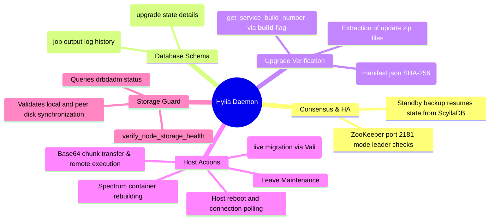

# Hylia (HA Rolling Upgrade & LCM) - Technical Documentation

This document details the internal technical structure, functions, flowcharts, and mindmaps of the Hylia rolling upgrade daemon.

## Technical Mindmap

## Function & Logic Breakdown

### `run_command_local(cmd)`
- Executes shell commands on the local host namespace. Returns status and output buffers.

### `run_remote_spark(ip, command, timeout=45)`
- Runs shell commands on target cluster hosts using Spark's REST API port `9099` over TLS.
- Re-attempts execution up to 5 times (2s intervals) to prevent network hiccups during reboots.

### `run_mtls_spark_api(ip, path, payload, method="POST")`
- Directly submits REST HTTP request calls targeting Spark's local or peer API. Used to coordinate scheduler tasks.

### `run_cql_query(cql_query)`
- Runs queries in ScyllaDB (looks for the local Daruk proxy port `9043`, falling back to `podman exec systemd-hydra-db cqlsh`).

### `get_cluster_hosts()`
- Parses `/etc/hci/cluster.json` to resolve IP addresses of cluster nodes.

### `get_zookeeper_leader_ip()`
- Scans nodes on port `2181` to locate the active ZooKeeper consensus leader.

### `is_zookeeper_leader()`
- Compares ZooKeeper leader IP with local hypervisor IP.

### `log_upgrade(job_id, line)`
- Writes log messages to standard out.
- Appends log records directly to the `hydra.hylia_logs` ScyllaDB table under the active `job_id` so all nodes can coordinate logs.

### `validate_and_extract_zip(zip_path, extract_dir)`
- Wipes `/tmp/helios_update` and extracts update package files.
- Parses `manifest.json` and performs SHA-256 hash checksum tests on all included components.

### `get_service_build_number(target_path)`
- Scans component python file headers for a `__build__` string parameter value.

### `verify_node_storage_health(job_id, node_ip, hostname)`
- Health guard. Runs before entering maintenance and leaving.
- Queries `drbdadm status` on target.
- Verifies that all resources are in a synchronized state (no `"Inconsistent"`, `"Outdated"`, or `"DUnknown"` states unless a single-node cluster is running).

### `hylia_rolling_upgrade(job_id)`
- Asynchronous orchestration thread:
  1. Loads manifest payload. Resolves whether it is a `FAST PATCH` (reboot not required) or `ROLLING REBOOT` upgrade.
  2. Transitions database job state to `UPGRADING`.
  3. Iterates over target hosts.
  4. Wait for other cluster hosts to reach a stable state `NORMAL`.
  5. Evacuates hosts by calling Vali's `/api/v1/host/maintenance` endpoint (`action="enter"`).
  6. Copies files via base64 encoded chunks.
  7. If Spectrum is upgraded, rebuilds the container on the target node.
  8. Triggers reboot and polls connection.
  9. Verifies DRBD sync health using `verify_node_storage_health()`.
  10. Clears maintenance mode (`action="leave"`).
  11. Transitions database job state to `COMPLETED` when all nodes finish.

### `main()` Loop
- Every 2 seconds, if it is the leader, queries `hydra.hylia_jobs`.
- If an active job is `PENDING`, starts the upgrade thread. If a job is `UPGRADING` and matches its node execution scope, resumes the execution thread (handles standby coordinator resume).
