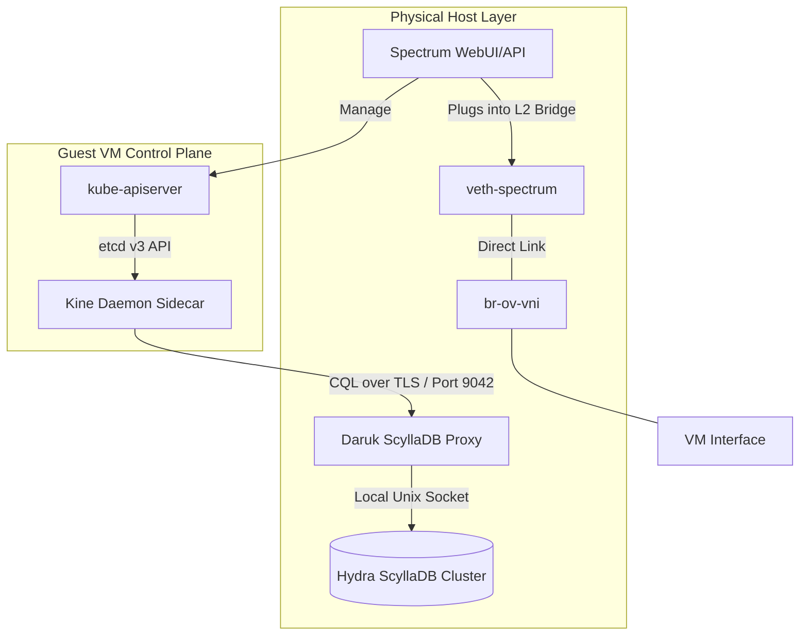

# Lanayru (ScyllaDB-Backed Kubernetes Workload Engine)

**Lanayru** is the guest Kubernetes orchestration engine for Helios HCI. It acts as the direct equivalent of VMware **Tanzu** (or Nutanix **Karbon**), allowing administrators to deploy fully-managed guest Kubernetes clusters directly from the Spectrum WebUI.

> [!NOTE]
> **Name Origin:** Named after **Lanayru**, the Golden Goddess of Wisdom from *The Legend of Zelda* who created the physical laws, routing logic, and cosmic order of the universe. In Helios-HCI, **Lanayru** brings logical order and scheduling structure to guest container workloads.

---

## 1. System Architecture

Unlike standard Kubernetes clusters that require dedicated, resource-heavy `etcd` database VMs, **Lanayru** leverages **Kine** (Kubernetes-in-default-databases) to store guest cluster states directly inside the physical host's **ScyllaDB (Hydra)** cluster.



### A. Kine Integration
* **API Translation:** A lightweight `kine` daemon runs as a systemd service (or container sidecar) inside the control plane VMs, listening on local port `2379` to mock a standard etcd server.
* **Host Database Persistence:** Kine translates incoming etcd gRPC read/write transactions into high-performance CQL queries, pointing directly to the host's physical ScyllaDB database pool via **Daruk** (port `9043` / `9042`).

### B. Database Schema
Cluster state is persisted inside the `hydra` keyspace under a dedicated table created only when a cluster is deployed:

```sql
-- Track metadata of active Kubernetes clusters managed by Lanayru
CREATE TABLE IF NOT EXISTS hydra.lanayru_clusters (
    cluster_id uuid PRIMARY KEY,
    name text,
    control_nodes int,
    overlay_segment_id uuid,
    status text,
    created_at timestamp
);

-- Store Kubernetes etcd key-value pairs translated by Kine
CREATE TABLE IF NOT EXISTS hydra.lanayru_k8s_state (
    cluster_id uuid,
    name text,
    value blob,
    version int,
    is_dir boolean,
    ttl int,
    PRIMARY KEY (cluster_id, name)
);
```

---

## 2. Deployment Options

Lanayru allows administrators to provision guest control planes in two configurations:

### Option A: Single Control Node (1 VM)
* **Description:** Provisions a single guest virtual machine running the control plane and API server.
* **Warning:** *Not production-ready.* Subject to immediate cluster downtime if the underlying host or VM fails.
* **Use Case:** Light testing, developer sandboxes, and edge computing nodes.

### Option B: High-Availability Quorum (3 VMs)
* **Description:** Provisions three virtual machines running redundant API servers and Kine sidecars.
* **Scheduling:** **Vali** (the host load balancer) enforces anti-affinity placement rules, ensuring that each of the 3 control VMs is scheduled on a *different* physical hypervisor node.
* **Use Case:** Production environments. If one physical node dies, the remaining two control plane VMs maintain database quorum.

---

## 3. Resolving the Urbosa NAT Network Challenge

### The Problem
When a guest Kubernetes cluster is deployed on an **Urbosa Overlay Network**, VMs receive private IPs within the segment (e.g. `10.244.0.0/24`). Because Urbosa utilizes a Tier-0 gateway with Source/Destination NAT for North-South routing, the host management system (**Spectrum WebUI/API** running on the host network) cannot route packets directly to the private IPs of the Kubernetes control planes (e.g. to inspect node health or fetch kubeconfigs).

### The Solution: Host-Overlay Veth Bridging
Instead of exposing the guest Kubernetes API to the public network or configuring complex NAT gateway rules, Helios resolves this using a **Veth Bridge Link**:

1. **Veth Creation:** The host `urbosa` daemon creates a virtual ethernet interface pair on the hypervisor host:
   ```bash
   ip link add veth-host type veth peer name veth-overlay
   ```
2. **Bridge Attachment:** The `veth-overlay` end is enslaved directly into the target segment's virtual bridge (`br-ov-{vni}`):
   ```bash
   ip link set veth-overlay up
   ```
   ```bash
   ip link set veth-overlay master br-ov-{vni}
   ```
3. **Host Routing:** The `veth-host` end is assigned an unused IP address within the overlay subnet range (e.g. `10.244.0.254/24`) and left in the host namespace.
4. **Result:** The host layer (where Spectrum resides) gains a direct, un-NAT'ed Layer-2 interface into the private overlay segment, allowing Spectrum to communicate with the guest Kubernetes API server (`https://10.244.0.10:6443`) instantly.

---

## 4. Deployment Pre-Checks & Requirements

Before initiating a Lanayru deployment, the Spectrum API executes a series of rigorous checks:

1. **ScyllaDB Ring Verification:**
   * Query `nodetool status` via Spark on all nodes.
   * *Requirement:* All metadata database seeds must report `UN` (Up Normal).
2. **Storage Space Allocation:**
   * Query the Linstor physical storage pool (`vg_aether`).
   * *Requirement:* Minimum `50 GB` of thin-provisioned storage available per control VM.
3. **Compute Capacity Validation:**
   * Check physical host RAM utilization via `free -m`.
   * *Requirement:* Control VMs require **2 vCPUs** and **4 GB RAM** minimum each.
4. **Urbosa SDN Status:**
   * Verify that the selected overlay segment is active and has a designated Tier-1 distributed router gateway configured.

---

## Technical Reference
* For details on internal state mapping tables, network bridging topologies, and anti-affinity scheduling configurations, refer to the [Lanayru Technical Guide](file:///C:/Users/AuraFlight/Desktop/container-hci/docs/lanayru_technical.md).
