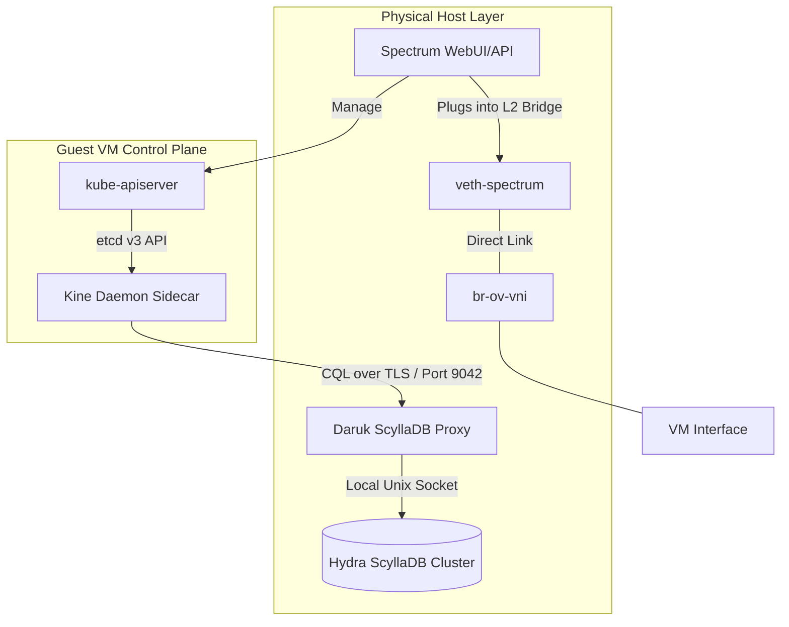

# Lanayru (ScyllaDB-Backed Kubernetes Workload Engine)

**Lanayru** is the guest Kubernetes orchestration engine for Helios HCI. It acts as the direct equivalent of VMware **Tanzu** (or Nutanix **Karbon**), allowing administrators to deploy fully-managed guest Kubernetes clusters directly from the Spectrum WebUI.

> [!NOTE]
> **Name Origin:** Named after **Lanayru**, the Golden Goddess of Wisdom from *The Legend of Zelda* who created the physical laws, routing logic, and cosmic order of the universe. In Helios-HCI, **Lanayru** brings logical order and scheduling structure to guest container workloads.

---

## 1. System Architecture

Unlike standard Kubernetes clusters that require dedicated, resource-heavy `etcd` database VMs, **Lanayru** leverages **Kine** (Kubernetes-in-default-databases) to store guest cluster states directly inside the physical host's **ScyllaDB (Hydra)** cluster.


```mermaid
graph TD
    subgraph Guest VM Control Plane
        API[kube-apiserver] -->|etcd v3 API| Kine[Kine Daemon Sidecar]
    end

    subgraph Physical Host Layer
        Kine -->|CQL over TLS / Port 9042| Proxy[Daruk ScyllaDB Proxy]
        Proxy -->|Local Unix Socket| DB[(Hydra ScyllaDB Cluster)]
        Spectrum[Spectrum WebUI/API] -->|Manage| API
        Spectrum -->|Plugs into L2 Bridge| Veth[veth-spectrum]
        Veth ---|Direct Link| Bridge[br-ov-vni]
    end

    Bridge --- VM_NIC[VM Interface]
```

### A. Kine Integration
* **API Translation:** A lightweight `kine` daemon runs as a systemd service (or container sidecar) inside the control plane VMs, listening on local port `2379` to mock a standard etcd server.
* **Host Database Persistence:** Kine translates incoming etcd gRPC read/write transactions into high-performance CQL queries, pointing directly to the host's physical ScyllaDB database pool via **Daruk** (port `9043` / `9042`).

### B. Database Schema
Cluster state is persisted inside the `hydra` keyspace under a dedicated table created only when a cluster is deployed:

```sql
-- Track metadata of active Kubernetes clusters managed by Lanayru
CREATE TABLE IF NOT EXISTS hydra.lanayru_clusters (
    cluster_id uuid PRIMARY KEY,
    name text,
    control_nodes int,
    overlay_segment_id uuid,
    status text,
    created_at timestamp
);

-- Store Kubernetes etcd key-value pairs translated by Kine
CREATE TABLE IF NOT EXISTS hydra.lanayru_k8s_state (
    cluster_id uuid,
    name text,
    value blob,
    version int,
    is_dir boolean,
    ttl int,
    PRIMARY KEY (cluster_id, name)
);
```

### C. Registering Control-Plane VMs

Each control node is registered in `hydra.vms` **before** any storage is built for it, using
Daruk's [`POST /v1/vm/create`](./daruk.md#operations) (`INSERT ... IF NOT EXISTS`). A name
that is already taken fails the deployment with the current owner named.

The order matters and so does the condition. `INSERT` is an upsert in CQL, and the
registration used to be unconditional and to run *after* the disk had been created and the
OS image written to it. Deploying a cluster whose name collided with an existing VM
therefore reset that VM's placement onto the new target host — and by then the image copy
had already run over its disk.

The registration also named columns `hydra.vms` does not have — `uuid`, `vcpus`, `ram`,
`guest_ip`, `network_name`, `created_at` — so Scylla rejected the statement and
`run_cql_query`'s `rc=1` was never read. **No Lanayru control node had ever actually been
recorded.** The real columns are `vcpu`, `memory`, `disk_path`, `disks_list`, `network_id`
and `state`; there is no column for the guest address, which lives in the cloud-init
configuration.

Once libvirt has started the guest, Lanayru records that through
[`POST /v1/vm/set-state`](./daruk.md#operations) with `expected_host_ip` set to the target
host, so a VM that has moved on is left alone.

> [!WARNING]
> That write was `UPDATE hydra.vms SET status = 'running' WHERE name = ?`, and **`status` is
> not the power state — it is the VM migration lock**, whose *released* value happens to be
> the string `running`. A provisioner that has never held that lock was clearing it on every
> VM it created, so a live migration in flight over the same name would find its lock gone
> and a second migration free to start. `state` is the column that records what the guest is
> doing; `/v1/vm/set-state` writes it and does not name `status` at all.

---

## 2. Deployment Options

Lanayru allows administrators to provision guest control planes in two configurations:

### Option A: Single Control Node (1 VM)
* **Description:** Provisions a single guest virtual machine running the control plane and API server.
* **Warning:** *Not production-ready.* Subject to immediate cluster downtime if the underlying host or VM fails.
* **Use Case:** Light testing, developer sandboxes, and edge computing nodes.

### Option B: High-Availability Quorum (3 VMs)
* **Description:** Provisions three virtual machines running redundant API servers and Kine sidecars.
* **Scheduling:** **Vali** (the host load balancer) enforces anti-affinity placement rules, ensuring that each of the 3 control VMs is scheduled on a *different* physical hypervisor node.
* **Use Case:** Production environments. If one physical node dies, the remaining two control plane VMs maintain database quorum.

---

## 3. Resolving the Urbosa NAT Network Challenge

### The Problem
When a guest Kubernetes cluster is deployed on an **Urbosa Overlay Network**, VMs receive private IPs within the segment (e.g. `10.244.0.0/24`). Because Urbosa utilizes a Tier-0 gateway with Source/Destination NAT for North-South routing, the host management system (**Spectrum WebUI/API** running on the host network) cannot route packets directly to the private IPs of the Kubernetes control planes (e.g. to inspect node health or fetch kubeconfigs).

### The Solution: Host-Overlay Veth Bridging
Instead of exposing the guest Kubernetes API to the public network or configuring complex NAT gateway rules, Helios resolves this using a **Veth Bridge Link**:

1. **Veth Creation:** The host `urbosa` daemon creates a virtual ethernet interface pair on the hypervisor host:
   ```bash
   ip link add veth-host type veth peer name veth-overlay
   ```
2. **Bridge Attachment:** The `veth-overlay` end is enslaved directly into the target segment's virtual bridge (`br-ov-{vni}`):
   ```bash
   ip link set veth-overlay up
   ```
   ```bash
   ip link set veth-overlay master br-ov-{vni}
   ```
3. **Host Routing:** The `veth-host` end is assigned an unused IP address within the overlay subnet range (e.g. `10.244.0.254/24`) and left in the host namespace.
4. **Result:** The host layer (where Spectrum resides) gains a direct, un-NAT'ed Layer-2 interface into the private overlay segment, allowing Spectrum to communicate with the guest Kubernetes API server (`https://10.244.0.10:6443`) instantly.

---

## 4. Deployment Pre-Checks & Requirements

Before initiating a Lanayru deployment, the Spectrum API executes a series of rigorous checks:

1. **ScyllaDB Ring Verification:**
   * Query `nodetool status` via Spark on all nodes.
   * *Requirement:* All metadata database seeds must report `UN` (Up Normal).
2. **Storage Space Allocation:**
   * Ask each node's sidon for its extent store capacity.
   * *Requirement:* Minimum `50 GB` of thin-provisioned storage available per control VM.
3. **Compute Capacity Validation:**
   * Check physical host RAM utilization via `free -m`.
   * *Requirement:* Control VMs require **2 vCPUs** and **4 GB RAM** minimum each.
4. **Urbosa SDN Status:**
   * Verify that the selected overlay segment is active and has a designated Tier-1 distributed router gateway configured.

The Phoenix console draws these four as a pre-flight and treats an `:error` check as
*blocking*: the deploy button is disabled and the reasons are listed under it. Each such
check is a condition already established to make the deploy fail — no overlay segment, an
unmounted extent store, a ring with no member up — and a deploy started anyway runs for
minutes on real hosts before saying so. Warnings do not block; a degraded ring or a
nearly-full store is a judgement call and it is the operator's.

---

## 5. Deploy and destroy are Catalyst tasks

Both build or tear down a Kubernetes cluster across every node, so both go on Catalyst's
`lanayru` queue and are drained on the node holding the `lanayru-queue` candidacy ([service_leadership.md](./service_leadership.md)). What drains it is the **console
backend** rather than a daemon of its own: `deploy_lanayru_worker` and
`destroy_lanayru_worker` import `run_cql_query`, `run_lwt`, `sidon_call`,
`get_cluster_nodes` and the log buffer from `spectrum_server.py`, so a worker anywhere else
means moving all of that first.

`lanayru_queue_loop()` runs under `supervise()` and long-polls `/api/v1/queues/lanayru`
only while this node holds the `lanayru-queue` candidacy — Catalyst's queues are in-process on the
leader, so a worker elsewhere polls a queue nothing is ever put on. It is supervised
because it is the only thing anywhere that runs a deploy or a teardown: a copy that died
quietly would leave every such task `pending` with nothing on the console to say why.

Each worker is handed **Catalyst's** task id rather than minting its own. Both already
write their progress into `hydra.catalyst_tasks` through `log_catalyst_task`, keyed by the
id they are given, so the row the submission wrote and the rows the worker writes are the
same row and the console's task ring follows a deploy from `pending` to its verdict without
a gap. A worker that raises where it does not catch is ended as `failed` by the loop, in
the table and in Catalyst; otherwise the task would stay `processing` for ever and the ring
would spin on it.

The console refuses before it submits: a second deploy while a cluster is on record would
overwrite the row describing the one that exists, a deploy onto a disabled overlay produces
a cluster whose pods cannot reach each other, and a destroy requires the cluster's name to
be typed back.

> [!NOTE]
> The Python tier's `/api/lanayru/deploy` and `/api/lanayru/destroy` still spawn a thread
> on whichever node served the request. They are the old console's path and are unchanged;
> they are also why the queue worker reuses Catalyst's task id, since the two paths write
> the same table.

---

## Technical Reference
* For details on internal state mapping tables, network bridging topologies, and anti-affinity scheduling configurations, refer to the [Lanayru Technical Guide](file:///C:/Users/AuraFlight/Desktop/container-hci/docs/lanayru_technical.md).
