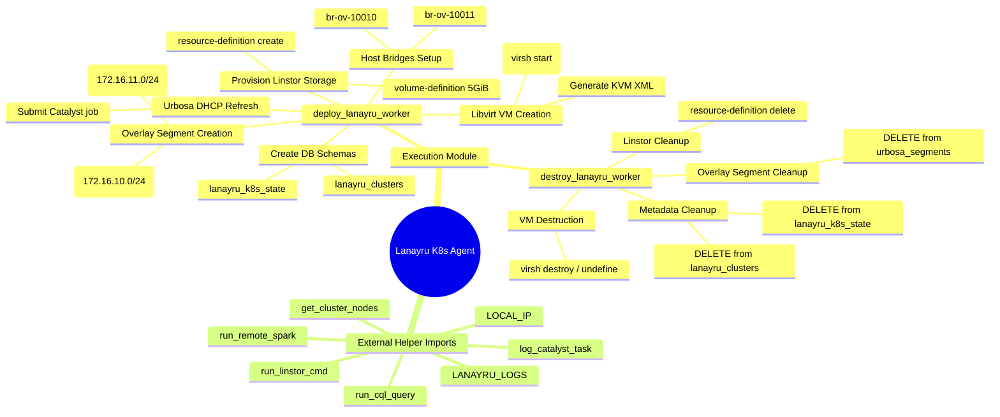

# Lanayru Technical Guide & System Mindmap

This document provides a detailed technical reference and architectural mindmap for the refactored **Lanayru** guest Kubernetes workload engine agent ([lanayru.py](file:///C:/Users/AuraFlight/Desktop/container-hci/lanayru.py)).

---

## 1. Lanayru System Mindmap



---

## 2. Component Specifications

| Technical Metric | Value / Implementation |
| :--- | :--- |
| **Script Path** | [lanayru.py](file:///C:/Users/AuraFlight/Desktop/container-hci/lanayru.py) |
| **Port Mapping** | VNC console ports: `5910` + i |
| **Orchestration** | Triggered asynchronously via threads in `spectrum_server.py` |

---

## 3. Operations & Lifecycle

```
[ Spectrum Client POST ]
          │
          │ (Thread Spawn)
          ▼
[ lanayru.py: deploy_lanayru_worker ]
          │
          ├─► Create ScyllaDB Schemas
          ├─► Setup L2 Overlay bridges
          ├─► Provision thin Linstor disks (RF=3)
          └─► Define & Start Libvirt VMs
```

---

## Technical Reference
* For details on high-level architecture designs and the host NAT bypass solution, refer to the main [Lanayru Design Guide](file:///C:/Users/AuraFlight/Desktop/container-hci/docs/lanayru.md).
