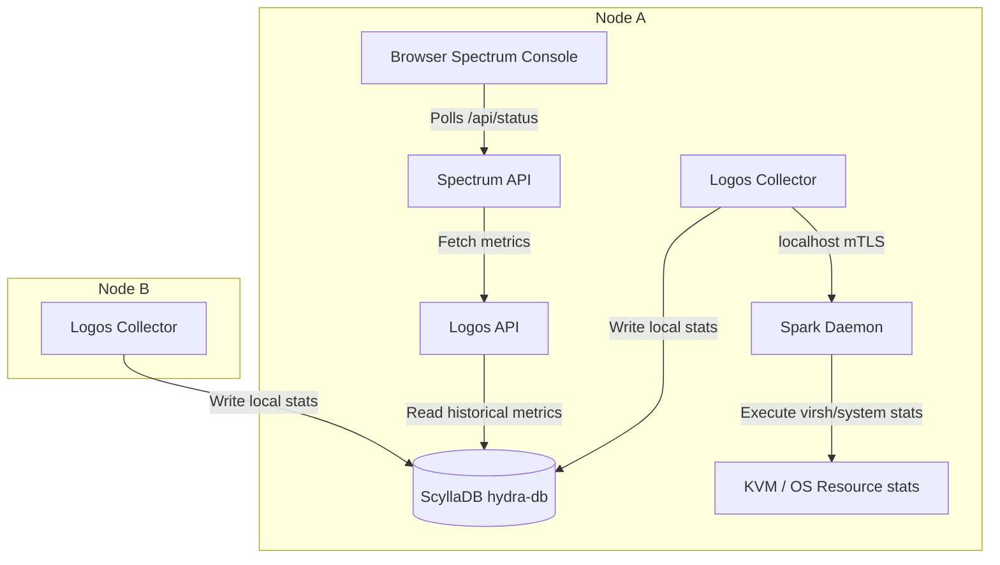

# Logos - Distributed Metrics Collection & Time-Series Data Server

**Logos** is the proposed time-series metrics aggregator and monitoring service for the Valkyrie HCI cluster. It replaces synchronous real-time hypervisor polling with a database-backed, background-aggregated telemetry loop, eliminating performance bottlenecks in the Spectrum console UI.

---

## 1. System Architecture

Logos operates as a distributed daemon (`logos.service`) running on every node in the cluster. It splits its responsibilities into a local **Telemetry Collector** (Write Path) and a clustered **Metrics API** (Read Path).



---

## 2. Component Interactions

### A. Telemetry Collection (Write Path)
1. **Interval**: Every 5–10 seconds, the local `logos` collector daemon wakes up.
2. **Local Polling via Spark**: Logos queries the local hypervisor stats by sending an HTTP command to the local Spark daemon on localhost port `9099`.
   - *Why through Spark?* Reuses the existing secure, local Spark credentials and keeps host system access centralized.
3. **Database Write**: The local collector writes the aggregated metrics record directly into ScyllaDB (`hydra.logos_metrics`).

### B. Metrics Query (Read Path)
1. **Request**: The Spectrum WebUI sends a poll request to the local `/api/status` or `/api/metrics/history` endpoint in `spectrum_server.py`.
2. **Cache Read**: Instead of running system commands, Spectrum queries the local Logos API instance or ScyllaDB directly.
3. **Response**: Sub-millisecond response times, as no shell commands (`virsh` or `lsblk`) are spawned on the hosts.

---

## 3. Communication Channels: Through Spark vs. Direct

| Communication Flow | Channel | Purpose |
| :--- | :--- | :--- |
| **Logos Collector $\rightarrow$ Local Host Stats** | **Through Spark** (`127.0.0.1:9099`) | Reuses Spark to execute `virsh domstats` and read host disk partitions, avoiding separate root socket permissions. |
| **Logos Collector $\rightarrow$ ScyllaDB** | **Direct** (TCP `9042`) | Collector writes metrics records directly to the `hydra.logos_metrics` table cluster-wide. |
| **Logos (Node A) $\rightarrow$ Logos (Node B)** | **Through Spark Mesh** (mTLS `9099`) | If a Logos node needs coordination, it routes via Spark: `Logos (A) -> Spark (A) -> Spark (B) -> Logos (B)`. |
| **Spectrum UI $\rightarrow$ Logos API** | **Direct** (Local HTTP / ScyllaDB) | Reads pre-populated historical metrics from the distributed database. |

---

## 4. Leader Coordination Dynamics

> [!NOTE]
> Do we need a leader for Logos?

* **No Leader for Ingestion (Writes)**: Since ScyllaDB is a distributed, partition-tolerant database, every local instance of Logos writes its own node's metrics independently. No master coordinator is needed for writes.
* **Consolidated API Reader**: When Spectrum reads cluster-wide metrics history, it can query the Logos API instance on any node. Because ScyllaDB synchronizes the `logos_metrics` table cluster-wide, any instance of Logos has a full view of the cluster's metrics. If a specific coordination step or health aggregation is required, the request is forwarded to the active ZooKeeper leader via Spark's mTLS routing.

---

## 5. Service Status & Integration

To integrate Logos into the cluster lifecycle and Spark status commands, we will register it as a first-class service.

### A. ScyllaDB Schema Definition
```sql
CREATE TABLE IF NOT EXISTS hydra.logos_metrics (
    node_ip text,
    timestamp timestamp,
    cpu_pct float,
    mem_pct float,
    disk_iops float,
    disk_bandwidth_kbps float,
    net_rx_kbps float,
    net_tx_kbps float,
    PRIMARY KEY (node_ip, timestamp)
) WITH CLUSTERING ORDER BY (timestamp DESC)
  AND default_time_to_live = 86400;
```

### B. Service Management & Status Monitoring
We will register `logos` in the service listings across all nodes:

1. **Systemd Unit File (`logos.service`)**:
   Exposed as a simple daemon running `/usr/local/bin/logos`.
2. **Spark status monitoring (`spark.py` & `spark_daemon_decoded.py`)**:
   Add `logos` to the `services` array so that:
   - `systemctl start/stop/status logos` is managed during `cluster start/stop` sequences.
   - It appears in the health console's status metrics and CLI outputs (`valcli host.list` / spark dashboards).
