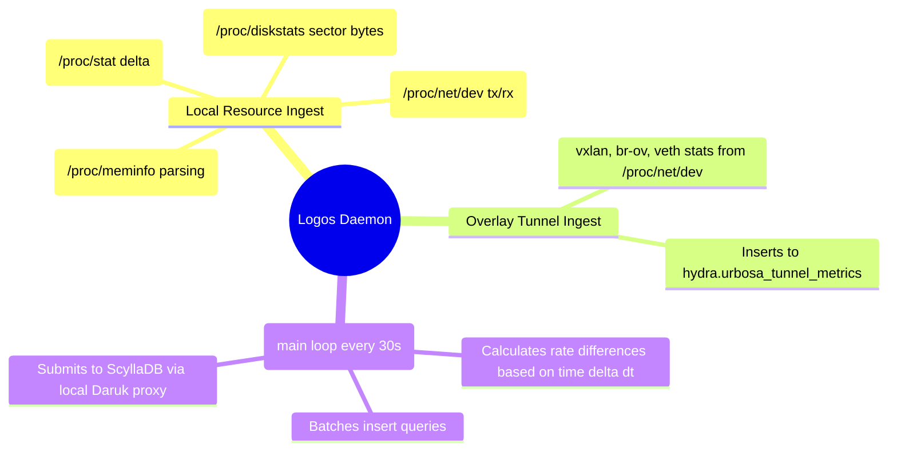

# Logos (Distributed Metrics Collection) - Technical Documentation

This document details the internal technical structure, functions, flowcharts, and mindmaps of the Logos metrics daemon.

## Technical Mindmap

## Function & Logic Breakdown

### `get_local_ip()`
- Reads local host IP from `/etc/hci/spectrum/spectrum.env`. Fallback: `127.0.0.1`.

### Host Resource Readers
- **`get_cpu_stats()`**: Reads `/proc/stat` and returns CPU idle and total ticks.
- **`get_mem_usage()`**: Reads `/proc/meminfo`. Subtracts `MemFree`, `Buffers`, `Cached`, and `SReclaimable` from `MemTotal` to get accurate RAM consumption. Returns `(mem_pct, mem_total_kb)`.
- **`get_cpu_cores()`**: Counts logical processors in `/proc/cpuinfo`.
- **`get_disk_stats()`**: Filters disk stats in `/proc/diskstats` for matching standard disk interfaces (`sd*`, `vd*`, `hd*`, `nvme*`). Returns total disk IO operations and sectors multiplied by 512 to get bytes.
- **`get_net_stats()`**: Reads rx/tx bytes for non-loopback interfaces in `/proc/net/dev`.
- **`get_interface_stats()`**: Filters interfaces in `/proc/net/dev` for SDN/overlay components (starting with `vxlan`, `br-ov`, or `veth`). Returns rx/tx bytes and packets.

### `run_cql_query(cql_query)`
- Runs queries in ScyllaDB (looks for local Daruk proxy on port 9043, falling back to direct container CLI commands).

### `main()` Ingestion Loop
- Executes every 30 seconds:
  1. Resolves local node IP.
  2. Queries current resource snapshots and calculates usage rates relative to the previous sample's timestamp and stats (dt time delta).
  3. Calculates disk IOPS, disk bandwidth (KB/s), network rates (KB/s).
  4. Gathers overlay tunnel rates (KB/s and packets/s).
  5. Assembles batched `INSERT INTO hydra.urbosa_tunnel_metrics` and `INSERT INTO hydra.logos_metrics` queries.
  6. Submits the combined batch statements to ScyllaDB.
