# Helios-HCI Master System Flowchart

This document details the system-wide execution flow, API pathways, and database boundaries connecting all components in a Helios-HCI cluster.

## System-Wide Component Interactions

```mermaid
flowchart TD
    %% CLI & Bootstrap Section
    Provision[provision.py] -->|Bootstrap SSH Keys & Config| Nodes[Valkyrie Node Hosts]
    SyncProvision[sync_provision.py] -->|Inject base64 variables| Provision
    CliCluster[cluster_new.py] -->|mTLS HTTPS Port 9099 execute| Spark[spark_daemon_decoded.py]
    Spark -->|Local Systemd Exec| ServiceUnits[Cluster systemd Quadlet Units]
    
    %% API & Web Console Ingress
    Browser[Web Browser UI / Client] -->|HTTPS Port 8443 Ingress| Spectrum[spectrum_server.py]
    Spectrum -->|Validate Token| SessionCheck{ScyllaDB Session Cache}
    SessionCheck -->|Cache Miss| Daruk[daruk.py ScyllaDB Proxy :9043]
    Daruk -->|Persistent CQL| Scylla[(ScyllaDB :9042)]
    
    %% VM Scheduling & Management
    Spectrum -->|Submit Task| Catalyst[catalyst.py Task Manager :9091]
    Valcli[valcli.py VM CLI] -->|Trigger API calls| Spectrum
    Valcli -->|Query VM State| Daruk
    Catalyst -->|Long-poll pending jobs| Vali[vali.py VM scheduler]
    Vali -->|Backup / Restore UEFI vars| Daruk
    Vali -->|Execute QEMU commands| Libvirt[libvirtd / KVM]
    
    %% Storage & High Availability
    Mipha[mipha.py HA Monitor] -->|Poll status 10s| ZK[ZooKeeper :2181]
    Mipha -->|If Leader: Promote Primary| DRBD[DRBD Kernel Replication]
    Mipha -->|Active Node Ping| Spark
    Mipha -->|If node DOWN: Fence host| SSH_Fence[SSH Fencing: kill qemu]
    SSH_Fence -->|Enqueue restarts| Catalyst
    
    %% Rolling Upgrades & LCM
    Hylia[hylia.py Upgrade Engine] -->|Validate Manifest Checksums| UpdateZip[update_package.zip]
    Hylia -->|Evacuate host| Vali
    Hylia -->|Copy binaries base64| Spark
    Hylia -->|Verify replication sync| DRBD
    Hylia -->|Reboot node| Spark
    TestHylia[test_hylia.py] -->|Unit Test Verification| Hylia
    
    %% Cron & Scheduling Worker
    Catalyst -->|Evaluate dagur_schedules| CatalystQueue{Catalyst Task Queue}
    CatalystQueue -->|Poll dagur queue| Dagur[dagur.py Cron Worker]
    Dagur -->|Execute cron command| Spark
    Dagur -->|Log run details| Daruk
    
    %% SDN Overlay Networks
    Spectrum -->|Enable SDN settings| UrbosaBoot[urbosa_bootstrap.py]
    UrbosaBoot -->|Seed default Firewall rules| Daruk
    Urbosa[urbosa.py SDN Controller] -->|If Leader: Create ns-t0| NetnsT0[ns-t0 Active-Passive Edge]
    Urbosa -->|Create ns-t1 namespaces| NetnsT1[ns-t1 Distributed Router]
    Urbosa -->|Create VXLAN tunnels dstport 4789| VXLAN[VXLAN Tunnel Bridge Mesh]
    Urbosa -->|Configure iptables micro-segmentation| Firewall[FORWARD chain rules]
    Gatoway[gatoway.py L2 Sync] -->|Sync VLAN bridges br-vlan-ID| Uplinks[Physical uplink sub-interfaces]
    
    %% Floating Virtual IP
    Bifrost[bifrost.py VIP Manager] -->|Poll ZK leader & local Port 8443| ZK
    Bifrost -->|Bind VIP to active interface| VIP[floating Virtual IP]
    Bifrost -->|Broadcast GARP update| VIP
    
    %% Centralized Metrics
    Logos[logos.py Ingestion] -->|Read CPU/RAM stats| HostOS[ProcFS: /proc]
    Logos -->|Read VXLAN/Veth rates| HostOS
    Logos -->|Batch write historical telemetry| Daruk
    
    %% Metrics Read Path
    Spectrum -->|Read historical telemetry| Daruk
```

## Description of Key Pathways

### 1. Ingress & Command Routing
- Administrators execute actions using **Spectrum** (Web Console) or **valcli** (Command Line Interface).
- Spectrum handles requests, verifying session parameters against ScyllaDB records via **Daruk** (query proxy).
- Core tasks (like VM creation or migration) submit asynchronous jobs to **Catalyst**'s local queue.

### 2. Task Execution Pipeline
- **Vali** and **Dagur** act as background execution workers. They perform long-polling requests targeting Catalyst (`GET /api/v1/queues/<service>`).
- When a task is picked up, workers coordinate system actions locally or invoke mTLS REST commands on port `9099` targeting **Spark** on remote cluster hosts.
- Workers report progress back to Catalyst, which resolves client long-polls.

### 3. High Availability & consensus
- **Mipha** monitors cluster nodes. It uses ZooKeeper consensus to elect a single active coordinator.
- The coordinator leader handles mounting `/var/lib/linstor` and promoting the storage databases.
- If a host goes offline, Mipha coordinates fencing and resets VM states to allow Vali to schedule a restart on surviving hosts.
- **Bifrost** queries ZooKeeper consensus and binds the floating VIP address to the active leader running Spectrum, allowing users a single ingress endpoint.

### 4. Software Defined Networks (SDN)
- **Urbosa** and **Gatoway** synchronize networks with configuration schemas defined in ScyllaDB.
- Gatoway manages physical Layer-2 bridges and VLAN sub-interfaces on host ports.
- Urbosa handles Layer-3 overlay segments (VXLAN tunnels), Tier-1 distributed router namespaces, Tier-0 active-passive edge gateways (masquerading namespaces on the VIP leader), and micro-segmentation iptables rules on the hosts.
