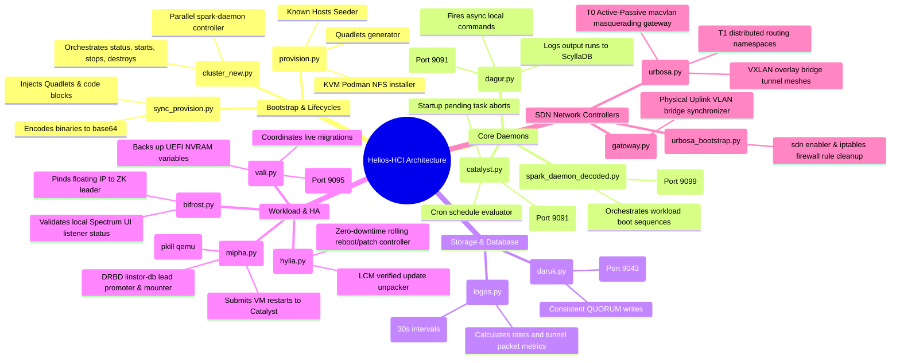

# Helios-HCI Master Technical Mindmap

This document aggregates the architectural taxonomy and technical components of the Helios-HCI system into a unified master mindmap.

```mermaid
mindmap
  root((Helios-HCI Architecture))
    Bootstrap & Lifecycles
      Provisioning (provision.py)
        KVM Podman NFS installer
        Quadlets generator
        Known Hosts Seeder
      Sync Manager (sync_provision.py)
        Encodes binaries to base64
        Injects Quadlets & code blocks
      System Controller (cluster_new.py)
        Parallel spark-daemon controller
        Orchestrates status, starts, stops, destroys
    Core Daemons
      mTLS Coordinator (spark_daemon_decoded.py)
        Executes local host shell scripts (Port 9099)
        Orchestrates workload boot sequences
      Task Coordinator (catalyst.py)
        HTTP API task server (Port 9091)
        Cron schedule evaluator
        Startup pending task aborts
      Cron Worker (dagur.py)
        Long-polls Catalyst queue (Port 9091)
        Fires async local commands
        Logs output runs to ScyllaDB
    Storage & Database
      ScyllaDB Proxy (daruk.py)
        Persistent cassandra-driver connection (Port 9043)
        Consistent QUORUM writes
      Metadata telemetry (logos.py)
        Ingests CPU/RAM/Disk stats (30s intervals)
        Calculates rates and tunnel packet metrics
    Workload & HA
      VM Scheduling (vali.py)
        Connects to libvirt hypervisor (Port 9095)
        Coordinates live migrations
        Backs up UEFI NVRAM variables
      HA Coordinator (mipha.py)
        DRBD linstor-db lead promoter & mounter
        Fences dead hosts (pkill qemu)
        Submits VM restarts to Catalyst
      VIP Manager (bifrost.py)
        Pinds floating IP to ZK leader
        Validates local Spectrum UI listener status
      Upgrade Coordinator (hylia.py)
        LCM verified update unpacker
        Zero-downtime rolling reboot/patch controller
    SDN Network Controllers
      Bridge Sync (gatoway.py)
        Physical Uplink VLAN bridge synchronizer
      Logical Router (urbosa.py)
        T0 Active-Passive macvlan masquerading gateway
        T1 distributed routing namespaces
        VXLAN overlay bridge tunnel meshes
      Network Seeder (urbosa_bootstrap.py)
        sdn enabler & iptables firewall rule cleanup
```
