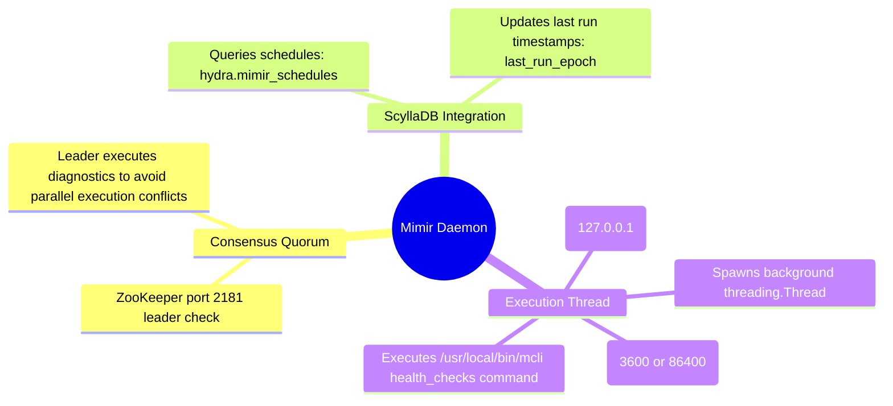

# Mimir (Health Checker Daemon) - Technical Documentation

This document details the internal technical structure, functions, flowcharts, and mindmaps of the Mimir health checker daemon.

## Technical Mindmap

## Function & Logic Breakdown

### `run_remote_spark(ip, command)`
- Submits shell commands to Spark REST execution endpoint (`https://<ip>:9099/api/v1/execute`) using mTLS credentials.

### `run_cql_query(cql_query)`
- Runs queries in ScyllaDB (looks for local Daruk proxy on port 9043, falling back to direct container command).

### `get_zookeeper_leader_ip()`
- Reads `/etc/hci/cluster.json` and scans ZooKeeper nodes on port `2181` to locate the active leader.
- Candidate fallback search on Catalyst API port `9091`.

### `is_zookeeper_leader()`
- Compares the ZooKeeper leader IP with local hypervisor IP.

### `main()` Loop
- Main execution entry point. Loops every 60 seconds:
  1. Checks `is_zookeeper_leader()`. If not the leader, skips the scheduling loop.
  2. Queries `hydra.mimir_schedules` to get the list of schedules.
  3. Iterates over active/enabled schedules:
     - Resolves the checking interval (e.g. 3600s if schedule name is `'hourly_checks'`, otherwise 86400s).
     - Compares elapsed time: `now - last_run >= interval`.
     - Updates `last_run_epoch` in ScyllaDB and inserts into local state tracking.
     - Spawns a daemonized background `threading.Thread` to run `/usr/local/bin/mcli health_checks run_all` (or a specific category) via `run_remote_spark` on `127.0.0.1`.
