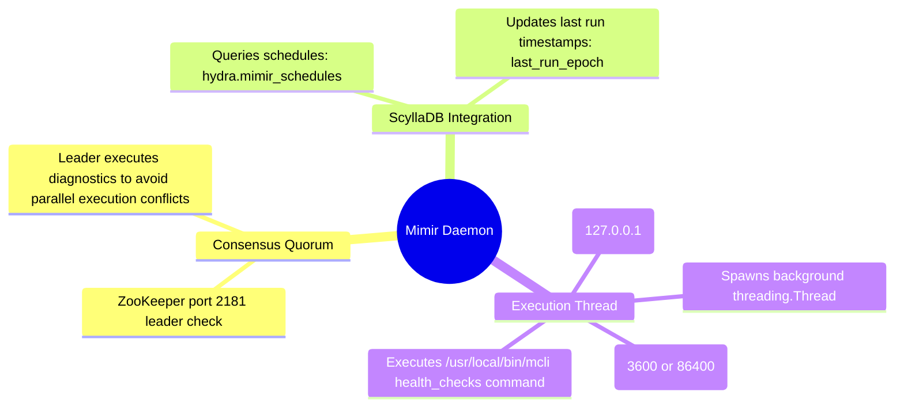
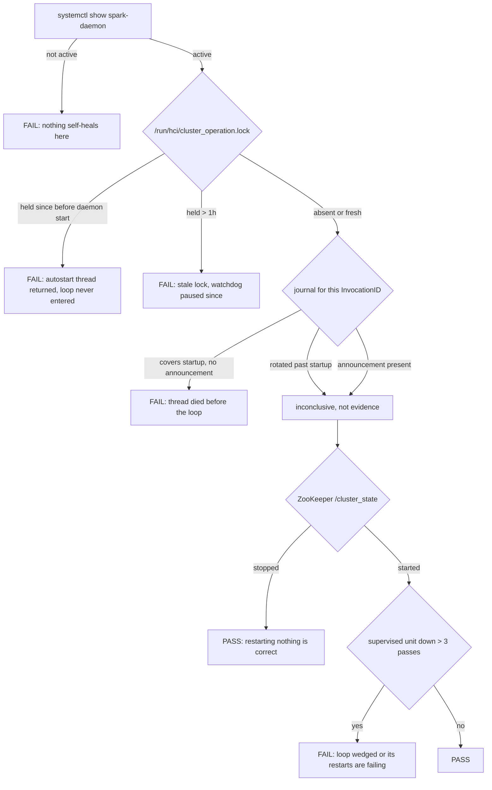

# Mimir (Health Checker Daemon) - Technical Documentation

This document details the internal technical structure, functions, flowcharts, and mindmaps of the Mimir health checker daemon.

## Technical Mindmap

```mermaid
mindmap
  root((Mimir Daemon))
    Consensus Quorum
      ZooKeeper port 2181 leader check
      Leader executes diagnostics to avoid parallel execution conflicts
    ScyllaDB Integration
      Queries schedules: hydra.mimir_schedules
      Updates last run timestamps: last_run_epoch
    Execution Thread
      Computes elapsed time >= interval (3600 or 86400)
      Spawns background threading.Thread
      Runs run_remote_spark targeting localhost (127.0.0.1)
      Executes /usr/local/bin/mcli health_checks command
```

## Function & Logic Breakdown

### `run_remote_spark(ip, command)`
- Submits shell commands to Spark REST execution endpoint (`https://<ip>:9099/api/v1/execute`) using mTLS credentials.

### `run_cql_query(cql_query)`
- Runs queries in ScyllaDB (looks for local Daruk proxy on port 9043, falling back to direct container command).

### `get_zookeeper_leader_ip()`
- Reads `/etc/hci/cluster.json` and scans ZooKeeper nodes on port `2181` to locate the active leader.
- Candidate fallback search on Catalyst API port `9091`.

### `is_zookeeper_leader()`
- Compares the ZooKeeper leader IP with local hypervisor IP.

### `main()` Loop (mimir)
- Main execution entry point. Loops every 60 seconds:
  1. Checks `is_zookeeper_leader()`. If not the leader, skips the scheduling loop.
  2. Queries `hydra.mimir_schedules` to get the list of schedules.
  3. Iterates over active/enabled schedules:
     - Resolves the checking interval (e.g. 3600s if schedule name is `'hourly_checks'`, otherwise 86400s).
     - Compares elapsed time: `now - last_run >= interval`.
     - Updates `last_run_epoch` in ScyllaDB and inserts into local state tracking.
     - Spawns a daemonized background `threading.Thread` to run `/usr/local/bin/mcli health_checks run_all` (or a specific category) via `run_remote_spark` on `127.0.0.1`.

---

## `mcli-runner` Check Structure

`mcli-runner` executes the checks on one node and prints a JSON map of
`check_name -> {status, output}`. `mcli` reads that map, writes each result into
`hydra.mimir_results` under the check's own category from `CHECK_ID_TO_FUNC`, and renders
the summary.

### Shared helpers

These exist so a check can ask a question about the node without re-deriving it inline,
and so every check can name the specific resource, unit or file at fault. All are
read-only.

| Helper | Returns |
| :--- | :--- |
| `run_cmd_timed(cmd, timeout)` | `(rc, out, err, elapsed, timed_out)`. `run_cmd` waits forever; a check whose subject is how long something takes cannot use it. |
| `systemd_props(unit, props)` | `systemctl show` output as a dict, `{}` if unreadable. |
| `monotonic_uptime()` / `seconds_since_monotonic(raw)` | Age of a systemd `*TimestampMonotonic` field, compared against `/proc/uptime`. Monotonic microseconds rather than the human-rendered `ActiveEnterTimestamp`, which is formatted in the node's locale — a locale-dependent date parse has already produced one check here that answered `PASS` because it could not read a date. |
| `parse_json_rows(out)` | Rows of a `SELECT JSON` result, skipping cqlsh's frame. |
| `parse_cql_timestamp_ms(value)` | Milliseconds for a CQL `timestamp`, which `SELECT JSON` renders as `'2026-08-21 20:58:49.309Z'` and not as a number. `None` for unparseable, never `0` — zero reads as 1970, i.e. infinitely stuck. |
| `libvirt_units_active()` | True if any of `libvirtd`, `libvirtd.socket`, `virtqemud`, `virtqemud.socket` is active. A modular host leaves `libvirtd.service` inactive while `virsh` works. |
| `load_deployed_module(name, paths)` | Imports a deployed CLI by path. `/usr/local/bin/*` have no `.py` suffix, importlib infers a loader from the extension, and `spec_from_file_location` returns `None` for an extensionless path — an explicit `SourceFileLoader` is the only thing that works. |
| `compose_report(headline, fails, warns, notes)` | One message: failures first, then warnings, then the evidence. The evidence prints on a `PASS` too, because "PASS" with nothing behind it is indistinguishable from a check that did not run. |

### Collector / classifier split

The four checks added for section 13 of the audit are each written as a pair:
`collect_*_facts()` performs the I/O and returns a plain dict; `classify_*(facts)` is pure
and returns `(status, message)`. The classifiers are what the unit tests in
`test_mimir_checks.py` drive, so each check can be shown to fire on the fault, stay quiet
on the healthy case, and answer `WARN` — never `PASS` — on an input it could not read.

| Check | Collector | Classifier |
| :--- | :--- | :--- |
| `watchdog_daemon_status` | `collect_watchdog_facts()` | `classify_watchdog()` |
| `sidon_latency_check` | inline — times a `ping` on `/run/sidon/control.sock` | inline thresholds |
| `drs_storage_capacity_check` | `collect_drs_storage_facts(local_ip, controller_ip)` | `classify_drs_storage_gate()` |
| `migration_lock_status` | `collect_migration_lock_facts()` | `classify_migration_locks()` |

### `collect_watchdog_facts()`

spark-daemon's watchdog thread publishes nothing, so the facts are gathered from four
independent places and the classifier weighs them:

```mermaid
flowchart TD
  A[systemctl show spark-daemon] -->|not active| F[FAIL: nothing self-heals here]
  A -->|active| B{/run/hci/cluster_operation.lock}
  B -->|held since before daemon start| F2[FAIL: autostart thread returned, loop never entered]
  B -->|held > 1h| F3[FAIL: stale lock, watchdog paused since]
  B -->|absent or fresh| C{journal for this InvocationID}
  C -->|covers startup, no announcement| F4[FAIL: thread died before the loop]
  C -->|rotated past startup| D[inconclusive, not evidence]
  C -->|announcement present| D
  D --> E{ZooKeeper /cluster_state}
  E -->|stopped| P1[PASS: restarting nothing is correct]
  E -->|started| G{supervised unit down > 3 passes}
  G -->|yes| F5[FAIL: loop wedged or its restarts are failing]
  G -->|no| P2[PASS]
```

Findings raised inside the first 180 seconds of the daemon's life are downgraded to
`WARN`: the autostart sequence polls with sleeps and has not necessarily reached the loop
yet, so a `FAIL` there would fire on every reboot.

### `collect_drs_storage_facts()`

Imports the deployed `vali` and calls `vali.get_storage_free_space(local_ip)` — the same
function the migrate task handler gates on — then compares its answer against
sidon's own `capacity` op reports for this host's extent store.
Calling the real function rather than copying its parser is what keeps the check honest in
both directions: a private copy would keep reporting the gate broken after it was fixed,
and would keep reporting it healthy if it broke in some new way.

`vali`'s module level only reads `/etc/hci/spectrum/spectrum.env` and sets a default
socket timeout; its server is behind `if __name__ == "__main__"`, so importing it is safe.

### `collect_migration_lock_facts()`

Reads `hydra.vms` (small, bounded by VM count) and asks `virsh` for running domains and
`virsh domjobinfo` for each. `hydra.catalyst_tasks` is scanned **only** when a VM holds the
migration lock or libvirt reports a migration in progress: it is a full partition scan of
a table with a 30-day retention, and it must not run hourly on every node just to confirm
that nothing is happening.
