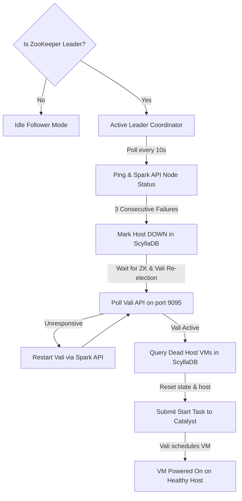

# Mipha (HA Cluster Monitor & VM Failover Coordinator)

**Mipha** is the host-level High Availability (HA) coordinator and VM failover daemon for the hypervisor hosts. It is the direct equivalent of Nutanix **Acropolis HA Manager**. It monitors the health of all cluster nodes, ensures the core orchestrator daemons are running, and recovers virtual machines when a node suffers a hardware or kernel crash.

---

## 1. System Architecture

Mipha runs as a native systemd daemon (`mipha.service`) on every hypervisor host. It employs ZooKeeper (Odin) to establish active leadership. While Mipha is installed on all hosts, only the active ZooKeeper leader node runs the monitoring and recovery control loop.



---

## 2. Component Interactions & Database Schema

### A. Host Health Monitoring
The active Mipha leader monitors all hosts defined in `/etc/hci/cluster.json`. Every 10 seconds, it performs two health checks on each host:
1. **Network Ping (ICMP):** Checks if the host's networking stack is reachable.
2. **Spark Daemon Query:** Checks if the Spark mTLS endpoint (`https://<ip>:9099/api/v1/node/status`) is responding.

A node is declared **OFFLINE** only if both checks fail for 3 consecutive intervals (30 seconds).

### B. Node State Reconcile
Once a node is declared offline, Mipha updates its status in ScyllaDB:
```sql
UPDATE hydra.nodes SET status = 'DOWN' WHERE ip = '<dead_host_ip>';
```
This prevents Vali's scheduler from placing new virtual machines onto the crashed host.

### C. Active Service Recovery (No Hardcoded Timers)
Before executing VM recovery, Mipha actively verifies that the management plane has settled:
1. **ZooKeeper Leader Resolution:** It queries ZK ports across the surviving nodes to verify that a ZooKeeper leader has successfully been established.
2. **Vali Active Polling:** It queries Vali's API (`http://<leader_ip>:9095/api/v1/hosts`) on the leader node.
3. **Vali Watchdog:** If Vali is unresponsive, Mipha issues remote Spark commands to restart `vali.service` and continues polling until Vali responds with HTTP 200.

### D. VM Failover Execution
Once the management plane is confirmed to be healthy, Mipha retrieves all virtual machines that were running on the crashed host:
```sql
SELECT name, memory, host_ip, state FROM hydra.vms;
```
For each VM where `host_ip == <dead_host_ip>` and `state == 'Running'`:
1. **Reset State:** Updates its state to `Stopped` and clears `host_ip` in ScyllaDB:
   ```sql
   UPDATE hydra.vms SET state = 'Stopped', host_ip = '' WHERE name = '<vm_name>';
   ```
2. **Inject Task:** Submits a task to Catalyst (`http://<catalyst_leader_ip>:9091/api/v1/tasks/submit`) to start the VM without specifying a target host:
   ```json
   {
     "service": "vali",
     "action": "start",
     "payload": {
       "vm_name": "<vm_name>",
       "target_host": ""
     }
   }
   ```
Vali receives the start task, evaluates the remaining cluster hosts using its DRS placement rules, and automatically boots the VM on the healthiest node with available capacity.

---

## 3. Command Examples & Syntax

### A. Managing the Mipha Service
Monitor and control the HA daemon using standard systemctl calls:
```bash
# Check service status and active PID
systemctl status mipha

# View real-time HA failover events and heartbeat logs
journalctl -u mipha -f --no-pager

# Restart the HA daemon
systemctl restart mipha
```

### B. Simulating a Host Failover
To simulate a host crash and observe Mipha's recovery orchestration:
1. Stop the target host's Spark Daemon and block network access (or shut down the host).
2. Monitor Mipha logs on the active leader:
   ```bash
   journalctl -u mipha -n 50 --no-pager
   ```
3. Verify that the dead host is marked `DOWN` in ScyllaDB:
   ```bash
   valcli db.query "SELECT hostname, ip, status FROM hydra.nodes;"
   ```
4. Verify that the VMs previously on the dead host are moved to another node and are now in the `Running` state:
   ```bash
   valcli vm.list
   ```
