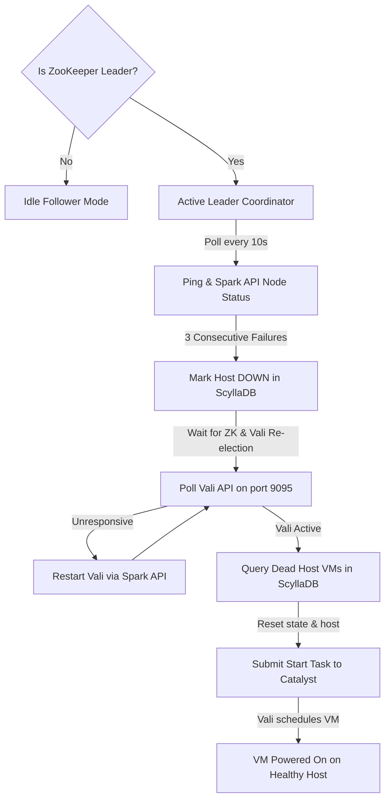

# Mipha (HA Cluster Monitor & VM Failover Coordinator)

**Mipha** is the host-level High Availability (HA) coordinator and VM failover daemon for the hypervisor hosts. It is the direct equivalent of Nutanix **Acropolis HA Manager**. It monitors the health of all cluster nodes, ensures the core orchestrator daemons are running, and recovers virtual machines when a node suffers a hardware or kernel crash.

> [!NOTE]
> **Name Origin:** In *The Legend of Zelda: Breath of the Wild*, **Mipha** is the Zora Champion who possesses the healing ability *Mipha's Grace*, which revives the player when they run out of health. Similarly, the **Mipha** daemon acts as a healing mechanism for the hypervisor pool, automatically resurrecting virtual machines on surviving healthy hosts when a physical node crashes.

---

## 1. System Architecture

Mipha runs as a native systemd daemon (`mipha.service`) on every hypervisor host. It employs ZooKeeper (Odin) to establish active leadership. While Mipha is installed on all hosts, only the active ZooKeeper leader node runs the monitoring and recovery control loop.


```mermaid
graph TD
    LeaderCheck{Is ZooKeeper Leader?} -->|No| Follower[Idle Follower Mode]
    LeaderCheck -->|Yes| ActiveLeader[Active Leader Coordinator]
    ActiveLeader -->|Poll every 10s| HealthCheck[Ping & Spark API Node Status]
    HealthCheck -->|3 Consecutive Failures| NodeDown[Mark Host DOWN in ScyllaDB]
    NodeDown -->|Wait for ZK & Vali Re-election| PollVali[Poll Vali API on port 9095]
    PollVali -->|Unresponsive| RestartVali[Restart Vali via Spark API] --> PollVali
    PollVali -->|Vali Active| FailoverVMs[Query Dead Host VMs in ScyllaDB]
    FailoverVMs -->|Reset state & host| SubmitTasks[Submit Start Task to Catalyst]
    SubmitTasks -->|Vali schedules VM| BootVM[VM Powered On on Healthy Host]
```

---

## 2. Component Interactions & Database Schema

### A. Host Health Monitoring
The active Mipha leader monitors all hosts defined in `/etc/hci/cluster.json`. Every 10 seconds, it performs two health checks on each host:
1. **Network Ping (ICMP):** Checks if the host's networking stack is reachable.
2. **Spark Daemon Query:** Checks if the Spark mTLS endpoint (`https://<ip>:9099/api/v1/node/status`) is responding.

A node is declared **OFFLINE** only if both checks fail for 3 consecutive intervals (30 seconds).

### B. Node State Reconcile
Once a node is declared offline, Mipha marks it `DOWN` through Daruk's
[`POST /v1/node/maintenance`](./daruk.md#operations), which is
`UPDATE hydra.nodes SET status = ?, maintenance_mode = ? WHERE hostname = ? IF status = ?`
with the status this pass read as the expected value.

This prevents Vali's scheduler from placing new virtual machines onto the crashed host.

Two things were wrong with the statement it replaces:

```sql
-- rejected by Scylla; `ip` is not the partition key
UPDATE hydra.nodes SET status = 'DOWN' WHERE ip = '<dead_host_ip>';
```

`hostname` is the partition key and `ip` is a plain column, so Scylla answered *"Cannot
execute this query as it might involve data filtering"* and nothing read the return code —
**a host that died was never actually marked `DOWN`**, and Vali went on scheduling onto it.
And unconditionally, a failover decision made before an operator touched the host would
have dragged it back out of maintenance. Conditioning on the status this pass read means
the later change wins; a refusal is logged and the failover continues, because the per-VM
release below is what actually keeps two hosts off one disk.

It does **not** remove the host from the ScyllaDB ring, which is a separate membership
with separate consequences: the ring still assigns the dead node token ranges, and every
`QUORUM` operation still counts it toward the replicas it needs. Mipha therefore reports
the ring's view of the failed host — whether it is still a member, what `nodetool` calls
it, how many members are up, and the command that would detach it — and detaches nothing.
`nodetool removenode` is irreversible, and from a health check that has been failing for
thirty seconds a dead node and a partitioned one look identical. See
[ring_lifecycle.md](./ring_lifecycle.md).

### B2. Maintenance Lock Renewal
Vali takes the cluster-wide maintenance lock (`hydra.cluster_locks`) when a host starts
draining and gives it back when that host has finished rejoining — an operator's
maintenance window apart, far longer than any TTL short enough to be useful when the
holder dies. Mipha renews it on every control-loop pass for whichever host `hydra.nodes`
reports in `ENTERING_MAINTENANCE`, `IN_MAINTENANCE` or `RECOVERING`, which is what lets
the TTL stay at five minutes.

The renewal is conditional on the lock's holder token, read from the row: if the lock
changed hands, the renewal is refused rather than extending someone else's lock in the
wrong host's name.

### C. Active Service Recovery (No Hardcoded Timers)
Before executing VM recovery, Mipha actively verifies that the management plane has settled:
1. **ZooKeeper Leader Resolution:** It queries ZK ports across the surviving nodes to verify that a ZooKeeper leader has successfully been established.
2. **Vali Active Polling:** It queries Vali's API (`http://<leader_ip>:9095/api/v1/hosts`) on the leader node.
3. **Vali Watchdog:** If Vali is unresponsive, Mipha issues remote Spark commands to restart `vali.service` and continues polling until Vali responds with HTTP 200.

### D. VM Failover Execution
Once the management plane is confirmed to be healthy, Mipha retrieves all virtual machines that were running on the crashed host:
```sql
SELECT name, memory, host_ip, state FROM hydra.vms;
```
For each VM where `host_ip == <dead_host_ip>` and `state == 'Running'`:
1. **Release the placement — conditionally.** `release_orphaned_vm()` calls Daruk's
   [`POST /v1/vm/release`](./daruk.md#the-applied--current-contract) with
   `expected_host_ip = <dead_host_ip>`, which is
   `UPDATE hydra.vms SET host_ip = '', state = 'Stopped' WHERE name = ? IF host_ip = ?`.

   This write used to be unconditional. SSH fencing and three consecutive failed health
   checks make a live host here unlikely, **not impossible**: the VM list was read seconds
   earlier, and in that window the guest can have been recovered elsewhere — by a previous
   failover pass whose start task only just landed, by an operator, or by a Vali start that
   was already in flight. The blind write then unplaced a *running* VM, and the start task
   below booted a second copy of it against the same DRBD device. Two qemu processes on one
   raw device is the corruption failover exists to prevent.

   A refusal means the VM is somewhere else and needs nothing from this failover, so it is
   **skipped, not started**. So is a VM whose release could not be answered at all: there is
   deliberately no `cqlsh` fallback, because a write that cannot be made conditional must not
   be made — we would no longer know who owns the guest, and guessing is how both sides of a
   partition come to own the same one.

2. **Inject Task:** Submits a task to Catalyst (`http://<catalyst_leader_ip>:9091/api/v1/tasks/submit`) to start the VM without specifying a target host:
   ```json
   {
     "service": "vali",
     "action": "start",
     "payload": {
       "vm_name": "<vm_name>",
       "target_host": ""
     }
   }
   ```
Vali receives the start task, evaluates the remaining cluster hosts using its DRS placement rules, and automatically boots the VM on the healthiest node with available capacity.

---

## 3. Command Examples & Syntax

### A. Managing the Mipha Service
Monitor and control the HA daemon using standard systemctl calls:
```bash
# Check service status and active PID
systemctl status mipha

# View real-time HA failover events and heartbeat logs
journalctl -u mipha -f --no-pager

# Restart the HA daemon
systemctl restart mipha
```

### B. Simulating a Host Failover
To simulate a host crash and observe Mipha's recovery orchestration:
1. Stop the target host's Spark Daemon and block network access (or shut down the host).
2. Monitor Mipha logs on the active leader:
   ```bash
   journalctl -u mipha -n 50 --no-pager
   ```
3. Verify that the dead host is marked `DOWN` in ScyllaDB:
   ```bash
   valcli db.query "SELECT hostname, ip, status FROM hydra.nodes;"
   ```
4. Verify that the VMs previously on the dead host are moved to another node and are now in the `Running` state:
   ```bash
   valcli vm.list
   ```


---

## Technical Reference

For the internal code structure, class/function details, and execution flowcharts, see the [Technical Guide](./mipha_technical.md).
