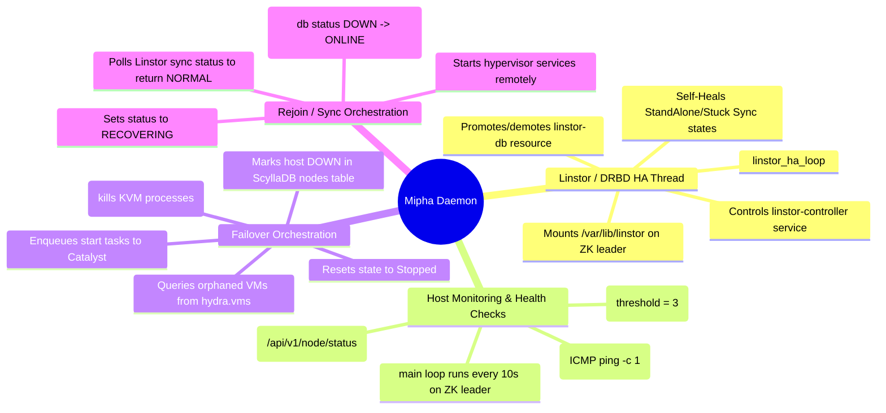

# Mipha (High Availability Coordinator) - Technical Documentation

This document details the internal technical structure, functions, flowcharts, and mindmaps of the Mipha high-availability service.

## Technical Mindmap

## Function & Logic Breakdown

### DRBD & Linstor HA Functions
- **`check_linstor_db_mount()`**: Returns True if `/var/lib/linstor` is mounted.
- **`get_local_drbd_role(resource_name)`**: Reads `drbdadm role <res>` to determine if the local resource is in `Primary` or `Secondary` state.
- **`get_all_drbd_resources()`**: Scans `/etc/drbd.d/*.res` to list all configured DRBD targets.
- **`resolve_drbd_standalone(resource_name)`**: Disconnects, marks secondary, and connects with `--discard-my-data` to resolve split-brain `StandAlone` conditions.
- **`check_and_resolve_stuck_resync()`**: Parses JSON output from `drbdsetup status --json`. If resync progress is stalled for 3 checks (90 seconds), triggers connection self-heal.
- **`linstor_ha_loop()`**: Separate thread. Coordinates storage HA:
  - If node is the ZooKeeper leader: promotes `linstor-db` to Primary, mounts `/var/lib/linstor` locally, stops linstor-controllers on remote nodes, and starts the local controller. Also mounts virtual VM/image containers.
  - If node is a follower: unmounts targets and demotes resources to Secondary.

### Cluster Execution Functions
- **`run_remote_spark(ip, command)`**: Executes remote commands via Spark's port `9099`. Evaluates node daemon certificates `/etc/hci/spark/certs/` first, falling back to `/root/.certs/` client credentials.
- **`run_mtls_spark_api(ip, path, payload, method="POST")`**: Calls Spark daemon REST APIs.
- **`run_cql_query(cql_query)`**: Submits queries to ScyllaDB via the local Daruk proxy port `9043` or container CLI.
- **`get_zookeeper_leader_ip()`**: Scans nodes on port `2181` to locate the leader.
- **`ping_host(ip)`**: Runs standard ICMP ping (`ping -c 1 -W 2 <ip>`).
- **`check_vali_health(ip)`**: Verifies if Vali's VM scheduler API port `9095` is responding.

### Failover & Rejoin Sequence (`main()`)

#### Rejoining Node Ingestion
- If a node marked as `DOWN` recovers connectivity, Mipha sets status to `RECOVERING`.
- Remotely triggers service start commands.
- Polls Linstor synchronization metrics using `get_linstor_pending_sync()`. Once fully synchronized, transitions node status back to `NORMAL`.

#### Fencing & VM Failover
- If a host misses 3 consecutive polls (30 seconds):
  1. Issues SSH fencing command (`ssh_fence_host` stops `libvirtd` / `virtqemud` and kills `qemu` processes) to prevent split-brain execution.
  2. Updates node status in ScyllaDB to `DOWN`.
  3. Creates Catalyst parent failover task.
  4. Polls consensus and health of Vali until recovered.
  5. Scans `hydra.vms` for running VMs registered to the dead host.
  6. Resets their status to `Stopped` and host to empty in ScyllaDB.
  7. Calls Catalyst `/api/v1/tasks/submit` to queue `vali start` tasks (Vali will automatically schedule them on the healthiest surviving nodes).
  8. Polls Catalyst sub-tasks until all VM failovers are completed.
