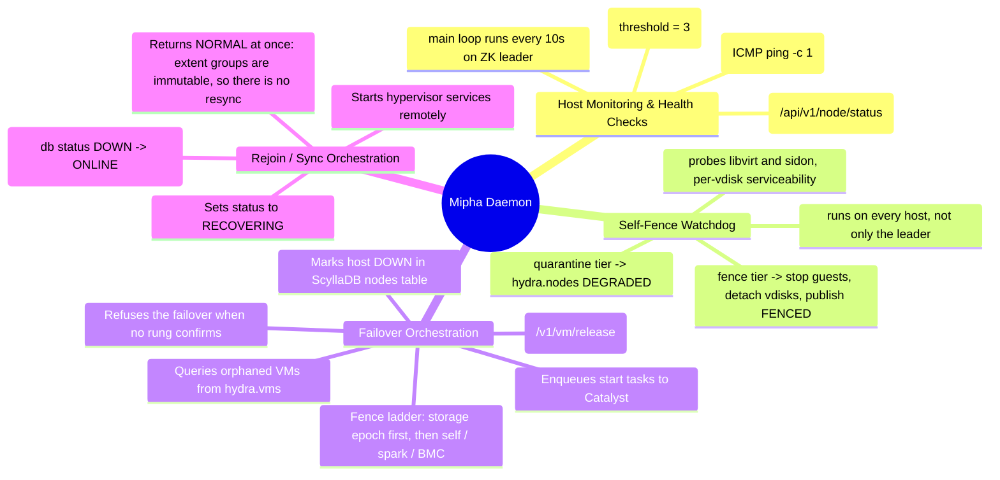

# Mipha (High Availability Coordinator) - Technical Documentation

This document details the internal technical structure, functions, flowcharts, and mindmaps of the Mipha high-availability service.

## Technical Mindmap

```mermaid
mindmap
  root((Mipha Daemon))
    Host Monitoring & Health Checks
      main loop runs every 10s on ZK leader
      Pings nodes (ICMP ping -c 1)
      Queries Spark status (/api/v1/node/status)
      Tracks consecutive failures (threshold = 3)
    Self-Fence Watchdog
      runs on every host, not only the leader
      probes libvirt and sidon, per-vdisk serviceability
      quarantine tier -> hydra.nodes DEGRADED
      fence tier -> stop guests, detach vdisks, publish FENCED
    Failover Orchestration
      Fence ladder: storage epoch first, then self / spark / BMC
      Refuses the failover when no rung confirms
      Marks host DOWN in ScyllaDB nodes table
      Queries orphaned VMs from hydra.vms
      Releases placement conditionally (/v1/vm/release)
      Enqueues start tasks to Catalyst
    Rejoin / Sync Orchestration
      Detects returning host (db status DOWN -> ONLINE)
      Sets status to RECOVERING
      Starts hypervisor services remotely
      Returns NORMAL at once: extent groups are immutable, so there is no resync
```

## Function & Logic Breakdown

### There is no storage HA thread

`linstor_ha_loop` and everything under it are gone, and what they did no longer has a
counterpart. That thread existed because DRBD's control plane was itself a replicated
volume: the LINSTOR controller's database lived on `linstor-db`, which had to be Primary
on exactly one node and mounted there, so the ZooKeeper leader had to promote it, mount
`/var/lib/linstor`, stop the controllers elsewhere and start its own -- and then deal with
what happened when two nodes disagreed about who that was.

The functions that dealt with the disagreement are gone too. `resolve_drbd_standalone`
implemented a five-case policy for deciding which side of a split-brain to discard, and
was the only site in the daemon that discarded data. `check_and_resolve_stuck_resync`
watched for a resync that had stalled. **Split-brain is not a state this storage layer can
reach**: every journal append carries its writer's epoch, every replica persists the
highest epoch it has been fenced at, and an append below that is refused -- so two owners
cannot both be accepted, there is no divergence to resolve, and there is no resync to
stall. Sidon needs no leader-elected coordinator: its block map is in Hydra, which every
node can write.

What ZooKeeper leadership still decides is who *acts* -- who runs the failover ladder, and
who runs Purah. One actor, not one truth.

### Fencing Functions

See [fencing.md](./fencing.md) for the design and for what remains unsafe.

- **`load_fencing_config(path=None)`**: Reads `/etc/hci/fencing.json`, or the built-in
  defaults when it is absent. Returns `(config, warnings)`. BMC credentials are dropped,
  with a warning, from a file any non-root account can read — chassis power-off
  credentials silently taken from a world-readable file would be worse than a fence that
  does not run. Absent is a supported state and means "no BMC"; it never means "assume the
  fence worked".
- **`fence_host(hostname, ip, hosts, db_status, config)` → `FenceResult`**: the ladder.
  Tries `storage`, `self`, `spark`, `bmc` in order and stops at the first that confirms.
  Storage moved to the front because it stopped being an inference: it is now the only
  unconditional rung, so trying anything before it is trying something weaker first.
  Never raises: a rung that throws is recorded as a failed rung. A host already confirmed
  fenced during this outage is returned from `FENCE_LEDGER` without being touched again;
  only confirmations are cached, so a failed fence is retried.
- **`failover_permitted(fence, config)` → `(allowed, reason)`**: the gate. One function
  rather than a condition in the control loop, because it is the decision the whole ladder
  exists to make.
- **`spark_fence_host(ip)`**: `POST /api/v1/host/fence`, reading the `409` body as well as
  the `200`. Falls back to the legacy shell command *plus* an explicit `pgrep -a qemu` when
  the peer daemon answers `404` (a rolling upgrade). Hygiene rather than safety now: a
  wedged host still holds its VIP and still burns CPU, but its writes were already refused
  by the storage rung.
- **`bmc_fence_host(hostname, ip, config)`**: `ipmitool chassis power off`, then polls
  `chassis power status` until it reads `off`. A zero exit status is never treated as a
  power-off. The password goes through `IPMI_PASSWORD` and `-E`, never argv.
- **`storage_fence_assert(dead_hostname, dead_ip, hosts)`**: **stops** the failed host's
  writes rather than arguing that they have stopped. Reads `hydra.dfs_vdisks` for the
  vdisks the dead host owns, raises each one's epoch through a compare-and-swap, and
  fences every reachable replica at the new epoch — in parallel, because a failover has a
  time budget. The deposed host does not have to agree, be reachable, or know: its next
  append meets a refusal.

  This rung works on two nodes, works with no BMC, works with no quorum, and needs Hydra
  and nothing else. When Hydra is unreachable the honest answer is that nothing can be
  fenced, which is what it returns — and refusing the failover there is obviously right
  rather than regrettable, since promoting a VM whose disk ownership cannot be moved is
  exactly the split-brain the ladder exists to prevent.

  The functions that supported the old inference are gone with it:
  `quorum_arms_the_fence` did the arithmetic on whether a numeric quorum was a real
  majority, and `_drbd_options_from` read the *configured* options because
  `drbdsetup status` reported `quorum: true` both when a majority was held and when
  quorum was switched off entirely.

### Self-Fencing Functions

- **`self_fence_loop()`**: the per-host watchdog thread, started from `main()` on every
  host regardless of leadership.
- **`probe_local_health()`**: one pass. Each probe returns `ok`, `failed` or `unknown`, and
  `unknown` never escalates to the destructive tier.
- The storage probe asks Sidon what it is serving. A vdisk reported **degraded** is one
  whose drain has failed: the guest's writes are still safe in the journal, but the
  journal is no longer emptying, so the disk will backpressure and stop. That is the
  local-origin equivalent of the old "Primary without quorum" — the guest is not broken
  yet and will be.
- **`self_fence_decide(probe, counters, config, hosts, uptime)` → `(action, reason)`**:
  `none`, `quarantine` or `fence`. Requires three consecutive passes, resets on any good
  one, honours a startup grace period, exempts a host in maintenance, and never fires on a
  single-node cluster.
- **`execute_self_fence(reason, hosts, config)`**: writes the marker first, calls the local
  `/api/v1/host/fence` or a built-in fallback, releases ZooKeeper leadership at three nodes
  or more, then publishes the status.
- **`self_fence_announcement()`**: `FENCED` only when the local fence verified, otherwise
  `DEGRADED`. `FENCED` makes the leader skip its own ladder, so a fence that did not take
  must not publish it.
- **`clear_self_fence(force=False)`**: `mipha --clear-self-fence`. Deliberately manual.
- **`report_fence_status()`**: `mipha --fence-status`.

### Cluster Execution Functions
- **`run_remote_spark(ip, command)`**: Executes remote commands via Spark's port `9099`. Evaluates node daemon certificates `/etc/hci/spark/certs/` first, falling back to `/root/.certs/` client credentials.
- **`run_mtls_spark_api(ip, path, payload, method="POST")`**: Calls Spark daemon REST APIs.
- **`run_mtls_spark_api_full(ip, path, payload, method="POST")`**: the same call keeping the
  status code and the 4xx body. The fence endpoint answers `409` with the reason the fence
  did not take, and `run_mtls_spark_api` would reduce that to "the request failed".
- **`run_argv_local(argv, timeout=45)`**: local commands as an argv list, `shell=False`.
  Used by everything added for fencing, which passes resource names and BMC addresses into
  commands.
- **`run_cql_query(cql_query)`**: Submits queries to ScyllaDB via the local Daruk proxy port `9043` or container CLI.
- **`get_zookeeper_leader_ip()`**: Scans nodes on port `2181` to locate the leader.
- **`ping_host(ip)`**: Runs standard ICMP ping (`ping -c 1 -W 2 <ip>`).
- **`check_vali_health(ip)`**: Verifies if Vali's VM scheduler API port `9095` is responding.

### Failover & Rejoin Sequence (`main()`)

#### Rejoining Node Ingestion
- If a node marked as `DOWN` recovers connectivity, Mipha sets status to `RECOVERING`.
- Remotely triggers service start commands.
- Transitions straight back to `NORMAL`. There is nothing to wait for: extent groups are
  immutable, so a returning node's copies are either correct or absent, and Purah replaces
  the absent ones in the background off the hot path. The DRBD version polled a sync
  metric because a returning node came back with stale replicas that had to catch up block
  by block before it could be trusted with a guest.

#### Fencing & VM Failover

Triggered when a host misses 3 consecutive polls (30 seconds), **or** when it reports
`hydra.nodes.status = FENCED` — a host that fenced itself never misses a health check, and
before this second trigger existed nothing evacuated it.

  1. Creates the Catalyst parent failover task. This happens *before* the fence, so a
     failover that is refused is as visible in the UI as one that ran.
  2. Runs the fence ladder (`fence_host`) and requires a confirmation. The old
     `ssh_fence_host` sent `systemctl stop libvirtd ... || true; pkill -9 qemu || true`,
     whose exit status was 0 whatever happened, discarded that status anyway, and only ran
     when the host still answered ping.
  3. If no rung confirms and `unconfirmed_fence_policy` is `block` (the default): marks the
     host `DOWN` so Vali stops placing there, marks the parent task `failed` with the
     reason, and **stops**. Nothing is released and nothing is restarted. The next pass
     retries, so the failover proceeds by itself once the host is powered off or quorum is
     armed.
  4. Updates node status in ScyllaDB to `DOWN` — except for a self-fenced host, which stays
     `FENCED`. `DOWN` is the state the rejoin path watches, and a self-fenced host has
     never stopped answering, so marking it `DOWN` would have it "rejoin" on the next pass
     and take Primary again on the storage it just gave up.
  5. Reports whether the host is still a ScyllaDB ring member (`report_ring_detach_candidate`).
  6. Polls consensus and health of Vali until recovered.
  7. Scans `hydra.vms` for running VMs registered to the dead host.
  8. Releases each placement through Daruk's conditional `/v1/vm/release`, skipping any VM
     that has already been recovered elsewhere.
  9. Calls Catalyst `/api/v1/tasks/submit` to queue `vali start` tasks (Vali will automatically schedule them on the healthiest surviving nodes).
  10. Polls Catalyst sub-tasks until all VM failovers are completed.

#### Self-Fencing

Runs on every host in its own thread. Probes libvirt and Sidon, and the serviceability of
every vdisk this host owns, every 10 seconds.

- **libvirt dead** → quarantine (`hydra.nodes.status = DEGRADED`, which Vali already
  excludes from placement). Not a fence: qemu keeps running when `libvirtd` dies, so the
  guests are fine and only their management is lost.
- **A vdisk that cannot serve I/O** — degraded, meaning its drain has failed and the
  journal is no longer emptying — for three consecutive passes → fence: destroy the
  guests, detach every vdisk, release ZooKeeper leadership at three nodes or more,
  publish `FENCED`.
- **The peer check applies to every local storage fault**, and this is the one behaviour
  that genuinely regressed. DRBD's quorum loss *was* a majority test, so a node could
  self-fence without checking that any peer was reachable. A failed drain proves nothing
  of the kind — the extent store may simply be full — so with no peer answering the
  outcome is quarantine rather than fence.
- **A fence that did not fully take publishes `DEGRADED`, not `FENCED`** — the leader must
  then prove the fence itself.

Cleared with `mipha --clear-self-fence` on the affected host.
