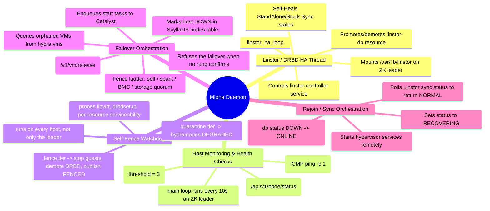

# Mipha (High Availability Coordinator) - Technical Documentation

This document details the internal technical structure, functions, flowcharts, and mindmaps of the Mipha high-availability service.

## Technical Mindmap

```mermaid
mindmap
  root((Mipha Daemon))
    Linstor / DRBD HA Thread
      linstor_ha_loop
      Promotes/demotes linstor-db resource
      Mounts /var/lib/linstor on ZK leader
      Controls linstor-controller service
      Self-Heals StandAlone/Stuck Sync states
    Host Monitoring & Health Checks
      main loop runs every 10s on ZK leader
      Pings nodes (ICMP ping -c 1)
      Queries Spark status (/api/v1/node/status)
      Tracks consecutive failures (threshold = 3)
    Self-Fence Watchdog
      runs on every host, not only the leader
      probes libvirt, drbdsetup, per-resource serviceability
      quarantine tier -> hydra.nodes DEGRADED
      fence tier -> stop guests, demote DRBD, publish FENCED
    Failover Orchestration
      Fence ladder: self / spark / BMC / storage quorum
      Refuses the failover when no rung confirms
      Marks host DOWN in ScyllaDB nodes table
      Queries orphaned VMs from hydra.vms
      Releases placement conditionally (/v1/vm/release)
      Enqueues start tasks to Catalyst
    Rejoin / Sync Orchestration
      Detects returning host (db status DOWN -> ONLINE)
      Sets status to RECOVERING
      Starts hypervisor services remotely
      Polls Linstor sync status to return NORMAL
```

## Function & Logic Breakdown

### DRBD & Linstor HA Functions
- **`check_linstor_db_mount()`**: Returns True if `/var/lib/linstor` is mounted.
- **`get_local_drbd_role(resource_name)`**: Reads `drbdadm role <res>` to determine if the local resource is in `Primary` or `Secondary` state.
- **`get_all_drbd_resources()`**: Scans `/etc/drbd.d/*.res` to list all configured DRBD targets.
- **`resolve_drbd_standalone(resource_name)`**: Resolves split-brain `StandAlone` conditions using a **per-resource** decision. ZooKeeper leadership is deliberately *not* consulted here: leadership is a single cluster-wide property, but "which node holds the authoritative copy" is a question about one resource, and using the former to answer the latter caused a node running a VM to discard its own live writes and resync from a stale peer.

  The policy, evaluated per resource:
  1. Not `StandAlone`, or `drbdsetup status --json` unreadable → no action.
  2. Local role is not `Primary` **and** the device has a live holder (mounted filesystem, stacked device, or a process holding it open) → refuse to touch the connection; log the resource and the holder for the operator.
  3. Local `Secondary` + peer `Primary` + no holders → the local copy is the safe victim: `disconnect`, then a **checked** `drbdadm secondary` (no `--force`, no `|| true`), then `connect --discard-my-data`. This is the only site in the daemon that discards data.
  4. Local `Primary`, peer not `Primary` → keep local writes; plain `disconnect`/`connect`.
  5. Both `Primary`, both `Secondary`, or peer role undeterminable → never discard; plain `disconnect`/`connect` and log for operator intervention.

  Because a `StandAlone` connection reports `peer-role: Unknown`, the peer role is resolved by querying reachable peers over the Spark mTLS path, and only when the local node is not `Primary` (i.e. only when it could be the victim). A result is accepted only if at least one peer answered and all answers agree.
- **`check_and_resolve_stuck_resync()`**: Parses JSON output from `drbdsetup status --json`. If resync progress is stalled for 3 checks (90 seconds), triggers connection self-heal.
- **`linstor_ha_loop()`**: Separate thread. Coordinates storage HA:
  - If node is the ZooKeeper leader: promotes `linstor-db` to Primary, mounts `/var/lib/linstor` locally, stops linstor-controllers on remote nodes, and starts the local controller. Also mounts virtual VM/image containers.
  - If node is a follower: unmounts targets and demotes resources to Secondary.

### Fencing Functions

See [fencing.md](./fencing.md) for the design and for what remains unsafe.

- **`load_fencing_config(path=None)`**: Reads `/etc/hci/fencing.json`, or the built-in
  defaults when it is absent. Returns `(config, warnings)`. BMC credentials are dropped,
  with a warning, from a file any non-root account can read — chassis power-off
  credentials silently taken from a world-readable file would be worse than a fence that
  does not run. Absent is a supported state and means "no BMC"; it never means "assume the
  fence worked".
- **`fence_host(hostname, ip, hosts, db_status, config)` → `FenceResult`**: the ladder.
  Tries `self`, `spark`, `bmc`, `storage` in order and stops at the first that confirms.
  Never raises: a rung that throws is recorded as a failed rung. A host already confirmed
  fenced during this outage is returned from `FENCE_LEDGER` without being touched again;
  only confirmations are cached, so a failed fence is retried.
- **`failover_permitted(fence, config)` → `(allowed, reason)`**: the gate. One function
  rather than a condition in the control loop, because it is the decision the whole ladder
  exists to make.
- **`spark_fence_host(ip)`**: `POST /api/v1/host/fence`, reading the `409` body as well as
  the `200`. Falls back to the legacy shell command *plus* an explicit `pgrep -a qemu` and
  DRBD status verification when the peer daemon answers `404` (a rolling upgrade).
- **`bmc_fence_host(hostname, ip, config)`**: `ipmitool chassis power off`, then polls
  `chassis power status` until it reads `off`. A zero exit status is never treated as a
  power-off. The password goes through `IPMI_PASSWORD` and `-E`, never argv.
- **`storage_fence_assert(dead_hostname, dead_ip, hosts)`**: proves from the surviving
  replicas that the failed host's kernel is already failing its writes. Requires, per
  resource, that quorum is armed (`quorum` is a real majority **and** `on-no-quorum` is
  `io-error`/`suspend-io`), that this side holds quorum, and that the peer connection is
  not `Connected`.
- **`quorum_arms_the_fence(options, node_count)`**: the arithmetic. `majority`/`all` are
  safe by construction; a numeric quorum only when it exceeds half the nodes, since
  `quorum 1` is satisfied by both sides of a partition at once.
- **`_drbd_options_from(ip, resource)`**: the *configured* options, local or through
  `GET /api/v1/storage/drbd/options`. Needed because `drbdsetup status` reports
  `quorum: true` both when a majority is held and when quorum is off.

### Self-Fencing Functions

- **`self_fence_loop()`**: the per-host watchdog thread, started from `main()` on every
  host regardless of leadership.
- **`probe_local_health()`**: one pass. Each probe returns `ok`, `failed` or `unknown`, and
  `unknown` never escalates to the destructive tier.
- **`resource_is_unserviceable(resource)` → `(bool, cause, detail)`**: `quorum-lost`,
  `io-failures` or `no-data`. A failed local disk with a connected `UpToDate` peer is
  deliberately *not* unserviceable — DRBD 9 keeps serving it over the network.
- **`self_fence_decide(probe, counters, config, hosts, uptime)` → `(action, reason)`**:
  `none`, `quarantine` or `fence`. Requires three consecutive passes, resets on any good
  one, honours a startup grace period, exempts a host in maintenance, and never fires on a
  single-node cluster.
- **`execute_self_fence(reason, hosts, config)`**: writes the marker first (so
  `linstor_ha_loop` stands down before anything is demoted), calls the local
  `/api/v1/host/fence` or a built-in fallback, releases ZooKeeper leadership at three nodes
  or more, then publishes the status.
- **`self_fence_announcement()`**: `FENCED` only when the local fence verified, otherwise
  `DEGRADED`. `FENCED` makes the leader skip its own ladder, so a fence that did not take
  must not publish it.
- **`clear_self_fence(force=False)`**: `mipha --clear-self-fence`. Deliberately manual.
- **`report_fence_status()`**: `mipha --fence-status`.

### Cluster Execution Functions
- **`run_remote_spark(ip, command)`**: Executes remote commands via Spark's port `9099`. Evaluates node daemon certificates `/etc/hci/spark/certs/` first, falling back to `/root/.certs/` client credentials.
- **`run_mtls_spark_api(ip, path, payload, method="POST")`**: Calls Spark daemon REST APIs.
- **`run_mtls_spark_api_full(ip, path, payload, method="POST")`**: the same call keeping the
  status code and the 4xx body. The fence endpoint answers `409` with the reason the fence
  did not take, and `run_mtls_spark_api` would reduce that to "the request failed".
- **`run_argv_local(argv, timeout=45)`**: local commands as an argv list, `shell=False`.
  Used by everything added for fencing, which passes resource names and BMC addresses into
  commands.
- **`run_cql_query(cql_query)`**: Submits queries to ScyllaDB via the local Daruk proxy port `9043` or container CLI.
- **`get_zookeeper_leader_ip()`**: Scans nodes on port `2181` to locate the leader.
- **`ping_host(ip)`**: Runs standard ICMP ping (`ping -c 1 -W 2 <ip>`).
- **`check_vali_health(ip)`**: Verifies if Vali's VM scheduler API port `9095` is responding.

### Failover & Rejoin Sequence (`main()`)

#### Rejoining Node Ingestion
- If a node marked as `DOWN` recovers connectivity, Mipha sets status to `RECOVERING`.
- Remotely triggers service start commands.
- Polls Linstor synchronization metrics using `get_linstor_pending_sync()`. Once fully synchronized, transitions node status back to `NORMAL`.

#### Fencing & VM Failover

Triggered when a host misses 3 consecutive polls (30 seconds), **or** when it reports
`hydra.nodes.status = FENCED` — a host that fenced itself never misses a health check, and
before this second trigger existed nothing evacuated it.

  1. Creates the Catalyst parent failover task. This happens *before* the fence, so a
     failover that is refused is as visible in the UI as one that ran.
  2. Runs the fence ladder (`fence_host`) and requires a confirmation. The old
     `ssh_fence_host` sent `systemctl stop libvirtd ... || true; pkill -9 qemu || true`,
     whose exit status was 0 whatever happened, discarded that status anyway, and only ran
     when the host still answered ping.
  3. If no rung confirms and `unconfirmed_fence_policy` is `block` (the default): marks the
     host `DOWN` so Vali stops placing there, marks the parent task `failed` with the
     reason, and **stops**. Nothing is released and nothing is restarted. The next pass
     retries, so the failover proceeds by itself once the host is powered off or quorum is
     armed.
  4. Updates node status in ScyllaDB to `DOWN` — except for a self-fenced host, which stays
     `FENCED`. `DOWN` is the state the rejoin path watches, and a self-fenced host has
     never stopped answering, so marking it `DOWN` would have it "rejoin" on the next pass
     and take Primary again on the storage it just gave up.
  5. Reports whether the host is still a ScyllaDB ring member (`report_ring_detach_candidate`).
  6. Polls consensus and health of Vali until recovered.
  7. Scans `hydra.vms` for running VMs registered to the dead host.
  8. Releases each placement through Daruk's conditional `/v1/vm/release`, skipping any VM
     that has already been recovered elsewhere.
  9. Calls Catalyst `/api/v1/tasks/submit` to queue `vali start` tasks (Vali will automatically schedule them on the healthiest surviving nodes).
  10. Polls Catalyst sub-tasks until all VM failovers are completed.

#### Self-Fencing

Runs on every host in its own thread. Probes libvirt, the DRBD control plane, and the
serviceability of every Primary resource every 10 seconds.

- **libvirt dead** → quarantine (`hydra.nodes.status = DEGRADED`, which Vali already
  excludes from placement). Not a fence: qemu keeps running when `libvirtd` dies, so the
  guests are fine and only their management is lost.
- **A Primary resource that cannot serve I/O** (quorum lost, forced I/O failures, or a
  failed disk with no `UpToDate` peer) for three consecutive passes → fence: destroy the
  guests, demote every resource, release ZooKeeper leadership at three nodes or more,
  publish `FENCED`.
- **A fence that did not fully take publishes `DEGRADED`, not `FENCED`** — the leader must
  then prove the fence itself.

Cleared with `mipha --clear-self-fence` on the affected host.
