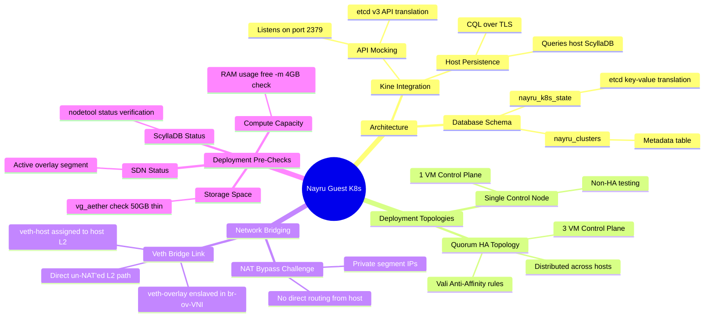

# Nayru Technical Guide & System Mindmap

This document provides a detailed technical reference and architectural mindmap for the **Nayru** guest Kubernetes orchestration engine.

---

## 1. Nayru System Mindmap



---

## 2. Component Specifications

| Technical Metric | Value / Implementation |
| :--- | :--- |
| **Kine Interface Port** | Port `2379` (etcd compatibility proxy) |
| **Database Target** | Host ScyllaDB (`hydra`) keyspace |
| **HA VM Requirements** | 3 x VMs (2 vCPUs, 4 GB RAM, 50 GB storage each) |
| **Anti-Affinity Rule** | Hard VM-to-Host distribution (Vali-enforced) |
| **Host Bridge Address** | `10.244.0.254/24` (or subnets matching guest overlay) |

---

## 3. Operations & Lifecycle

```
[ WebUI/API (Spectrum) ]
         │
         │ (Pre-Checks: ScyllaDB, Storage, RAM)
         ▼
[ Provision Guest VMs ] ───(Vali Anti-Affinity)───► Scheduled on Host 1, 2, 3
         │
         ▼
[ Bootstrap Kine Daemon ] ──(mTLS Connection)───► Host ScyllaDB (nayru_k8s_state)
         │
         ▼
[ Create Veth Bridge ] ────(IP Link Commands)───► Enslave in segment bridge (br-ov)
```
