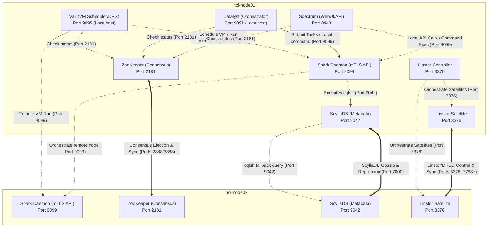

# Helios-HCI Network Architecture & Port Reference

This document maps all services, network ports, scope boundaries (localhost-only vs. cluster-wide mesh), and communication paths across the Helios-HCI hypervisor cluster.

---

## 1. Cluster Port Allocation Table

| Service Name | Port | Protocol | Network Scope | Description |
| :--- | :--- | :--- | :--- | :--- |
| **ZooKeeper** (Odin) | `2181` | TCP | Localhost & Cluster | Client API port. Used by Vali, Dagur, Mimir, Catalyst, and Bifrost. |
| **ZooKeeper Peers** | `2888` / `3888` | TCP | Cluster Mesh | Inter-node ZooKeeper sync (follower connections & leader election). |
| **ScyllaDB** (HydraDB) | `9042` | TCP | Localhost & Cluster | Native CQL query port. Used by Logos, Vali, Catalyst, and Spectrum. |
| **ScyllaDB Cluster** | `7000` | TCP | Cluster Mesh | Inter-node database cluster communication (gossip protocol). |
| **Spark Daemon** | `9099` | TCP | Localhost & Cluster | Secure mTLS API port for remote command execution and orchestrating. |
| **Spectrum Web UI** | `8443` | TCP (HTTPS) | Public / Management | Prism Web Console interface and REST API gateway. |
| **Catalyst Manager** | `9091` | TCP (HTTP) | Localhost | Task Manager API. Mapped locally for scheduling and submission. |
| **Vali Placement** | `9095` | TCP (HTTP) | Localhost | Acropolis VM placement, live migration, and DRS controls. |
| **Linstor Controller** | `3370` | TCP | Localhost & Cluster | Linstor Controller REST API and orchestration port. |
| **Linstor Satellite** | `3376` | TCP | Cluster Mesh | Linstor Satellite communication port. |
| **DRBD Replication** | `7700`-`7890` | TCP | Cluster Mesh | DRBD synchronous block-level replication traffic. |

---

## 2. Cluster Communication Flow Chart

The following diagram illustrates how requests flow from the Web UI / Console down to the hypervisor host command layer, distinguishing between localhost-only bindings and inter-node Mutual TLS / consensus connections.

---

## 3. Communication Boundary Descriptions

### A. Localhost Bindings (No External Access)
To ensure isolation and security, internal daemon API ports are bound exclusively to the loopback interface (`127.0.0.1`):
* **Vali (`9095`) & Catalyst (`9091`)**: These services are not exposed externally. Access from Spectrum is routed locally through the `spark-daemon` mTLS wrapper to prevent unauthenticated commands.
* **Storage Mounts**: Hypervisor VMs access storage containers directly via block-level DRBD device mapping (e.g. `/dev/drbd/by-res/...`), bypassing network-attached filesystem shares entirely for localized guests.

### B. Mutual TLS Mesh (Port `9099`)
* All node-to-node remote command execution is performed through the **Spark Daemon** over port `9099`.
* The daemon requires valid mTLS certificates (`node.crt` and `client.crt` signed by the cluster CA) for every connection, replacing the need for inter-node root SSH keys.

### C. Cluster Data Mesh (Ports `7000`, `2888`, `3888`, `3376`, `7700`-`7890`)
* **Gossip Database Layer**: ScyllaDB nodes talk to each other directly on port `7000` to share cluster metadata, tables partition maps, and telemetry stats.
* **Consensus Sync Layer**: ZooKeeper nodes use ports `2888` and `3888` to elect Odin leaders and synchronize locks.
* **Software-Defined Storage**: Linstor Satellites and Controller communicate over ports `3370` and `3376` for cluster resource provisioning, and DRBD volumes replicate synchronously across the physical disks using TCP ports `7700` to `7890`.

