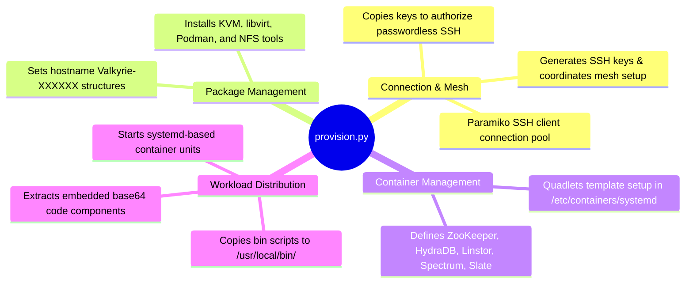

# Cluster Provisioning Script - Technical Documentation

This document details the internal technical structure, functions, flowcharts, and mindmaps of the cluster provisioning orchestrator (`provision.py`).

## Technical Mindmap

## Function & Logic Breakdown

### SSH Connection Pool
- Establishes connection pools targeting host IPs.
- Connects using private SSH keys if present, falling back to prompt password credentials.
- Configures key mesh: generates RSA host keys and appends them to `/root/.ssh/authorized_keys` and `/root/.ssh/known_hosts` globally to enable passwordless libvirt VM live migration.

### Hostname Setup
- Verifies hostname matches the pattern `Valkyrie-XXXXXX` (where XXXXXX is the last 6 characters of the host's primary MAC address).
- If mismatched, assigns the hostname dynamically and reboots the host.

### Quadlet Container Deploys
- Generates systemd Quadlet files under `/etc/containers/systemd/` on all target hosts:
  - **`zookeeper.container`**: Consensus service running library Zookeeper on host network.
  - **`hydra-db.container`**: ScyllaDB container mapping `/var/lib/scylla` storage.
  - **`linstor-controller.container`**: Piraeus controller server mapping `/var/lib/linstor`.
  - **`aether.container`**: Privileged Piraeus satellite running in host mode with `/dev` and `/lib/modules` mounts for DRBD kernel replication.
  - **`spectrum.container`**: Local UI admin portal mapping host libvirt socket and certificate stores.
  - **`slate.container`**: Traefik Edge proxy mapping certificate stores.

### Utility Distribution (`main()`)
- Extracts embedded scripts from base64 blocks (`URBOSA_B64`, `GATOWAY_B64`, `CATCLI_B64`, etc.).
- Writes scripts to `/usr/local/bin/` on all target nodes.
- Initiates Quadlet services: reloads systemd configurations and runs `systemctl start` on the container services.
