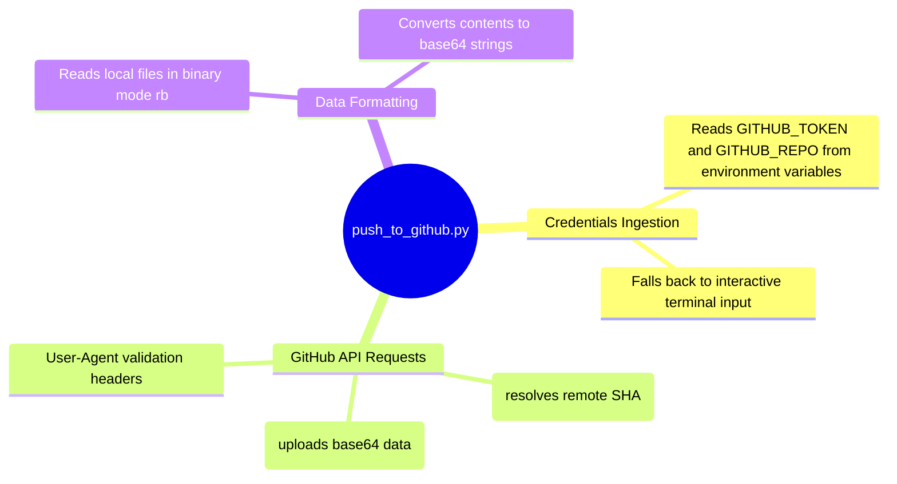

# Push to GitHub Utility - Technical Documentation

This document details the internal technical structure, functions, flowcharts, and mindmaps of the GitHub repository upload utility (`push_to_github.py`).

## Technical Mindmap

## Function & Logic Breakdown

### Remote File SHA Resolution
- **`get_file_sha(owner, repo, path, token)`**:
  - Queries `GET https://api.github.com/repos/{owner}/{repo}/contents/{path}`.
  - Passes Authorization Header token.
  - Returns the target file's git SHA hash value.
  - Returns `None` if HTTP error is `404 Not Found` (meaning the file does not exist yet).

### File Upload (`upload_file_to_github()`)
- Reads the local file.
- Encodes file contents into a Base64 string.
- Resolves the existing SHA hash on the remote repo.
- Assembles a PUT payload containing commit message, base64 content, and optionally the file's current SHA (required by GitHub when updating existing files).
- Submits the PUT request to the contents API to commit and publish the change.
- Logs the resulting uploaded file's short commit SHA.
