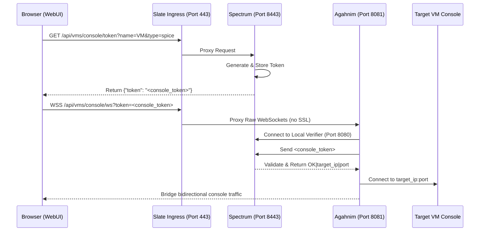

# Slate Service (Edge Reverse Proxy & Ingress)

Slate is a Traefik-based edge reverse proxy and ingress service integrated into the container-hci cluster. It runs as a Quadlet-managed container on port `443` on every node.

> **Name Origin:** Named after the **Sheikah Slate**, the ancient, multi-purpose hand-held tablet from *The Legend of Zelda: Breath of the Wild* that Link uses to activate towers, control runes, and interface with ancient technology. Similarly, **Slate** acts as the cluster's ingress gateway, bridging the client WebUI to internal VM consoles (VNC/SPICE) and cluster APIs.

## Purpose and Motivation

Before Slate was introduced, browser security restrictions prevented direct connections to VM consoles:
1. **Cross-Origin Secure WebSocket Restrictions**: Browsers block secure WebSockets (`wss://`) to different origins (e.g., node IP on port `8081` for SPICE or `8443` for VNC) if those endpoints use self-signed certificates, even if the user manually accepted the certificate in another tab.
2. **Port Proliferation**: Multiple ports had to be exposed (`8443` for Spectrum, `8081` for Agahnim/consoles).
3. **Same-Origin Solution**: By placing Slate on port `443` as the single ingress, all traffic (web UI, API, VNC, and SPICE) uses the exact same origin (`https://<node-ip>/`). Once the user authorizes the certificate for the main WebUI on port `443`, secure WebSockets to `/api/vms/console/ws` connect seamlessly without any certificate warnings.

## Console Routing Architecture

## Configuration Layout

Slate config files are located on the host under `/etc/hci/slate/`:

### 1. `/etc/hci/slate/slate.yml` (Static Configuration)
Configures entrypoints, providers, and disables SSL verification for internal backends:
- **Port 443 (websecure)**: Configured for TLS.
- **File Provider**: Watches `/etc/traefik/dynamic.yml` for routing rules.

### 2. `/etc/hci/slate/dynamic.yml` (Dynamic Configuration)
Defines routers, services, and SSL termination:
- **Routers**:
  - `spectrum-router`: Routes all HTTP traffic to Spectrum backend.
  - `agahnim-router`: Routes WebSocket paths matching `/api/vms/console/ws` to Agahnim backend.
- **Certificates**: Shares the WebUI certificates located at `/etc/hci/spectrum/certs/server.crt` and `server.key`.

## Lifecycle Management

Slate is registered as a first-class cluster service in the `spark` service manager suite:
- **Status Check**: `spark status` monitors Slate and verifies it is listening on port `443`.
- **Startup / Shutdown**: Integrated into `spark start/stop/restart` and `cluster start/stop` commands.
- **Quadlet Definition**: Defined in `/etc/containers/systemd/slate.container` and managed by systemd as `slate.service`.
