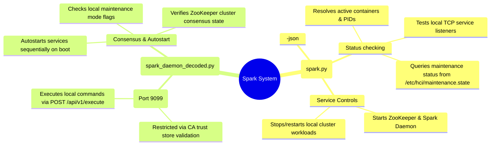

# Spark (Cluster Service & Bootstrap Manager) - Technical Documentation

This document details the internal technical structure, functions, flowcharts, and mindmaps of the Spark CLI manager (`spark.py`) and the Spark Daemon API (`spark_daemon_decoded.py`).

## Technical Mindmap

## Function & Logic Breakdown - Spark CLI (`spark.py`)

### `check_tcp_port(port, local_ip=None)`
- Verifies socket connectivity on the target port locally.
- Attempts connecting to `127.0.0.1` first, then falls back to `local_ip`.

### `get_local_maintenance_status(ip_addr)`
- Checks if `/etc/hci/maintenance.state` exists.
- If not, queries node status (`IN_MAINTENANCE` or `ENTERING_MAINTENANCE`) in ScyllaDB using the Daruk query proxy, falling back to a containerized `cqlsh` shell script run.

### `show_status_json()` / `show_status()`
- Probes status of all core cluster services (`zookeeper`, `hydra-db`, `aether`, `spark-daemon`, `spectrum`, `bifrost`, `dagur`, `mimir`, `vali`, `catalyst`, `hylia`, `gatoway`, `logos`, `mipha`, `daruk`, `agahnim`, `slate`, `urbosa`).
- Checks if systemd status is `active`.
- Probes associated TCP ports (e.g. 2181 for ZooKeeper, 9042 for HydraDB, etc.).
- Resolves process PIDs (reads systemd `MainPID` properties for native helper daemons like `daruk` or fetches containerized process ID mappings using `podman top systemd-<service> hpid`).
- Prints a structured human-readable breakdown or JSON map.

---

## Function & Logic Breakdown - Spark Daemon (`spark_daemon_decoded.py`)

### mTLS Socket Listener
- Sets up an HTTPS server (`ThreadingHTTPServer`) on port `9099` running inside a privileged container mounting the host's `/usr/local/bin` and certificates.
- Binds SSL context:
  - Enforces `ssl.CERT_REQUIRED` to validate incoming client certificates.
  - Loads `/etc/hci/spark/certs/node.crt` and `/etc/hci/spark/certs/node.key`.
  - Configures trust validation using `/etc/hci/spark/certs/ca.crt`.

### API Endpoints
- **`POST /api/v1/execute`**: Extracts a JSON command payload, executes it using `subprocess.Popen` in the host context (via privileged mounts and systemd socket communication), and returns the exit status code, `stdout`, and `stderr` buffers.
- **`GET /api/v1/node/status`**: Returns local metadata, including IP, hostname, ZooKeeper leader state, and maintenance status.

### Workload Autostart Loop
- Runs in a separate daemon thread on service startup:
  1. Bootstraps the local ZooKeeper instance if it is down.
  2. Halts auto-start progression if `/etc/hci/maintenance.state` is present.
  3. Polls local ZooKeeper port `2181` until quorum mode is reached.
  4. Queries ZooKeeper `/cluster_state` node. If manual stop was requested, exits start sequence.
  5. Starts local cluster database, storage, and logic daemons sequentially (via systemd commands acting on containerized Quadlet service targets).
