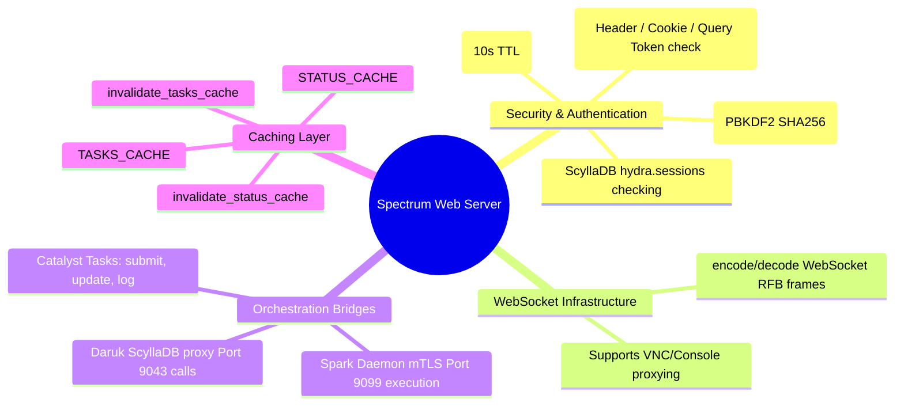

# Spectrum (Cluster Management Portal) - Technical Documentation

This document details the internal technical structure, functions, flowcharts, and mindmaps of the Spectrum admin portal API backend (`spectrum_server.py`).

## Technical Mindmap

## Function & Logic Breakdown

### Password & Session Security
- **`hash_password(password)`**: Hashes credentials using PBKDF2-HMAC-SHA256 with 100,000 iterations.
- **`verify_password(password, encoded_hash)`**: Verifies against salt and hash using `secrets.compare_digest`.
- **`is_authenticated(handler)`**: Performs authentication checks:
  1. Requests coming directly from localhost interfaces are auto-authenticated as `local-admin` (unless header proxied).
  2. Extracts tokens from the `Authorization: Bearer <token>` header, the `token` URL query parameter, or the `session_id` Cookie.
  3. Validates session status in database table `hydra.sessions`.
  4. Caches active user tokens for 10 seconds locally to avoid database queries on rapid UI polls.

### WebSocket Proxying
- **`decode_websocket_frame(sock)`**: Reads and parses standard RFC 6455 WebSocket frames, decoding opcode, masking key, and performing unmasking transformation on payloads.
- **`encode_websocket_frame(payload, opcode=2)`**: Encodes data buffers into binary frames.

### Catalyst Integration
- **`log_catalyst_task(service, action, status, progress, payload_dict, ...)`**: Helper that logs actions in `hydra.catalyst_tasks` and invalidates caches.

### mTLS Command Routing
- **`run_remote_spark(ip, command, timeout=45)`**: Routes administrative tasks securely across nodes using Spark's port `9099` mTLS execution API.

### HTTP Routing (`SpectrumAPIHandler`)
Serves static assets, routes frontend routes, and handles REST APIs:
- **`GET /api/status`**: Returns health, services state, and cluster storage mappings.
- **`GET /api/catalyst/tasks`**: Returns recent task progression.
- **`POST /api/v1/vms/create`**: Provisions virtual disks via Linstor, creates VM metadata in `hydra.vms`, and registers QEMU guest configuration in libvirt.
- **`DELETE /api/v1/vms/<name>`**: Stops guest and purges volume resources.
