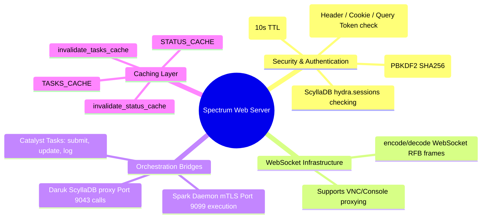

# Spectrum (Cluster Management Portal) - Technical Documentation

This document details the internal technical structure, functions, flowcharts, and mindmaps of the Spectrum admin portal API backend (`spectrum_server.py`).

## Technical Mindmap

```mermaid
mindmap
  root((Spectrum Web Server))
    Security & Authentication
      verify_password (PBKDF2 SHA256)
      is_authenticated (Header / Cookie / Query Token check)
      ScyllaDB hydra.sessions checking
      In-memory SESSION_CACHE (10s TTL)
    WebSocket Infrastructure
      encode/decode WebSocket RFB frames
      Supports VNC/Console proxying
    Orchestration Bridges
      Spark Daemon mTLS Port 9099 execution
      Daruk ScyllaDB proxy Port 9043 calls
      Catalyst Tasks: submit, update, log
    Caching Layer
      STATUS_CACHE
      TASKS_CACHE
      invalidate_status_cache
      invalidate_tasks_cache
```

## Function & Logic Breakdown

### Password & Session Security
- **`hash_password(password)`**: Hashes credentials using PBKDF2-HMAC-SHA256 with 100,000 iterations.
- **`verify_password(password, encoded_hash)`**: Verifies against salt and hash using `secrets.compare_digest`.
- **`is_authenticated(handler)`**: Performs authentication checks:
  1. Requests coming directly from localhost interfaces are auto-authenticated as `local-admin` (unless header proxied).
  2. Extracts tokens from the `Authorization: Bearer <token>` header, the `token` URL query parameter, or the `session_id` Cookie.
  3. Validates session status in database table `hydra.sessions`.
  4. Caches active user tokens for 10 seconds locally to avoid database queries on rapid UI polls.

### WebSocket Proxying
- **`decode_websocket_frame(sock)`**: Reads and parses standard RFC 6455 WebSocket frames, decoding opcode, masking key, and performing unmasking transformation on payloads.
- **`encode_websocket_frame(payload, opcode=2)`**: Encodes data buffers into binary frames.

### Catalyst Integration
- **`log_catalyst_task(service, action, status, progress, payload_dict, ...)`**: Helper that logs actions in `hydra.catalyst_tasks` and invalidates caches.

### mTLS Command Routing
- **`run_remote_spark(ip, command, timeout=45)`**: Routes administrative tasks securely across nodes using Spark's port `9099` mTLS execution API.

### Bounded reads

Two polling endpoints used to answer every request with a full table scan. Both tables
have a time-ordered clustering key, so "the newest N rows of one partition" is a read the
storage engine answers directly — it walks N rows on one replica set instead of every row
on all of them.

- **`read_node_metrics(limit=METRICS_SAMPLES_PER_NODE)`**: one
  `WHERE node_ip = ? LIMIT n` per configured node against `hydra.logos_metrics`
  (`PRIMARY KEY (node_ip, timestamp)`, `CLUSTERING ORDER BY (timestamp DESC)`, 24h TTL).
  Returns `(rows, unread_ips)`; a node whose partition could not be read is *named*, not
  silently omitted, because that is not the same as a node that reported nothing.
- **`read_dagur_runs(per_job, cap)`**: one partition per row of `hydra.dagur_schedules`
  against `hydra.dagur_runs` (`PRIMARY KEY (job_name, start_time)`, clustered
  `start_time DESC`), merged newest-first. Job names are matched against
  `_DAGUR_JOB_NAME_RE` before they reach a statement.
- **`cql_timestamp_ms(value)`**: `SELECT JSON` renders a `timestamp` column as
  `"2026-08-18 20:58:32.922Z"`, not as a number. Every cross-partition merge orders on
  this rather than on the raw value.
- **`is_ip_literal(value)`** / **`parse_json_rows(stdout)`**: an address that is not
  literally an address never reaches a statement; `parse_json_rows` is the one place that
  turns `SELECT JSON` output back into dicts.

`METRICS_SAMPLES_PER_NODE` is 40 because `static/metrics.html` slices each host's series
to its last 40 points before drawing it. Anything beyond that was read out of Hydra and
discarded in JavaScript.

### The Valhalla image catalogue
- **`image_backing_kind(path)`**: `'drbd'`, `'file'`, or `None`. `None` means the row
  points somewhere this file will not delete from, and the delete is refused rather than
  attempted. Quoting is not the guard on its own — a correctly quoted `rm -f /etc` is
  still `rm -f /etc` — so the path must be under `/dev/drbd/` or under
  `/var/lib/hci/aether/volumes/`, with no `..` segment and no NUL.
- **`remove_image_backing(name, path)`**: a DRBD-backed image is removed by deleting its
  LINSTOR resource definition (`img-<slug>`), which tears the device down on every node;
  `rm` on `/dev/drbd/by-res/<res>/0` would delete a udev symlink and leave the resource,
  and the storage it holds, allocated. A staged file is removed on every node and each
  result is checked. Returns `(ok, detail)`.
- **`delete_catalogue_image(name)`**: backing store first and checked, then the row.
  Returns `(status, body)`. On failure the row is kept, so the image stays on the page
  and the delete can be retried.

### VM lifecycle
- **`delete_vm(name)`**: read the row (so "no such VM" is decided before any conditional
  write) → `POST /v1/vm/migrate-lock` → re-read the placement under the lock →
  `POST /v1/vm/set-state` (whose condition is `IF host_ip = ?`) → destroy, undefine,
  delete disks, all checked → delete the row. Any refusal or failure leaves the row in
  place and releases the lock. Helpers: `_read_vm_row`, `_destroy_vm_on_host`,
  `_delete_vm_disks`.
- **`run_lwt(endpoint, params)`**: `(ok, applied, current, error)` against Daruk's typed
  compare-and-swap endpoints. A refused swap is `(True, False, {...}, "")` — a lost race,
  not a failure. See [daruk.md](./daruk.md).

### Tests
`test_spectrum_data_layer.py` covers all of the above with a fake Hydra that records
statements, so the assertions are on the *shape* of each read and the *order* of each
write sequence, not only on the result.

### HTTP Routing (`SpectrumAPIHandler`)
Serves static assets, routes frontend routes, and handles REST APIs:
- **`GET /api/status`**: Returns health, services state, and cluster storage mappings.
- **`GET /api/catalyst/tasks`**: Returns recent task progression.
- **`POST /api/v1/vms/create`**: Provisions virtual disks via Linstor, creates VM metadata in `hydra.vms`, and registers QEMU guest configuration in libvirt.
- **`DELETE /api/v1/vms/<name>`**: Stops guest and purges volume resources.
