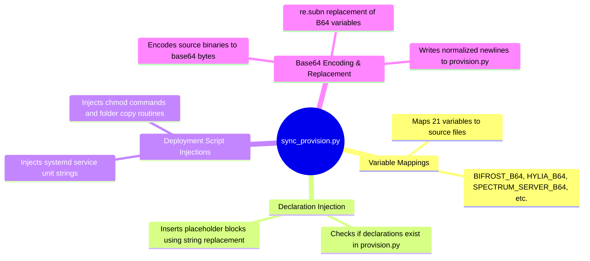

# Sync Provision Utility - Technical Documentation

This document details the internal technical structure, functions, flowcharts, and mindmaps of the synchronization provision utility (`sync_provision.py`).

## Technical Mindmap

## Function & Logic Breakdown

### Declarations and Deployment Injections
- Walks a checklist of core services to ensure their installation parameters are registered in `provision.py`:
  - **Bifrost**: Injects `bifrost.service` systemd unit and binaries installation scripts.
  - **Gatoway**: Injects `gatoway.service` systemd unit and L2 setup scripts.
  - **Urbosa**: Injects `urbosa.service` overlay and firewall orchestration scripts.
  - **Logos**: Injects `logos.service` metrics service scripts.
  - **Mipha**: Injects `mipha.service` high availability coordinator scripts.
  - **Daruk**: Injects `daruk.service` ScyllaDB proxy scripts.
  - **Hylia**: Injects `hylia.service` rolling upgrade daemon scripts.

### Binary Encoding & Sync Loop (`main()`)
- Walks the key-value dictionary mapping variable labels to actual local scripts.
- For each file:
  1. Reads contents in binary mode.
  2. Converts bytes into a base64 encoded string.
  3. Uses regex to locate the target variable block in `provision.py`:
     `pattern = rf'{var_name}\s*=\s*".*?"'`
  4. Drops in the new base64 string.
- Re-saves `provision.py` with standard Unix newline endings.
