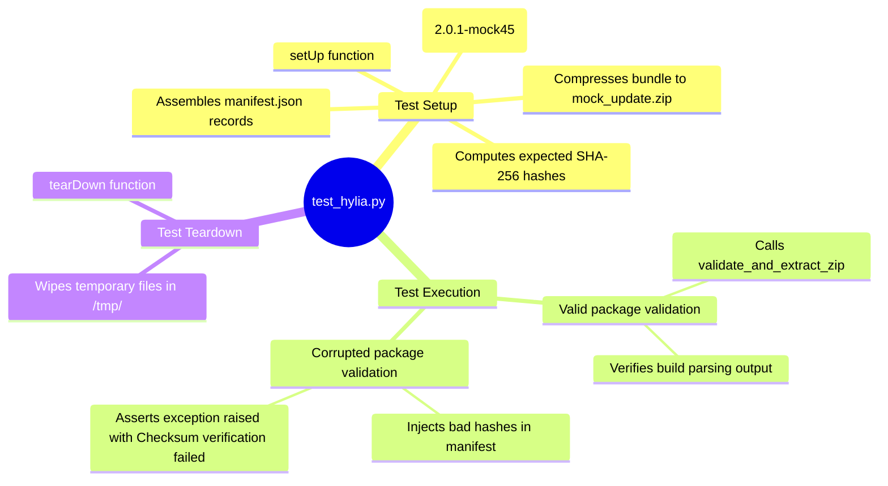

# Hylia Test Framework - Technical Documentation

This document details the internal technical structure, functions, flowcharts, and mindmaps of the rolling upgrade unit testing framework (`test_hylia.py`).

## Technical Mindmap

## Function & Logic Breakdown

### Test Lifecycle Coordination (`unittest.TestCase`)

#### `setUp()`
- Creates temporary directories `/tmp/yggdrasil_test_env` and `/tmp/yggdrasil_test_extract`.
- Creates a mock Python component script (`mock_service.py`) and defines `__build__ = "2.0.1-mock45"`.
- Calculates the correct SHA-256 hash of this script.
- Writes a dummy `changelog.md` and a `manifest.json` referencing the hash and installation path.
- Deflates the files into a mock zip archive `mock_update.zip`.

#### `tearDown()`
- Deletes the test directories `/tmp/yggdrasil_test_env` and `/tmp/yggdrasil_test_extract` to clean up the local environment.

#### `test_valid_package_verification()`
- Runs `hylia.validate_and_extract_zip` on the mock zip.
- Asserts version, build name, and changelog contents match the input mock declarations.
- Calls `hylia.get_service_build_number` to assert version extraction works.

#### `test_invalid_hash_verification()`
- Creates a modified manifest dictionary containing a corrupted SHA-256 signature (`"badhash123"`).
- Compresses the corrupted files into `corrupt_update.zip`.
- Asserts that calling `hylia.validate_and_extract_zip` raises an exception containing the string `"Checksum verification failed"`.
